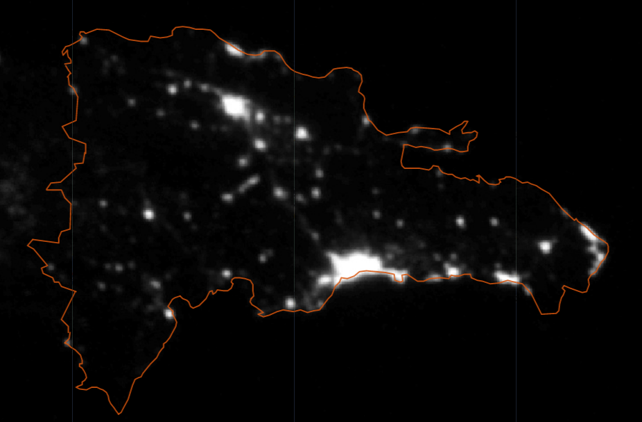
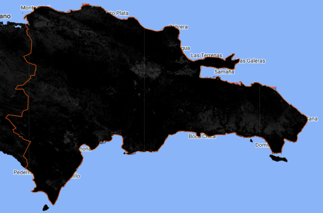
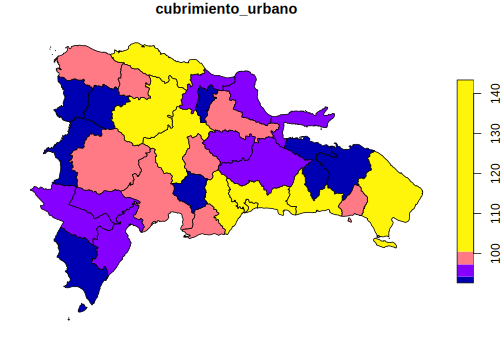
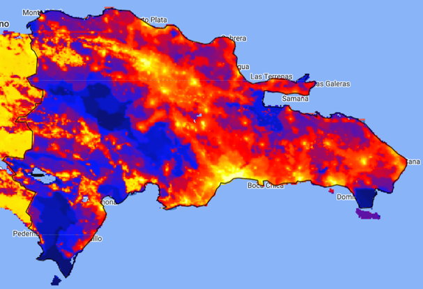
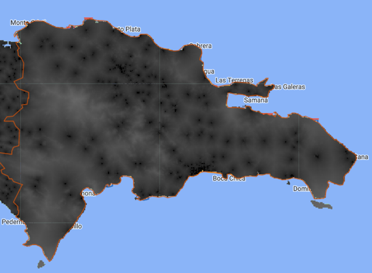

# Día 1 - Sesión 3- Censo e información satelital


## Uso de imágenes satelitales y SAE

Uno de los artículo pioneros de estimación de áreas pequeñas fue el artículo de Singh, R, et. al. (2002) el cual abordó la estimación del rendimiento de cultivos para los tehsil (unidad subadministrativa)  del distriyo Rohtak district en Haryana (India). 


Las imágenes raster representan el mundo mediante un conjunto de celdas contiguas igualmente espaciadas conocidas como pixeles, estas imágenes tienen información como un sistema de información geográfico, Un sistema de referencia de coordenadas. Las imágenes almacenan un identificador, un valor en cada pixel (o un vector con diferentes valores) y cada celda tiene asociada una escala de colores.

Las imágenes pueden obtenerse crudas y procesadas, estas primeras contienen solamente las capas de colores, las segundas contienen también valores que han sido procesados en cada celda (índices de vegetación, intensidad lumínica, tipo de vegetación). 

La información cruda puede utilizarse para entrenar características que se desean entrenar (carreteras, tipo de cultivo, bosque / no bosque), afortunadamente en Google Earth Engine encontramos muchos indicadores  procesadas asociadas a un pixel. Estos indicadores pueden agregarse a nivel de un área geográfica.


### Fuentes de datos de imágenes satelitales

Algunas de las principales fuentes de imágenes satelitales son: 

  * http://earthexplorer.usgs.gov/

  * https://lpdaacsvc.cr.usgs.gov/appeears/

  * https://search.earthdata.nasa.gov/search

  * https://scihub.copernicus.eu/

  * https://aws.amazon.com/public-data-sets/landsat/

Sin embargo la mayor parte de estas fuentes están centralizadas en **Google Earth Engine** que permite buscar fuentes de datos provenientes de imágenes satelitales. GEE se puede manejar por medio de APIS en diferentes lenguajes de programación: Javascript (por defecto), Python y R (paquete rgee).


## Google Earth Eninge


Crear una cuenta en [link](https://earthengine.google.com/), una vez que se ingrese a la cuenta puede buscarse los conjuntos de datos de interés:


* Una vez se busque el conjunto de datos se puede abrir un editor de código brindado por google en  Javascript. 

*  Copiar y pegar la sintaxis que brinda el buscador de conjunto de datos para visualizar la imagen raster y disponer de sentencias que Permitan la obtención  del conjunto de datos de interés posteriormente en R


## Instalación de rgee

*  Descargar e instalar anaconda o conda. (<https://www.anaconda.com/products/individual>)

*  Abrir Anaconda prompt y configurar ambiente de trabajo (ambiente python rgee_py) con las siguientes sentencias:


```python
conda create -n rgee_py python=3.9
activate rgee_py
pip install google-api-python-client
pip install earthengine-api
pip install numpy
```

*  Listar los ambientes de Python disponibles en anaconda prompt


```python
conda env list
```


*   Una vez identificado la ruta del ambiente ambiente rgee_py definirla en R (**no se debe olvidar cambiar \\ por /**). 
*   Instalar `reticulate` y `rgee`, cargar paquetes para procesamiento espacial y configurar el ambiente de trabajo como sigue:


```r
library(reticulate) # Conexión con Python
library(rgee) # Conexión con Google Earth Engine
library(sf) # Paquete para manejar datos geográficos
library(dplyr) # Paquete para procesamiento de datos
library(magrittr)

rgee_environment_dir = "C://Users//sguerrero//Anaconda3//envs//rgee_py//python.exe"

# Configurar python (Algunas veces no es detectado y se debe reiniciar R)
reticulate::use_python(rgee_environment_dir, required=T)

rgee::ee_install_set_pyenv(py_path = rgee_environment_dir, py_env = "rgee_py")

Sys.setenv(RETICULATE_PYTHON = rgee_environment_dir)
Sys.setenv(EARTHENGINE_PYTHON = rgee_environment_dir)
```

*  Una vez configurado el ambiente puede iniciarlizarse una sesión de Google Earth Engine como sigue:


```r
rgee::ee_Initialize(drive = T)
```


**Notas:** 

-   Se debe inicializar cada sesión con el comando `rgee::ee_Initialize(drive = T)`. 

-   Los comandos de javascript que invoquen métodos con "." se sustituyen por signo peso ($), por ejemplo:


```r
ee.ImageCollection().filterDate()  # Javascript
ee$ImageCollection()$filterDate()  # R
```

### Descargar información satelital

*   **Paso 1**: disponer de los shapefile 


```r
shape <- read_sf("Recursos/Día1/Sesion2/Shape/DOM.shp")
plot(shape["geometry"])
```


*   **Paso 2**: Seleccionar el archivo de imágenes  que desea procesar, para nuestro ejemplo **luces nocturnas**.  


```r
luces <- ee$ImageCollection("NOAA/DMSP-OLS/NIGHTTIME_LIGHTS") %>%
  ee$ImageCollection$filterDate("2013-01-01", "2014-01-01") %>%
  ee$ImageCollection$map(function(x) x$select("stable_lights")) %>%
  ee$ImageCollection$toBands()
```

* **Paso 3**: Descargar la información


```r
shape_luces <- map(unique(shape$dam),
                 ~tryCatch(ee_extract(
                   x = luces,
                   y = shape["dam"] %>% filter(dam == .x),
                   ee$Reducer$mean(),
                   sf = FALSE
                 ) %>% mutate(dam = .x),
                 error = function(e)data.frame(dam = .x)))

shape_luces %<>% bind_rows()

tba(shape_luces, cap = "Promedio de luces nocturnasa")
```

Repetir la rutina para: 

-   Tipo de suelo: **crops-coverfraction** (Porcentaje de cubrimiento cultivos) y **urban-coverfraction** (Porcentaje de cobertura urbana) disponibles en <https://developers.google.com/earth-engine/datasets/catalog/COGTMNICUS_Landcover_100m_Proba-V-C3_Global#description> 


- Tiempo de viaje al hospital o clínica más cercana (**accessibility**) y tiempo de viaje al hospital o clínica más cercana utilizando transporte no motorizado (**accessibility_walking_only**) información disponible en <https://develoGTMs.google.com/earth-engine/datasets/catalog/Oxford_MAP_accessibility_to_healthcare_2019> 

- Modificación humana, donde se consideran los asentamiento humano, la agricultura, el transporte, la minería y producción de energía e infraestructura eléctrica. En el siguiente link encuentra la información satelital  <https://develoGTMs.google.com/earth-engine/datasets/catalog/CSP_HM_GlobalHumanModification#description>


* **Paso 4**  consolidar la información. 

<table class="table table-striped lightable-classic" style="margin-left: auto; margin-right: auto; font-family: Arial Narrow; margin-left: auto; margin-right: auto;">
 <thead>
  <tr>
   <th style="text-align:left;"> dam </th>
   <th style="text-align:right;"> luces_nocturnas </th>
   <th style="text-align:right;"> cubrimiento_cultivo </th>
   <th style="text-align:right;"> cubrimiento_urbano </th>
   <th style="text-align:right;"> modificacion_humana </th>
   <th style="text-align:right;"> accesibilidad_hospitales </th>
   <th style="text-align:right;"> accesibilidad_hosp_caminado </th>
  </tr>
 </thead>
<tbody>
  <tr>
   <td style="text-align:left;"> 02 </td>
   <td style="text-align:right;"> 97.27735 </td>
   <td style="text-align:right;"> 107.10243 </td>
   <td style="text-align:right;"> 100.28394 </td>
   <td style="text-align:right;"> 111.01645 </td>
   <td style="text-align:right;"> 112.25437 </td>
   <td style="text-align:right;"> 109.66652 </td>
  </tr>
  <tr>
   <td style="text-align:left;"> 03 </td>
   <td style="text-align:right;"> 94.36142 </td>
   <td style="text-align:right;"> 97.71126 </td>
   <td style="text-align:right;"> 96.32667 </td>
   <td style="text-align:right;"> 96.29454 </td>
   <td style="text-align:right;"> 100.55525 </td>
   <td style="text-align:right;"> 105.35470 </td>
  </tr>
  <tr>
   <td style="text-align:left;"> 04 </td>
   <td style="text-align:right;"> 96.53042 </td>
   <td style="text-align:right;"> 95.73335 </td>
   <td style="text-align:right;"> 96.55354 </td>
   <td style="text-align:right;"> 98.67362 </td>
   <td style="text-align:right;"> 102.77860 </td>
   <td style="text-align:right;"> 103.78255 </td>
  </tr>
  <tr>
   <td style="text-align:left;"> 05 </td>
   <td style="text-align:right;"> 91.61138 </td>
   <td style="text-align:right;"> 98.91270 </td>
   <td style="text-align:right;"> 93.17994 </td>
   <td style="text-align:right;"> 95.16236 </td>
   <td style="text-align:right;"> 97.72809 </td>
   <td style="text-align:right;"> 95.59357 </td>
  </tr>
  <tr>
   <td style="text-align:left;"> 01 </td>
   <td style="text-align:right;"> 97.65958 </td>
   <td style="text-align:right;"> 86.79795 </td>
   <td style="text-align:right;"> 106.90397 </td>
   <td style="text-align:right;"> 82.34083 </td>
   <td style="text-align:right;"> 89.53466 </td>
   <td style="text-align:right;"> 87.11064 </td>
  </tr>
  <tr>
   <td style="text-align:left;"> 06 </td>
   <td style="text-align:right;"> 100.52567 </td>
   <td style="text-align:right;"> 107.21708 </td>
   <td style="text-align:right;"> 99.96448 </td>
   <td style="text-align:right;"> 104.95498 </td>
   <td style="text-align:right;"> 94.75524 </td>
   <td style="text-align:right;"> 95.69942 </td>
  </tr>
  <tr>
   <td style="text-align:left;"> 08 </td>
   <td style="text-align:right;"> 94.54495 </td>
   <td style="text-align:right;"> 103.38473 </td>
   <td style="text-align:right;"> 93.84241 </td>
   <td style="text-align:right;"> 102.73169 </td>
   <td style="text-align:right;"> 98.74441 </td>
   <td style="text-align:right;"> 101.96155 </td>
  </tr>
  <tr>
   <td style="text-align:left;"> 09 </td>
   <td style="text-align:right;"> 96.82438 </td>
   <td style="text-align:right;"> 91.41961 </td>
   <td style="text-align:right;"> 97.18788 </td>
   <td style="text-align:right;"> 92.96846 </td>
   <td style="text-align:right;"> 91.28395 </td>
   <td style="text-align:right;"> 90.46557 </td>
  </tr>
  <tr>
   <td style="text-align:left;"> 30 </td>
   <td style="text-align:right;"> 95.68487 </td>
   <td style="text-align:right;"> 91.78986 </td>
   <td style="text-align:right;"> 93.93370 </td>
   <td style="text-align:right;"> 96.83847 </td>
   <td style="text-align:right;"> 98.54392 </td>
   <td style="text-align:right;"> 98.93543 </td>
  </tr>
  <tr>
   <td style="text-align:left;"> 10 </td>
   <td style="text-align:right;"> 92.18900 </td>
   <td style="text-align:right;"> 98.33939 </td>
   <td style="text-align:right;"> 94.53840 </td>
   <td style="text-align:right;"> 97.45111 </td>
   <td style="text-align:right;"> 108.54346 </td>
   <td style="text-align:right;"> 107.34596 </td>
  </tr>
</tbody>
</table>

Los resultados se muestran en los siguientes mapas


### Luces nocturnas 




### Cubrimiento cultivos 




### Cubrimiento urbanos




### Modificación humana 




### Tiempo promedio al hospital 


### Tiempo promedio al hospital en vehiculo no motorizado




## Censos de población y vivienda

Es necesario definir las variables del país con los que se desea trabajar. De acuerdo a esto, como primer paso se debe tener acceso al censo del país, para ello puede acceder desde el siguiente enlace <https://redatam.org/en/microdata> en el cual dispondrá de un archivo *.zip* con los microdatos del país. Ahora bien, para leer el conjunto de datos, es necesario emplear la función redatam.open de la librería `redatam`, la cual depende directamente del diccionario censal del software REDATAM, este es un archivo con extensión dicx y que debe encontrarse en la carpeta sobre los datos que se están leyendo. Así, es como se crea un objeto dentro de `R` que hace la respectiva unión del diccionario con los microdatos de la base de datos censal. La siguiente sintaxis muestra la lectura del diccionario en `R` y los cálculos iniciales

 


```r
# https://redatamr.ideasybits.com/
library(redatam)
RepDoma <-  redatam.open("cpv2010dom-cde.dicX")

CONTEOS <- redatam.query(RepDoma,
                      "freq PROVIC.IDPROVI
                         by VIVIENDA.ZONA
                         by PERSONA.P27
                         by PERSONA.P29
                         by PERSONA.ANEST", tot.omit = FALSE)
```

Después de realizar algunas validaciones se estandarizan las variables como muestra el siguiente código.


```r
CONTEOS <- readRDS(file = "Recursos/Día1/Sesion2/Data/CONTEOS.RDS")
# Eliminando totales de la tabla
CONTEOS2 <- CONTEOS %>% filter_at(vars(matches("_label")),all_vars(. !=  "__tot__"))

censo_mrp <- CONTEOS2 %>%
  transmute(dam = str_pad(
              string = IDPROVI1_value,
              width = 2,
              pad = "0"
            ),
            area = case_when(ZONA2_value == 1 ~ "1", # 1 = Urbana
                             TRUE ~ "0"),
            sexo = as.character(P273_value),
            edad = case_when(
              P294_value  %in% 0:14 ~ "1", # 0 a 14
              P294_value  %in% 15:29 ~ "2", # 15 a 29
              P294_value  %in% 30:44 ~ "3", # 30 a 44
              P294_value  %in% 45:64 ~ "4", # 45 a 64
              TRUE ~ "5"), # 65 o mas

            anoest = case_when(
              P294_value < 5| is.na(ANEST5_value) ~ "98",     # No aplica
              ANEST5_value == 99 ~ "99", #NS/NR
              ANEST5_value %in% 0 ~ "1",  # Sin educacion
              ANEST5_value %in% c(1:6) ~ "2",  # 1-6
              ANEST5_value %in% c(7:12) ~ "3",  # 7-12
              ANEST5_value > 12 ~ "4" ,  # 12 o mas
              TRUE ~ "Error"
            ),
            value) %>%
  group_by(dam, area, sexo, edad,anoest) %>%
  summarise(n = sum(value), .groups = "drop")
```

A partir de la base estandarizada es posible construir algunas covariables para la  dam. 


```r
censo_mrp <- readRDS("Recursos/Día1/Sesion2/Data/censo_mrp_dam.rds")
tasa_censo <- model.matrix(dam ~ -1 +.,
                           data = censo_mrp %>% select(-n)) %>% 
  data.frame() %>%
  mutate(dam = censo_mrp$dam, 
         n = censo_mrp$n) %>% 
  group_by(dam) %>%
  summarise_all(~weighted.mean(x = .,w = n)) %>%
  select(-area0, -anoest98,-anoest98,-n)
tba(tasa_censo)
```

<table class="table table-striped lightable-classic" style="margin-left: auto; margin-right: auto; font-family: Arial Narrow; margin-left: auto; margin-right: auto;">
 <thead>
  <tr>
   <th style="text-align:left;"> dam </th>
   <th style="text-align:right;"> area1 </th>
   <th style="text-align:right;"> sexo2 </th>
   <th style="text-align:right;"> edad2 </th>
   <th style="text-align:right;"> edad3 </th>
   <th style="text-align:right;"> edad4 </th>
   <th style="text-align:right;"> edad5 </th>
   <th style="text-align:right;"> anoest2 </th>
   <th style="text-align:right;"> anoest3 </th>
   <th style="text-align:right;"> anoest4 </th>
   <th style="text-align:right;"> anoest99 </th>
  </tr>
 </thead>
<tbody>
  <tr>
   <td style="text-align:left;"> 01 </td>
   <td style="text-align:right;"> 1.0000 </td>
   <td style="text-align:right;"> 0.5224 </td>
   <td style="text-align:right;"> 0.2781 </td>
   <td style="text-align:right;"> 0.2117 </td>
   <td style="text-align:right;"> 0.1808 </td>
   <td style="text-align:right;"> 0.0725 </td>
   <td style="text-align:right;"> 0.2000 </td>
   <td style="text-align:right;"> 0.3680 </td>
   <td style="text-align:right;"> 0.2286 </td>
   <td style="text-align:right;"> 0.0193 </td>
  </tr>
  <tr>
   <td style="text-align:left;"> 02 </td>
   <td style="text-align:right;"> 0.7718 </td>
   <td style="text-align:right;"> 0.4733 </td>
   <td style="text-align:right;"> 0.2773 </td>
   <td style="text-align:right;"> 0.1831 </td>
   <td style="text-align:right;"> 0.1531 </td>
   <td style="text-align:right;"> 0.0634 </td>
   <td style="text-align:right;"> 0.3350 </td>
   <td style="text-align:right;"> 0.2771 </td>
   <td style="text-align:right;"> 0.0540 </td>
   <td style="text-align:right;"> 0.0065 </td>
  </tr>
  <tr>
   <td style="text-align:left;"> 03 </td>
   <td style="text-align:right;"> 0.7128 </td>
   <td style="text-align:right;"> 0.4804 </td>
   <td style="text-align:right;"> 0.2643 </td>
   <td style="text-align:right;"> 0.1572 </td>
   <td style="text-align:right;"> 0.1489 </td>
   <td style="text-align:right;"> 0.0718 </td>
   <td style="text-align:right;"> 0.3470 </td>
   <td style="text-align:right;"> 0.2542 </td>
   <td style="text-align:right;"> 0.0493 </td>
   <td style="text-align:right;"> 0.0055 </td>
  </tr>
  <tr>
   <td style="text-align:left;"> 04 </td>
   <td style="text-align:right;"> 0.8345 </td>
   <td style="text-align:right;"> 0.4826 </td>
   <td style="text-align:right;"> 0.2756 </td>
   <td style="text-align:right;"> 0.1738 </td>
   <td style="text-align:right;"> 0.1454 </td>
   <td style="text-align:right;"> 0.0638 </td>
   <td style="text-align:right;"> 0.3169 </td>
   <td style="text-align:right;"> 0.2948 </td>
   <td style="text-align:right;"> 0.0827 </td>
   <td style="text-align:right;"> 0.0082 </td>
  </tr>
  <tr>
   <td style="text-align:left;"> 05 </td>
   <td style="text-align:right;"> 0.5977 </td>
   <td style="text-align:right;"> 0.4849 </td>
   <td style="text-align:right;"> 0.2509 </td>
   <td style="text-align:right;"> 0.1752 </td>
   <td style="text-align:right;"> 0.1748 </td>
   <td style="text-align:right;"> 0.0899 </td>
   <td style="text-align:right;"> 0.3471 </td>
   <td style="text-align:right;"> 0.3252 </td>
   <td style="text-align:right;"> 0.0625 </td>
   <td style="text-align:right;"> 0.0052 </td>
  </tr>
  <tr>
   <td style="text-align:left;"> 06 </td>
   <td style="text-align:right;"> 0.6626 </td>
   <td style="text-align:right;"> 0.4909 </td>
   <td style="text-align:right;"> 0.2671 </td>
   <td style="text-align:right;"> 0.1988 </td>
   <td style="text-align:right;"> 0.1736 </td>
   <td style="text-align:right;"> 0.0786 </td>
   <td style="text-align:right;"> 0.3140 </td>
   <td style="text-align:right;"> 0.3383 </td>
   <td style="text-align:right;"> 0.1038 </td>
   <td style="text-align:right;"> 0.0087 </td>
  </tr>
  <tr>
   <td style="text-align:left;"> 07 </td>
   <td style="text-align:right;"> 0.4828 </td>
   <td style="text-align:right;"> 0.4768 </td>
   <td style="text-align:right;"> 0.2380 </td>
   <td style="text-align:right;"> 0.1431 </td>
   <td style="text-align:right;"> 0.1527 </td>
   <td style="text-align:right;"> 0.0788 </td>
   <td style="text-align:right;"> 0.3287 </td>
   <td style="text-align:right;"> 0.1949 </td>
   <td style="text-align:right;"> 0.0315 </td>
   <td style="text-align:right;"> 0.0037 </td>
  </tr>
  <tr>
   <td style="text-align:left;"> 08 </td>
   <td style="text-align:right;"> 0.5144 </td>
   <td style="text-align:right;"> 0.4610 </td>
   <td style="text-align:right;"> 0.2648 </td>
   <td style="text-align:right;"> 0.1728 </td>
   <td style="text-align:right;"> 0.1625 </td>
   <td style="text-align:right;"> 0.0845 </td>
   <td style="text-align:right;"> 0.3822 </td>
   <td style="text-align:right;"> 0.2730 </td>
   <td style="text-align:right;"> 0.0440 </td>
   <td style="text-align:right;"> 0.0035 </td>
  </tr>
  <tr>
   <td style="text-align:left;"> 09 </td>
   <td style="text-align:right;"> 0.4535 </td>
   <td style="text-align:right;"> 0.4889 </td>
   <td style="text-align:right;"> 0.2733 </td>
   <td style="text-align:right;"> 0.2084 </td>
   <td style="text-align:right;"> 0.1694 </td>
   <td style="text-align:right;"> 0.0764 </td>
   <td style="text-align:right;"> 0.3125 </td>
   <td style="text-align:right;"> 0.3699 </td>
   <td style="text-align:right;"> 0.0840 </td>
   <td style="text-align:right;"> 0.0078 </td>
  </tr>
  <tr>
   <td style="text-align:left;"> 10 </td>
   <td style="text-align:right;"> 0.7996 </td>
   <td style="text-align:right;"> 0.4865 </td>
   <td style="text-align:right;"> 0.2658 </td>
   <td style="text-align:right;"> 0.1648 </td>
   <td style="text-align:right;"> 0.1418 </td>
   <td style="text-align:right;"> 0.0665 </td>
   <td style="text-align:right;"> 0.3214 </td>
   <td style="text-align:right;"> 0.2603 </td>
   <td style="text-align:right;"> 0.0485 </td>
   <td style="text-align:right;"> 0.0052 </td>
  </tr>
  <tr>
   <td style="text-align:left;"> 11 </td>
   <td style="text-align:right;"> 0.7784 </td>
   <td style="text-align:right;"> 0.4766 </td>
   <td style="text-align:right;"> 0.3001 </td>
   <td style="text-align:right;"> 0.2393 </td>
   <td style="text-align:right;"> 0.1250 </td>
   <td style="text-align:right;"> 0.0430 </td>
   <td style="text-align:right;"> 0.2986 </td>
   <td style="text-align:right;"> 0.3722 </td>
   <td style="text-align:right;"> 0.0650 </td>
   <td style="text-align:right;"> 0.0076 </td>
  </tr>
  <tr>
   <td style="text-align:left;"> 12 </td>
   <td style="text-align:right;"> 0.9425 </td>
   <td style="text-align:right;"> 0.5059 </td>
   <td style="text-align:right;"> 0.2821 </td>
   <td style="text-align:right;"> 0.2061 </td>
   <td style="text-align:right;"> 0.1466 </td>
   <td style="text-align:right;"> 0.0515 </td>
   <td style="text-align:right;"> 0.2810 </td>
   <td style="text-align:right;"> 0.3955 </td>
   <td style="text-align:right;"> 0.0794 </td>
   <td style="text-align:right;"> 0.0080 </td>
  </tr>
  <tr>
   <td style="text-align:left;"> 13 </td>
   <td style="text-align:right;"> 0.4696 </td>
   <td style="text-align:right;"> 0.4885 </td>
   <td style="text-align:right;"> 0.2762 </td>
   <td style="text-align:right;"> 0.2049 </td>
   <td style="text-align:right;"> 0.1606 </td>
   <td style="text-align:right;"> 0.0719 </td>
   <td style="text-align:right;"> 0.3142 </td>
   <td style="text-align:right;"> 0.3582 </td>
   <td style="text-align:right;"> 0.0781 </td>
   <td style="text-align:right;"> 0.0070 </td>
  </tr>
  <tr>
   <td style="text-align:left;"> 14 </td>
   <td style="text-align:right;"> 0.5252 </td>
   <td style="text-align:right;"> 0.4855 </td>
   <td style="text-align:right;"> 0.2700 </td>
   <td style="text-align:right;"> 0.1929 </td>
   <td style="text-align:right;"> 0.1729 </td>
   <td style="text-align:right;"> 0.0731 </td>
   <td style="text-align:right;"> 0.3258 </td>
   <td style="text-align:right;"> 0.3517 </td>
   <td style="text-align:right;"> 0.0765 </td>
   <td style="text-align:right;"> 0.0079 </td>
  </tr>
  <tr>
   <td style="text-align:left;"> 15 </td>
   <td style="text-align:right;"> 0.5312 </td>
   <td style="text-align:right;"> 0.4718 </td>
   <td style="text-align:right;"> 0.2685 </td>
   <td style="text-align:right;"> 0.1984 </td>
   <td style="text-align:right;"> 0.1764 </td>
   <td style="text-align:right;"> 0.0798 </td>
   <td style="text-align:right;"> 0.3103 </td>
   <td style="text-align:right;"> 0.3318 </td>
   <td style="text-align:right;"> 0.0519 </td>
   <td style="text-align:right;"> 0.0048 </td>
  </tr>
  <tr>
   <td style="text-align:left;"> 16 </td>
   <td style="text-align:right;"> 0.6441 </td>
   <td style="text-align:right;"> 0.4651 </td>
   <td style="text-align:right;"> 0.2738 </td>
   <td style="text-align:right;"> 0.1932 </td>
   <td style="text-align:right;"> 0.1334 </td>
   <td style="text-align:right;"> 0.0459 </td>
   <td style="text-align:right;"> 0.2589 </td>
   <td style="text-align:right;"> 0.2403 </td>
   <td style="text-align:right;"> 0.0316 </td>
   <td style="text-align:right;"> 0.0028 </td>
  </tr>
  <tr>
   <td style="text-align:left;"> 17 </td>
   <td style="text-align:right;"> 0.6810 </td>
   <td style="text-align:right;"> 0.5047 </td>
   <td style="text-align:right;"> 0.2665 </td>
   <td style="text-align:right;"> 0.1984 </td>
   <td style="text-align:right;"> 0.1549 </td>
   <td style="text-align:right;"> 0.0646 </td>
   <td style="text-align:right;"> 0.3707 </td>
   <td style="text-align:right;"> 0.3252 </td>
   <td style="text-align:right;"> 0.0460 </td>
   <td style="text-align:right;"> 0.0052 </td>
  </tr>
  <tr>
   <td style="text-align:left;"> 18 </td>
   <td style="text-align:right;"> 0.5839 </td>
   <td style="text-align:right;"> 0.4895 </td>
   <td style="text-align:right;"> 0.2699 </td>
   <td style="text-align:right;"> 0.2126 </td>
   <td style="text-align:right;"> 0.1689 </td>
   <td style="text-align:right;"> 0.0703 </td>
   <td style="text-align:right;"> 0.2875 </td>
   <td style="text-align:right;"> 0.3940 </td>
   <td style="text-align:right;"> 0.0727 </td>
   <td style="text-align:right;"> 0.0067 </td>
  </tr>
  <tr>
   <td style="text-align:left;"> 19 </td>
   <td style="text-align:right;"> 0.2891 </td>
   <td style="text-align:right;"> 0.4902 </td>
   <td style="text-align:right;"> 0.2568 </td>
   <td style="text-align:right;"> 0.2001 </td>
   <td style="text-align:right;"> 0.1839 </td>
   <td style="text-align:right;"> 0.0954 </td>
   <td style="text-align:right;"> 0.3037 </td>
   <td style="text-align:right;"> 0.3483 </td>
   <td style="text-align:right;"> 0.1097 </td>
   <td style="text-align:right;"> 0.0078 </td>
  </tr>
  <tr>
   <td style="text-align:left;"> 20 </td>
   <td style="text-align:right;"> 0.4354 </td>
   <td style="text-align:right;"> 0.4837 </td>
   <td style="text-align:right;"> 0.2811 </td>
   <td style="text-align:right;"> 0.2007 </td>
   <td style="text-align:right;"> 0.1554 </td>
   <td style="text-align:right;"> 0.0628 </td>
   <td style="text-align:right;"> 0.3080 </td>
   <td style="text-align:right;"> 0.3691 </td>
   <td style="text-align:right;"> 0.0595 </td>
   <td style="text-align:right;"> 0.0059 </td>
  </tr>
  <tr>
   <td style="text-align:left;"> 21 </td>
   <td style="text-align:right;"> 0.5186 </td>
   <td style="text-align:right;"> 0.4996 </td>
   <td style="text-align:right;"> 0.2807 </td>
   <td style="text-align:right;"> 0.1956 </td>
   <td style="text-align:right;"> 0.1451 </td>
   <td style="text-align:right;"> 0.0507 </td>
   <td style="text-align:right;"> 0.2931 </td>
   <td style="text-align:right;"> 0.3782 </td>
   <td style="text-align:right;"> 0.0783 </td>
   <td style="text-align:right;"> 0.0082 </td>
  </tr>
  <tr>
   <td style="text-align:left;"> 22 </td>
   <td style="text-align:right;"> 0.6009 </td>
   <td style="text-align:right;"> 0.4725 </td>
   <td style="text-align:right;"> 0.2559 </td>
   <td style="text-align:right;"> 0.1698 </td>
   <td style="text-align:right;"> 0.1695 </td>
   <td style="text-align:right;"> 0.0891 </td>
   <td style="text-align:right;"> 0.3482 </td>
   <td style="text-align:right;"> 0.2674 </td>
   <td style="text-align:right;"> 0.0642 </td>
   <td style="text-align:right;"> 0.0075 </td>
  </tr>
  <tr>
   <td style="text-align:left;"> 23 </td>
   <td style="text-align:right;"> 0.8408 </td>
   <td style="text-align:right;"> 0.5063 </td>
   <td style="text-align:right;"> 0.2861 </td>
   <td style="text-align:right;"> 0.1974 </td>
   <td style="text-align:right;"> 0.1522 </td>
   <td style="text-align:right;"> 0.0572 </td>
   <td style="text-align:right;"> 0.2840 </td>
   <td style="text-align:right;"> 0.4022 </td>
   <td style="text-align:right;"> 0.0817 </td>
   <td style="text-align:right;"> 0.0077 </td>
  </tr>
  <tr>
   <td style="text-align:left;"> 24 </td>
   <td style="text-align:right;"> 0.5628 </td>
   <td style="text-align:right;"> 0.4827 </td>
   <td style="text-align:right;"> 0.2754 </td>
   <td style="text-align:right;"> 0.1871 </td>
   <td style="text-align:right;"> 0.1662 </td>
   <td style="text-align:right;"> 0.0743 </td>
   <td style="text-align:right;"> 0.3198 </td>
   <td style="text-align:right;"> 0.3320 </td>
   <td style="text-align:right;"> 0.1000 </td>
   <td style="text-align:right;"> 0.0089 </td>
  </tr>
  <tr>
   <td style="text-align:left;"> 25 </td>
   <td style="text-align:right;"> 0.7561 </td>
   <td style="text-align:right;"> 0.5017 </td>
   <td style="text-align:right;"> 0.2795 </td>
   <td style="text-align:right;"> 0.2221 </td>
   <td style="text-align:right;"> 0.1583 </td>
   <td style="text-align:right;"> 0.0649 </td>
   <td style="text-align:right;"> 0.2843 </td>
   <td style="text-align:right;"> 0.3727 </td>
   <td style="text-align:right;"> 0.1106 </td>
   <td style="text-align:right;"> 0.0102 </td>
  </tr>
  <tr>
   <td style="text-align:left;"> 26 </td>
   <td style="text-align:right;"> 0.4795 </td>
   <td style="text-align:right;"> 0.4776 </td>
   <td style="text-align:right;"> 0.2632 </td>
   <td style="text-align:right;"> 0.1821 </td>
   <td style="text-align:right;"> 0.1770 </td>
   <td style="text-align:right;"> 0.1038 </td>
   <td style="text-align:right;"> 0.3340 </td>
   <td style="text-align:right;"> 0.3156 </td>
   <td style="text-align:right;"> 0.0767 </td>
   <td style="text-align:right;"> 0.0074 </td>
  </tr>
  <tr>
   <td style="text-align:left;"> 27 </td>
   <td style="text-align:right;"> 0.7917 </td>
   <td style="text-align:right;"> 0.4785 </td>
   <td style="text-align:right;"> 0.2810 </td>
   <td style="text-align:right;"> 0.2098 </td>
   <td style="text-align:right;"> 0.1501 </td>
   <td style="text-align:right;"> 0.0681 </td>
   <td style="text-align:right;"> 0.3121 </td>
   <td style="text-align:right;"> 0.3151 </td>
   <td style="text-align:right;"> 0.0817 </td>
   <td style="text-align:right;"> 0.0074 </td>
  </tr>
  <tr>
   <td style="text-align:left;"> 28 </td>
   <td style="text-align:right;"> 0.6797 </td>
   <td style="text-align:right;"> 0.4949 </td>
   <td style="text-align:right;"> 0.2690 </td>
   <td style="text-align:right;"> 0.2028 </td>
   <td style="text-align:right;"> 0.1597 </td>
   <td style="text-align:right;"> 0.0655 </td>
   <td style="text-align:right;"> 0.2883 </td>
   <td style="text-align:right;"> 0.3819 </td>
   <td style="text-align:right;"> 0.0855 </td>
   <td style="text-align:right;"> 0.0101 </td>
  </tr>
  <tr>
   <td style="text-align:left;"> 29 </td>
   <td style="text-align:right;"> 0.4939 </td>
   <td style="text-align:right;"> 0.4836 </td>
   <td style="text-align:right;"> 0.2656 </td>
   <td style="text-align:right;"> 0.1718 </td>
   <td style="text-align:right;"> 0.1537 </td>
   <td style="text-align:right;"> 0.0756 </td>
   <td style="text-align:right;"> 0.3438 </td>
   <td style="text-align:right;"> 0.3188 </td>
   <td style="text-align:right;"> 0.0526 </td>
   <td style="text-align:right;"> 0.0056 </td>
  </tr>
  <tr>
   <td style="text-align:left;"> 30 </td>
   <td style="text-align:right;"> 0.7412 </td>
   <td style="text-align:right;"> 0.4902 </td>
   <td style="text-align:right;"> 0.2722 </td>
   <td style="text-align:right;"> 0.1855 </td>
   <td style="text-align:right;"> 0.1624 </td>
   <td style="text-align:right;"> 0.0775 </td>
   <td style="text-align:right;"> 0.3308 </td>
   <td style="text-align:right;"> 0.3338 </td>
   <td style="text-align:right;"> 0.0696 </td>
   <td style="text-align:right;"> 0.0070 </td>
  </tr>
  <tr>
   <td style="text-align:left;"> 31 </td>
   <td style="text-align:right;"> 0.6292 </td>
   <td style="text-align:right;"> 0.4587 </td>
   <td style="text-align:right;"> 0.2556 </td>
   <td style="text-align:right;"> 0.2037 </td>
   <td style="text-align:right;"> 0.1761 </td>
   <td style="text-align:right;"> 0.0848 </td>
   <td style="text-align:right;"> 0.3785 </td>
   <td style="text-align:right;"> 0.2681 </td>
   <td style="text-align:right;"> 0.0602 </td>
   <td style="text-align:right;"> 0.0050 </td>
  </tr>
  <tr>
   <td style="text-align:left;"> 32 </td>
   <td style="text-align:right;"> 0.8780 </td>
   <td style="text-align:right;"> 0.5098 </td>
   <td style="text-align:right;"> 0.2870 </td>
   <td style="text-align:right;"> 0.2126 </td>
   <td style="text-align:right;"> 0.1502 </td>
   <td style="text-align:right;"> 0.0447 </td>
   <td style="text-align:right;"> 0.2409 </td>
   <td style="text-align:right;"> 0.4005 </td>
   <td style="text-align:right;"> 0.1291 </td>
   <td style="text-align:right;"> 0.0131 </td>
  </tr>
</tbody>
</table>

Es posible construir a partir de una variable del censo, haciendo que el proceso se hace más corto, para este caso es empleada la variable `VIVIENDA.V05`, agregada por dam 

En el primer bloque que código usando la función `redatam.query()` se realiza el conteo de viviendas que tienen el piso de tierra. Seguido de esto, eliminamos los registros que no son de interés, por ejemplo, el total en la dam o total nacional, los cuales se identifican dentro de la base con la etiqueta `__tot__`. 

El siguiente paso es contar el número de viviendas por dam que tienen piso de tierra en el censo (`Pobx`) y el total de viviendas que respondieron a la pregunta (`PobT`), para finalmente realizar el cociente de estas dos preguntas.  


```r
CONTEOS <- redatam.query(RepDoma,
                         "freq PROVIC.IDPROVI
                          by VIVIENDA.V05",
                         tot.omit = FALSE)

PISO <- CONTEOS %>% 
  filter_at(vars(matches("_label")),
            all_vars(!. %in%  c("__tot__","__mv__") ))

tasa_piso <- PISO %>%
  mutate(Pobx = ifelse(V052_value %in% c(7), value, 0),
         PobT = value) %>%
  group_by(
    depto = str_pad(
      string = IDPROVI1_value,
      width = 2,
      pad = "0"
    )
  ) %>%
  summarise(PobT = sum(PobT),
            Pobx = sum(Pobx)) %>% 
  transmute(depto,
            piso_tierra = Pobx/PobT)
```
La tabla resultante se muestra a continuación. 
<table class="table table-striped lightable-classic" style="margin-left: auto; margin-right: auto; font-family: Arial Narrow; margin-left: auto; margin-right: auto;">
 <thead>
  <tr>
   <th style="text-align:left;"> dam </th>
   <th style="text-align:right;"> piso_tierra </th>
  </tr>
 </thead>
<tbody>
  <tr>
   <td style="text-align:left;"> 02 </td>
   <td style="text-align:right;"> 0.1038 </td>
  </tr>
  <tr>
   <td style="text-align:left;"> 03 </td>
   <td style="text-align:right;"> 0.1435 </td>
  </tr>
  <tr>
   <td style="text-align:left;"> 04 </td>
   <td style="text-align:right;"> 0.0828 </td>
  </tr>
  <tr>
   <td style="text-align:left;"> 05 </td>
   <td style="text-align:right;"> 0.0593 </td>
  </tr>
  <tr>
   <td style="text-align:left;"> 01 </td>
   <td style="text-align:right;"> 0.0033 </td>
  </tr>
  <tr>
   <td style="text-align:left;"> 06 </td>
   <td style="text-align:right;"> 0.0191 </td>
  </tr>
  <tr>
   <td style="text-align:left;"> 08 </td>
   <td style="text-align:right;"> 0.0582 </td>
  </tr>
  <tr>
   <td style="text-align:left;"> 09 </td>
   <td style="text-align:right;"> 0.0365 </td>
  </tr>
  <tr>
   <td style="text-align:left;"> 30 </td>
   <td style="text-align:right;"> 0.0564 </td>
  </tr>
  <tr>
   <td style="text-align:left;"> 10 </td>
   <td style="text-align:right;"> 0.1133 </td>
  </tr>
  <tr>
   <td style="text-align:left;"> 11 </td>
   <td style="text-align:right;"> 0.0089 </td>
  </tr>
  <tr>
   <td style="text-align:left;"> 07 </td>
   <td style="text-align:right;"> 0.3020 </td>
  </tr>
  <tr>
   <td style="text-align:left;"> 12 </td>
   <td style="text-align:right;"> 0.0120 </td>
  </tr>
  <tr>
   <td style="text-align:left;"> 13 </td>
   <td style="text-align:right;"> 0.0214 </td>
  </tr>
  <tr>
   <td style="text-align:left;"> 14 </td>
   <td style="text-align:right;"> 0.0252 </td>
  </tr>
  <tr>
   <td style="text-align:left;"> 28 </td>
   <td style="text-align:right;"> 0.0197 </td>
  </tr>
  <tr>
   <td style="text-align:left;"> 15 </td>
   <td style="text-align:right;"> 0.0926 </td>
  </tr>
  <tr>
   <td style="text-align:left;"> 29 </td>
   <td style="text-align:right;"> 0.0523 </td>
  </tr>
  <tr>
   <td style="text-align:left;"> 16 </td>
   <td style="text-align:right;"> 0.2136 </td>
  </tr>
  <tr>
   <td style="text-align:left;"> 17 </td>
   <td style="text-align:right;"> 0.0257 </td>
  </tr>
  <tr>
   <td style="text-align:left;"> 18 </td>
   <td style="text-align:right;"> 0.0422 </td>
  </tr>
  <tr>
   <td style="text-align:left;"> 24 </td>
   <td style="text-align:right;"> 0.0287 </td>
  </tr>
  <tr>
   <td style="text-align:left;"> 19 </td>
   <td style="text-align:right;"> 0.0155 </td>
  </tr>
  <tr>
   <td style="text-align:left;"> 20 </td>
   <td style="text-align:right;"> 0.0211 </td>
  </tr>
  <tr>
   <td style="text-align:left;"> 21 </td>
   <td style="text-align:right;"> 0.0323 </td>
  </tr>
  <tr>
   <td style="text-align:left;"> 31 </td>
   <td style="text-align:right;"> 0.0734 </td>
  </tr>
  <tr>
   <td style="text-align:left;"> 22 </td>
   <td style="text-align:right;"> 0.1748 </td>
  </tr>
  <tr>
   <td style="text-align:left;"> 23 </td>
   <td style="text-align:right;"> 0.0221 </td>
  </tr>
  <tr>
   <td style="text-align:left;"> 26 </td>
   <td style="text-align:right;"> 0.0357 </td>
  </tr>
  <tr>
   <td style="text-align:left;"> 25 </td>
   <td style="text-align:right;"> 0.0170 </td>
  </tr>
  <tr>
   <td style="text-align:left;"> 32 </td>
   <td style="text-align:right;"> 0.0152 </td>
  </tr>
  <tr>
   <td style="text-align:left;"> 27 </td>
   <td style="text-align:right;"> 0.0620 </td>
  </tr>
</tbody>
</table>


El proceso se repite con otras preguntas del censo hasta consolidar la tabla siguiente. 


```r
predictors_censo_dam <- readRDS("Recursos/Día1/Sesion2/Data/predictors_censo_dam.rds")
tba(predictors_censo_dam)
```

<table class="table table-striped lightable-classic" style="margin-left: auto; margin-right: auto; font-family: Arial Narrow; margin-left: auto; margin-right: auto;">
 <thead>
  <tr>
   <th style="text-align:left;"> dam </th>
   <th style="text-align:right;"> area1 </th>
   <th style="text-align:right;"> sexo2 </th>
   <th style="text-align:right;"> edad2 </th>
   <th style="text-align:right;"> edad3 </th>
   <th style="text-align:right;"> edad4 </th>
   <th style="text-align:right;"> edad5 </th>
   <th style="text-align:right;"> anoest2 </th>
   <th style="text-align:right;"> anoest3 </th>
   <th style="text-align:right;"> anoest4 </th>
   <th style="text-align:right;"> anoest99 </th>
   <th style="text-align:right;"> tiene_sanitario </th>
   <th style="text-align:right;"> tiene_acueducto </th>
   <th style="text-align:right;"> tiene_gas </th>
   <th style="text-align:right;"> eliminar_basura </th>
   <th style="text-align:right;"> tiene_internet </th>
   <th style="text-align:right;"> piso_tierra </th>
   <th style="text-align:right;"> material_paredes </th>
   <th style="text-align:right;"> material_techo </th>
   <th style="text-align:right;"> rezago_escolar </th>
   <th style="text-align:right;"> alfabeta </th>
   <th style="text-align:right;"> hacinamiento </th>
   <th style="text-align:right;"> tasa_desocupacion </th>
  </tr>
 </thead>
<tbody>
  <tr>
   <td style="text-align:left;"> 02 </td>
   <td style="text-align:right;"> 0.7718 </td>
   <td style="text-align:right;"> 0.4733 </td>
   <td style="text-align:right;"> 0.2773 </td>
   <td style="text-align:right;"> 0.1831 </td>
   <td style="text-align:right;"> 0.1531 </td>
   <td style="text-align:right;"> 0.0634 </td>
   <td style="text-align:right;"> 0.3350 </td>
   <td style="text-align:right;"> 0.2771 </td>
   <td style="text-align:right;"> 0.0540 </td>
   <td style="text-align:right;"> 0.0065 </td>
   <td style="text-align:right;"> 0.1587 </td>
   <td style="text-align:right;"> 0.7424 </td>
   <td style="text-align:right;"> 0.3233 </td>
   <td style="text-align:right;"> 0.1962 </td>
   <td style="text-align:right;"> 0.9594 </td>
   <td style="text-align:right;"> 0.1038 </td>
   <td style="text-align:right;"> 0.1229 </td>
   <td style="text-align:right;"> 0.0489 </td>
   <td style="text-align:right;"> 0.1050 </td>
   <td style="text-align:right;"> 0.7512 </td>
   <td style="text-align:right;"> 0.3066 </td>
   <td style="text-align:right;"> 0.0016 </td>
  </tr>
  <tr>
   <td style="text-align:left;"> 03 </td>
   <td style="text-align:right;"> 0.7128 </td>
   <td style="text-align:right;"> 0.4804 </td>
   <td style="text-align:right;"> 0.2643 </td>
   <td style="text-align:right;"> 0.1572 </td>
   <td style="text-align:right;"> 0.1489 </td>
   <td style="text-align:right;"> 0.0718 </td>
   <td style="text-align:right;"> 0.3470 </td>
   <td style="text-align:right;"> 0.2542 </td>
   <td style="text-align:right;"> 0.0493 </td>
   <td style="text-align:right;"> 0.0055 </td>
   <td style="text-align:right;"> 0.2531 </td>
   <td style="text-align:right;"> 0.6512 </td>
   <td style="text-align:right;"> 0.4074 </td>
   <td style="text-align:right;"> 0.4032 </td>
   <td style="text-align:right;"> 0.9705 </td>
   <td style="text-align:right;"> 0.1435 </td>
   <td style="text-align:right;"> 0.2050 </td>
   <td style="text-align:right;"> 0.0935 </td>
   <td style="text-align:right;"> 0.1047 </td>
   <td style="text-align:right;"> 0.7433 </td>
   <td style="text-align:right;"> 0.2683 </td>
   <td style="text-align:right;"> 0.0008 </td>
  </tr>
  <tr>
   <td style="text-align:left;"> 04 </td>
   <td style="text-align:right;"> 0.8345 </td>
   <td style="text-align:right;"> 0.4826 </td>
   <td style="text-align:right;"> 0.2756 </td>
   <td style="text-align:right;"> 0.1738 </td>
   <td style="text-align:right;"> 0.1454 </td>
   <td style="text-align:right;"> 0.0638 </td>
   <td style="text-align:right;"> 0.3169 </td>
   <td style="text-align:right;"> 0.2948 </td>
   <td style="text-align:right;"> 0.0827 </td>
   <td style="text-align:right;"> 0.0082 </td>
   <td style="text-align:right;"> 0.1426 </td>
   <td style="text-align:right;"> 0.7577 </td>
   <td style="text-align:right;"> 0.3386 </td>
   <td style="text-align:right;"> 0.2966 </td>
   <td style="text-align:right;"> 0.9441 </td>
   <td style="text-align:right;"> 0.0828 </td>
   <td style="text-align:right;"> 0.1261 </td>
   <td style="text-align:right;"> 0.0559 </td>
   <td style="text-align:right;"> 0.1652 </td>
   <td style="text-align:right;"> 0.8083 </td>
   <td style="text-align:right;"> 0.3060 </td>
   <td style="text-align:right;"> 0.0013 </td>
  </tr>
  <tr>
   <td style="text-align:left;"> 05 </td>
   <td style="text-align:right;"> 0.5977 </td>
   <td style="text-align:right;"> 0.4849 </td>
   <td style="text-align:right;"> 0.2509 </td>
   <td style="text-align:right;"> 0.1752 </td>
   <td style="text-align:right;"> 0.1748 </td>
   <td style="text-align:right;"> 0.0899 </td>
   <td style="text-align:right;"> 0.3471 </td>
   <td style="text-align:right;"> 0.3252 </td>
   <td style="text-align:right;"> 0.0625 </td>
   <td style="text-align:right;"> 0.0052 </td>
   <td style="text-align:right;"> 0.0624 </td>
   <td style="text-align:right;"> 0.8704 </td>
   <td style="text-align:right;"> 0.2923 </td>
   <td style="text-align:right;"> 0.3864 </td>
   <td style="text-align:right;"> 0.9466 </td>
   <td style="text-align:right;"> 0.0593 </td>
   <td style="text-align:right;"> 0.0901 </td>
   <td style="text-align:right;"> 0.0339 </td>
   <td style="text-align:right;"> 0.1133 </td>
   <td style="text-align:right;"> 0.8275 </td>
   <td style="text-align:right;"> 0.1455 </td>
   <td style="text-align:right;"> 0.0006 </td>
  </tr>
  <tr>
   <td style="text-align:left;"> 01 </td>
   <td style="text-align:right;"> 1.0000 </td>
   <td style="text-align:right;"> 0.5224 </td>
   <td style="text-align:right;"> 0.2781 </td>
   <td style="text-align:right;"> 0.2117 </td>
   <td style="text-align:right;"> 0.1808 </td>
   <td style="text-align:right;"> 0.0725 </td>
   <td style="text-align:right;"> 0.2000 </td>
   <td style="text-align:right;"> 0.3680 </td>
   <td style="text-align:right;"> 0.2286 </td>
   <td style="text-align:right;"> 0.0193 </td>
   <td style="text-align:right;"> 0.0119 </td>
   <td style="text-align:right;"> 0.7946 </td>
   <td style="text-align:right;"> 0.0673 </td>
   <td style="text-align:right;"> 0.0810 </td>
   <td style="text-align:right;"> 0.6678 </td>
   <td style="text-align:right;"> 0.0033 </td>
   <td style="text-align:right;"> 0.0109 </td>
   <td style="text-align:right;"> 0.0111 </td>
   <td style="text-align:right;"> 0.3694 </td>
   <td style="text-align:right;"> 0.9247 </td>
   <td style="text-align:right;"> 0.1962 </td>
   <td style="text-align:right;"> 0.0066 </td>
  </tr>
  <tr>
   <td style="text-align:left;"> 06 </td>
   <td style="text-align:right;"> 0.6626 </td>
   <td style="text-align:right;"> 0.4909 </td>
   <td style="text-align:right;"> 0.2671 </td>
   <td style="text-align:right;"> 0.1988 </td>
   <td style="text-align:right;"> 0.1736 </td>
   <td style="text-align:right;"> 0.0786 </td>
   <td style="text-align:right;"> 0.3140 </td>
   <td style="text-align:right;"> 0.3383 </td>
   <td style="text-align:right;"> 0.1038 </td>
   <td style="text-align:right;"> 0.0087 </td>
   <td style="text-align:right;"> 0.0656 </td>
   <td style="text-align:right;"> 0.5465 </td>
   <td style="text-align:right;"> 0.2116 </td>
   <td style="text-align:right;"> 0.3791 </td>
   <td style="text-align:right;"> 0.9119 </td>
   <td style="text-align:right;"> 0.0191 </td>
   <td style="text-align:right;"> 0.0955 </td>
   <td style="text-align:right;"> 0.0149 </td>
   <td style="text-align:right;"> 0.1718 </td>
   <td style="text-align:right;"> 0.8580 </td>
   <td style="text-align:right;"> 0.1501 </td>
   <td style="text-align:right;"> 0.0021 </td>
  </tr>
  <tr>
   <td style="text-align:left;"> 08 </td>
   <td style="text-align:right;"> 0.5144 </td>
   <td style="text-align:right;"> 0.4610 </td>
   <td style="text-align:right;"> 0.2648 </td>
   <td style="text-align:right;"> 0.1728 </td>
   <td style="text-align:right;"> 0.1625 </td>
   <td style="text-align:right;"> 0.0845 </td>
   <td style="text-align:right;"> 0.3822 </td>
   <td style="text-align:right;"> 0.2730 </td>
   <td style="text-align:right;"> 0.0440 </td>
   <td style="text-align:right;"> 0.0035 </td>
   <td style="text-align:right;"> 0.2241 </td>
   <td style="text-align:right;"> 0.5158 </td>
   <td style="text-align:right;"> 0.4239 </td>
   <td style="text-align:right;"> 0.4996 </td>
   <td style="text-align:right;"> 0.9655 </td>
   <td style="text-align:right;"> 0.0582 </td>
   <td style="text-align:right;"> 0.2128 </td>
   <td style="text-align:right;"> 0.0240 </td>
   <td style="text-align:right;"> 0.0816 </td>
   <td style="text-align:right;"> 0.7910 </td>
   <td style="text-align:right;"> 0.3178 </td>
   <td style="text-align:right;"> 0.0008 </td>
  </tr>
  <tr>
   <td style="text-align:left;"> 09 </td>
   <td style="text-align:right;"> 0.4535 </td>
   <td style="text-align:right;"> 0.4889 </td>
   <td style="text-align:right;"> 0.2733 </td>
   <td style="text-align:right;"> 0.2084 </td>
   <td style="text-align:right;"> 0.1694 </td>
   <td style="text-align:right;"> 0.0764 </td>
   <td style="text-align:right;"> 0.3125 </td>
   <td style="text-align:right;"> 0.3699 </td>
   <td style="text-align:right;"> 0.0840 </td>
   <td style="text-align:right;"> 0.0078 </td>
   <td style="text-align:right;"> 0.0496 </td>
   <td style="text-align:right;"> 0.6379 </td>
   <td style="text-align:right;"> 0.1732 </td>
   <td style="text-align:right;"> 0.3440 </td>
   <td style="text-align:right;"> 0.9114 </td>
   <td style="text-align:right;"> 0.0365 </td>
   <td style="text-align:right;"> 0.0806 </td>
   <td style="text-align:right;"> 0.0145 </td>
   <td style="text-align:right;"> 0.1391 </td>
   <td style="text-align:right;"> 0.8654 </td>
   <td style="text-align:right;"> 0.1709 </td>
   <td style="text-align:right;"> 0.0013 </td>
  </tr>
  <tr>
   <td style="text-align:left;"> 30 </td>
   <td style="text-align:right;"> 0.7412 </td>
   <td style="text-align:right;"> 0.4902 </td>
   <td style="text-align:right;"> 0.2722 </td>
   <td style="text-align:right;"> 0.1855 </td>
   <td style="text-align:right;"> 0.1624 </td>
   <td style="text-align:right;"> 0.0775 </td>
   <td style="text-align:right;"> 0.3308 </td>
   <td style="text-align:right;"> 0.3338 </td>
   <td style="text-align:right;"> 0.0696 </td>
   <td style="text-align:right;"> 0.0070 </td>
   <td style="text-align:right;"> 0.1346 </td>
   <td style="text-align:right;"> 0.4029 </td>
   <td style="text-align:right;"> 0.2879 </td>
   <td style="text-align:right;"> 0.3509 </td>
   <td style="text-align:right;"> 0.9449 </td>
   <td style="text-align:right;"> 0.0564 </td>
   <td style="text-align:right;"> 0.1727 </td>
   <td style="text-align:right;"> 0.0209 </td>
   <td style="text-align:right;"> 0.1269 </td>
   <td style="text-align:right;"> 0.8358 </td>
   <td style="text-align:right;"> 0.2080 </td>
   <td style="text-align:right;"> 0.0007 </td>
  </tr>
  <tr>
   <td style="text-align:left;"> 10 </td>
   <td style="text-align:right;"> 0.7996 </td>
   <td style="text-align:right;"> 0.4865 </td>
   <td style="text-align:right;"> 0.2658 </td>
   <td style="text-align:right;"> 0.1648 </td>
   <td style="text-align:right;"> 0.1418 </td>
   <td style="text-align:right;"> 0.0665 </td>
   <td style="text-align:right;"> 0.3214 </td>
   <td style="text-align:right;"> 0.2603 </td>
   <td style="text-align:right;"> 0.0485 </td>
   <td style="text-align:right;"> 0.0052 </td>
   <td style="text-align:right;"> 0.1983 </td>
   <td style="text-align:right;"> 0.7116 </td>
   <td style="text-align:right;"> 0.4010 </td>
   <td style="text-align:right;"> 0.3478 </td>
   <td style="text-align:right;"> 0.9788 </td>
   <td style="text-align:right;"> 0.1133 </td>
   <td style="text-align:right;"> 0.1710 </td>
   <td style="text-align:right;"> 0.1151 </td>
   <td style="text-align:right;"> 0.1016 </td>
   <td style="text-align:right;"> 0.7355 </td>
   <td style="text-align:right;"> 0.3088 </td>
   <td style="text-align:right;"> 0.0004 </td>
  </tr>
  <tr>
   <td style="text-align:left;"> 11 </td>
   <td style="text-align:right;"> 0.7784 </td>
   <td style="text-align:right;"> 0.4766 </td>
   <td style="text-align:right;"> 0.3001 </td>
   <td style="text-align:right;"> 0.2393 </td>
   <td style="text-align:right;"> 0.1250 </td>
   <td style="text-align:right;"> 0.0430 </td>
   <td style="text-align:right;"> 0.2986 </td>
   <td style="text-align:right;"> 0.3722 </td>
   <td style="text-align:right;"> 0.0650 </td>
   <td style="text-align:right;"> 0.0076 </td>
   <td style="text-align:right;"> 0.0499 </td>
   <td style="text-align:right;"> 0.1475 </td>
   <td style="text-align:right;"> 0.1943 </td>
   <td style="text-align:right;"> 0.2442 </td>
   <td style="text-align:right;"> 0.9006 </td>
   <td style="text-align:right;"> 0.0089 </td>
   <td style="text-align:right;"> 0.0871 </td>
   <td style="text-align:right;"> 0.0182 </td>
   <td style="text-align:right;"> 0.1158 </td>
   <td style="text-align:right;"> 0.8615 </td>
   <td style="text-align:right;"> 0.3985 </td>
   <td style="text-align:right;"> 0.0028 </td>
  </tr>
  <tr>
   <td style="text-align:left;"> 07 </td>
   <td style="text-align:right;"> 0.4828 </td>
   <td style="text-align:right;"> 0.4768 </td>
   <td style="text-align:right;"> 0.2380 </td>
   <td style="text-align:right;"> 0.1431 </td>
   <td style="text-align:right;"> 0.1527 </td>
   <td style="text-align:right;"> 0.0788 </td>
   <td style="text-align:right;"> 0.3287 </td>
   <td style="text-align:right;"> 0.1949 </td>
   <td style="text-align:right;"> 0.0315 </td>
   <td style="text-align:right;"> 0.0037 </td>
   <td style="text-align:right;"> 0.2423 </td>
   <td style="text-align:right;"> 0.5225 </td>
   <td style="text-align:right;"> 0.6287 </td>
   <td style="text-align:right;"> 0.5988 </td>
   <td style="text-align:right;"> 0.9826 </td>
   <td style="text-align:right;"> 0.3020 </td>
   <td style="text-align:right;"> 0.2668 </td>
   <td style="text-align:right;"> 0.0577 </td>
   <td style="text-align:right;"> 0.0710 </td>
   <td style="text-align:right;"> 0.6320 </td>
   <td style="text-align:right;"> 0.2933 </td>
   <td style="text-align:right;"> 0.0005 </td>
  </tr>
  <tr>
   <td style="text-align:left;"> 12 </td>
   <td style="text-align:right;"> 0.9425 </td>
   <td style="text-align:right;"> 0.5059 </td>
   <td style="text-align:right;"> 0.2821 </td>
   <td style="text-align:right;"> 0.2061 </td>
   <td style="text-align:right;"> 0.1466 </td>
   <td style="text-align:right;"> 0.0515 </td>
   <td style="text-align:right;"> 0.2810 </td>
   <td style="text-align:right;"> 0.3955 </td>
   <td style="text-align:right;"> 0.0794 </td>
   <td style="text-align:right;"> 0.0080 </td>
   <td style="text-align:right;"> 0.0482 </td>
   <td style="text-align:right;"> 0.7438 </td>
   <td style="text-align:right;"> 0.1351 </td>
   <td style="text-align:right;"> 0.1958 </td>
   <td style="text-align:right;"> 0.8864 </td>
   <td style="text-align:right;"> 0.0120 </td>
   <td style="text-align:right;"> 0.0710 </td>
   <td style="text-align:right;"> 0.0404 </td>
   <td style="text-align:right;"> 0.1455 </td>
   <td style="text-align:right;"> 0.8905 </td>
   <td style="text-align:right;"> 0.3271 </td>
   <td style="text-align:right;"> 0.0021 </td>
  </tr>
  <tr>
   <td style="text-align:left;"> 13 </td>
   <td style="text-align:right;"> 0.4696 </td>
   <td style="text-align:right;"> 0.4885 </td>
   <td style="text-align:right;"> 0.2762 </td>
   <td style="text-align:right;"> 0.2049 </td>
   <td style="text-align:right;"> 0.1606 </td>
   <td style="text-align:right;"> 0.0719 </td>
   <td style="text-align:right;"> 0.3142 </td>
   <td style="text-align:right;"> 0.3582 </td>
   <td style="text-align:right;"> 0.0781 </td>
   <td style="text-align:right;"> 0.0070 </td>
   <td style="text-align:right;"> 0.0482 </td>
   <td style="text-align:right;"> 0.4743 </td>
   <td style="text-align:right;"> 0.1600 </td>
   <td style="text-align:right;"> 0.2868 </td>
   <td style="text-align:right;"> 0.9109 </td>
   <td style="text-align:right;"> 0.0214 </td>
   <td style="text-align:right;"> 0.0301 </td>
   <td style="text-align:right;"> 0.0215 </td>
   <td style="text-align:right;"> 0.1327 </td>
   <td style="text-align:right;"> 0.8496 </td>
   <td style="text-align:right;"> 0.1545 </td>
   <td style="text-align:right;"> 0.0024 </td>
  </tr>
  <tr>
   <td style="text-align:left;"> 14 </td>
   <td style="text-align:right;"> 0.5252 </td>
   <td style="text-align:right;"> 0.4855 </td>
   <td style="text-align:right;"> 0.2700 </td>
   <td style="text-align:right;"> 0.1929 </td>
   <td style="text-align:right;"> 0.1729 </td>
   <td style="text-align:right;"> 0.0731 </td>
   <td style="text-align:right;"> 0.3258 </td>
   <td style="text-align:right;"> 0.3517 </td>
   <td style="text-align:right;"> 0.0765 </td>
   <td style="text-align:right;"> 0.0079 </td>
   <td style="text-align:right;"> 0.0914 </td>
   <td style="text-align:right;"> 0.6197 </td>
   <td style="text-align:right;"> 0.2136 </td>
   <td style="text-align:right;"> 0.4319 </td>
   <td style="text-align:right;"> 0.9307 </td>
   <td style="text-align:right;"> 0.0252 </td>
   <td style="text-align:right;"> 0.1265 </td>
   <td style="text-align:right;"> 0.0256 </td>
   <td style="text-align:right;"> 0.1335 </td>
   <td style="text-align:right;"> 0.8534 </td>
   <td style="text-align:right;"> 0.1747 </td>
   <td style="text-align:right;"> 0.0011 </td>
  </tr>
  <tr>
   <td style="text-align:left;"> 28 </td>
   <td style="text-align:right;"> 0.6797 </td>
   <td style="text-align:right;"> 0.4949 </td>
   <td style="text-align:right;"> 0.2690 </td>
   <td style="text-align:right;"> 0.2028 </td>
   <td style="text-align:right;"> 0.1597 </td>
   <td style="text-align:right;"> 0.0655 </td>
   <td style="text-align:right;"> 0.2883 </td>
   <td style="text-align:right;"> 0.3819 </td>
   <td style="text-align:right;"> 0.0855 </td>
   <td style="text-align:right;"> 0.0101 </td>
   <td style="text-align:right;"> 0.0385 </td>
   <td style="text-align:right;"> 0.7019 </td>
   <td style="text-align:right;"> 0.1433 </td>
   <td style="text-align:right;"> 0.1773 </td>
   <td style="text-align:right;"> 0.8864 </td>
   <td style="text-align:right;"> 0.0197 </td>
   <td style="text-align:right;"> 0.0217 </td>
   <td style="text-align:right;"> 0.0151 </td>
   <td style="text-align:right;"> 0.1560 </td>
   <td style="text-align:right;"> 0.8700 </td>
   <td style="text-align:right;"> 0.1483 </td>
   <td style="text-align:right;"> 0.0015 </td>
  </tr>
  <tr>
   <td style="text-align:left;"> 15 </td>
   <td style="text-align:right;"> 0.5312 </td>
   <td style="text-align:right;"> 0.4718 </td>
   <td style="text-align:right;"> 0.2685 </td>
   <td style="text-align:right;"> 0.1984 </td>
   <td style="text-align:right;"> 0.1764 </td>
   <td style="text-align:right;"> 0.0798 </td>
   <td style="text-align:right;"> 0.3103 </td>
   <td style="text-align:right;"> 0.3318 </td>
   <td style="text-align:right;"> 0.0519 </td>
   <td style="text-align:right;"> 0.0048 </td>
   <td style="text-align:right;"> 0.0963 </td>
   <td style="text-align:right;"> 0.8061 </td>
   <td style="text-align:right;"> 0.3138 </td>
   <td style="text-align:right;"> 0.4871 </td>
   <td style="text-align:right;"> 0.9562 </td>
   <td style="text-align:right;"> 0.0926 </td>
   <td style="text-align:right;"> 0.0724 </td>
   <td style="text-align:right;"> 0.0409 </td>
   <td style="text-align:right;"> 0.0894 </td>
   <td style="text-align:right;"> 0.7713 </td>
   <td style="text-align:right;"> 0.1734 </td>
   <td style="text-align:right;"> 0.0007 </td>
  </tr>
  <tr>
   <td style="text-align:left;"> 29 </td>
   <td style="text-align:right;"> 0.4939 </td>
   <td style="text-align:right;"> 0.4836 </td>
   <td style="text-align:right;"> 0.2656 </td>
   <td style="text-align:right;"> 0.1718 </td>
   <td style="text-align:right;"> 0.1537 </td>
   <td style="text-align:right;"> 0.0756 </td>
   <td style="text-align:right;"> 0.3438 </td>
   <td style="text-align:right;"> 0.3188 </td>
   <td style="text-align:right;"> 0.0526 </td>
   <td style="text-align:right;"> 0.0056 </td>
   <td style="text-align:right;"> 0.1584 </td>
   <td style="text-align:right;"> 0.3967 </td>
   <td style="text-align:right;"> 0.3666 </td>
   <td style="text-align:right;"> 0.5787 </td>
   <td style="text-align:right;"> 0.9690 </td>
   <td style="text-align:right;"> 0.0523 </td>
   <td style="text-align:right;"> 0.2579 </td>
   <td style="text-align:right;"> 0.0166 </td>
   <td style="text-align:right;"> 0.1000 </td>
   <td style="text-align:right;"> 0.8193 </td>
   <td style="text-align:right;"> 0.1801 </td>
   <td style="text-align:right;"> 0.0015 </td>
  </tr>
  <tr>
   <td style="text-align:left;"> 16 </td>
   <td style="text-align:right;"> 0.6441 </td>
   <td style="text-align:right;"> 0.4651 </td>
   <td style="text-align:right;"> 0.2738 </td>
   <td style="text-align:right;"> 0.1932 </td>
   <td style="text-align:right;"> 0.1334 </td>
   <td style="text-align:right;"> 0.0459 </td>
   <td style="text-align:right;"> 0.2589 </td>
   <td style="text-align:right;"> 0.2403 </td>
   <td style="text-align:right;"> 0.0316 </td>
   <td style="text-align:right;"> 0.0028 </td>
   <td style="text-align:right;"> 0.2475 </td>
   <td style="text-align:right;"> 0.6564 </td>
   <td style="text-align:right;"> 0.4743 </td>
   <td style="text-align:right;"> 0.4722 </td>
   <td style="text-align:right;"> 0.9689 </td>
   <td style="text-align:right;"> 0.2136 </td>
   <td style="text-align:right;"> 0.1851 </td>
   <td style="text-align:right;"> 0.1202 </td>
   <td style="text-align:right;"> 0.0647 </td>
   <td style="text-align:right;"> 0.6170 </td>
   <td style="text-align:right;"> 0.3718 </td>
   <td style="text-align:right;"> 0.0002 </td>
  </tr>
  <tr>
   <td style="text-align:left;"> 17 </td>
   <td style="text-align:right;"> 0.6810 </td>
   <td style="text-align:right;"> 0.5047 </td>
   <td style="text-align:right;"> 0.2665 </td>
   <td style="text-align:right;"> 0.1984 </td>
   <td style="text-align:right;"> 0.1549 </td>
   <td style="text-align:right;"> 0.0646 </td>
   <td style="text-align:right;"> 0.3707 </td>
   <td style="text-align:right;"> 0.3252 </td>
   <td style="text-align:right;"> 0.0460 </td>
   <td style="text-align:right;"> 0.0052 </td>
   <td style="text-align:right;"> 0.0597 </td>
   <td style="text-align:right;"> 0.6812 </td>
   <td style="text-align:right;"> 0.2013 </td>
   <td style="text-align:right;"> 0.2577 </td>
   <td style="text-align:right;"> 0.9238 </td>
   <td style="text-align:right;"> 0.0257 </td>
   <td style="text-align:right;"> 0.1211 </td>
   <td style="text-align:right;"> 0.0286 </td>
   <td style="text-align:right;"> 0.0852 </td>
   <td style="text-align:right;"> 0.8494 </td>
   <td style="text-align:right;"> 0.2445 </td>
   <td style="text-align:right;"> 0.0012 </td>
  </tr>
  <tr>
   <td style="text-align:left;"> 18 </td>
   <td style="text-align:right;"> 0.5839 </td>
   <td style="text-align:right;"> 0.4895 </td>
   <td style="text-align:right;"> 0.2699 </td>
   <td style="text-align:right;"> 0.2126 </td>
   <td style="text-align:right;"> 0.1689 </td>
   <td style="text-align:right;"> 0.0703 </td>
   <td style="text-align:right;"> 0.2875 </td>
   <td style="text-align:right;"> 0.3940 </td>
   <td style="text-align:right;"> 0.0727 </td>
   <td style="text-align:right;"> 0.0067 </td>
   <td style="text-align:right;"> 0.0508 </td>
   <td style="text-align:right;"> 0.6276 </td>
   <td style="text-align:right;"> 0.2385 </td>
   <td style="text-align:right;"> 0.2723 </td>
   <td style="text-align:right;"> 0.8766 </td>
   <td style="text-align:right;"> 0.0422 </td>
   <td style="text-align:right;"> 0.1088 </td>
   <td style="text-align:right;"> 0.0321 </td>
   <td style="text-align:right;"> 0.1231 </td>
   <td style="text-align:right;"> 0.8535 </td>
   <td style="text-align:right;"> 0.1761 </td>
   <td style="text-align:right;"> 0.0029 </td>
  </tr>
  <tr>
   <td style="text-align:left;"> 24 </td>
   <td style="text-align:right;"> 0.5628 </td>
   <td style="text-align:right;"> 0.4827 </td>
   <td style="text-align:right;"> 0.2754 </td>
   <td style="text-align:right;"> 0.1871 </td>
   <td style="text-align:right;"> 0.1662 </td>
   <td style="text-align:right;"> 0.0743 </td>
   <td style="text-align:right;"> 0.3198 </td>
   <td style="text-align:right;"> 0.3320 </td>
   <td style="text-align:right;"> 0.1000 </td>
   <td style="text-align:right;"> 0.0089 </td>
   <td style="text-align:right;"> 0.0888 </td>
   <td style="text-align:right;"> 0.5112 </td>
   <td style="text-align:right;"> 0.2304 </td>
   <td style="text-align:right;"> 0.4438 </td>
   <td style="text-align:right;"> 0.9395 </td>
   <td style="text-align:right;"> 0.0287 </td>
   <td style="text-align:right;"> 0.1069 </td>
   <td style="text-align:right;"> 0.0106 </td>
   <td style="text-align:right;"> 0.1725 </td>
   <td style="text-align:right;"> 0.8535 </td>
   <td style="text-align:right;"> 0.1312 </td>
   <td style="text-align:right;"> 0.0014 </td>
  </tr>
  <tr>
   <td style="text-align:left;"> 19 </td>
   <td style="text-align:right;"> 0.2891 </td>
   <td style="text-align:right;"> 0.4902 </td>
   <td style="text-align:right;"> 0.2568 </td>
   <td style="text-align:right;"> 0.2001 </td>
   <td style="text-align:right;"> 0.1839 </td>
   <td style="text-align:right;"> 0.0954 </td>
   <td style="text-align:right;"> 0.3037 </td>
   <td style="text-align:right;"> 0.3483 </td>
   <td style="text-align:right;"> 0.1097 </td>
   <td style="text-align:right;"> 0.0078 </td>
   <td style="text-align:right;"> 0.0336 </td>
   <td style="text-align:right;"> 0.3167 </td>
   <td style="text-align:right;"> 0.2653 </td>
   <td style="text-align:right;"> 0.5648 </td>
   <td style="text-align:right;"> 0.9315 </td>
   <td style="text-align:right;"> 0.0155 </td>
   <td style="text-align:right;"> 0.0943 </td>
   <td style="text-align:right;"> 0.0099 </td>
   <td style="text-align:right;"> 0.1731 </td>
   <td style="text-align:right;"> 0.8522 </td>
   <td style="text-align:right;"> 0.1199 </td>
   <td style="text-align:right;"> 0.0006 </td>
  </tr>
  <tr>
   <td style="text-align:left;"> 20 </td>
   <td style="text-align:right;"> 0.4354 </td>
   <td style="text-align:right;"> 0.4837 </td>
   <td style="text-align:right;"> 0.2811 </td>
   <td style="text-align:right;"> 0.2007 </td>
   <td style="text-align:right;"> 0.1554 </td>
   <td style="text-align:right;"> 0.0628 </td>
   <td style="text-align:right;"> 0.3080 </td>
   <td style="text-align:right;"> 0.3691 </td>
   <td style="text-align:right;"> 0.0595 </td>
   <td style="text-align:right;"> 0.0059 </td>
   <td style="text-align:right;"> 0.1084 </td>
   <td style="text-align:right;"> 0.5409 </td>
   <td style="text-align:right;"> 0.2254 </td>
   <td style="text-align:right;"> 0.4523 </td>
   <td style="text-align:right;"> 0.9463 </td>
   <td style="text-align:right;"> 0.0211 </td>
   <td style="text-align:right;"> 0.1233 </td>
   <td style="text-align:right;"> 0.0342 </td>
   <td style="text-align:right;"> 0.1070 </td>
   <td style="text-align:right;"> 0.8418 </td>
   <td style="text-align:right;"> 0.2265 </td>
   <td style="text-align:right;"> 0.0009 </td>
  </tr>
  <tr>
   <td style="text-align:left;"> 21 </td>
   <td style="text-align:right;"> 0.5186 </td>
   <td style="text-align:right;"> 0.4996 </td>
   <td style="text-align:right;"> 0.2807 </td>
   <td style="text-align:right;"> 0.1956 </td>
   <td style="text-align:right;"> 0.1451 </td>
   <td style="text-align:right;"> 0.0507 </td>
   <td style="text-align:right;"> 0.2931 </td>
   <td style="text-align:right;"> 0.3782 </td>
   <td style="text-align:right;"> 0.0783 </td>
   <td style="text-align:right;"> 0.0082 </td>
   <td style="text-align:right;"> 0.0598 </td>
   <td style="text-align:right;"> 0.6674 </td>
   <td style="text-align:right;"> 0.1860 </td>
   <td style="text-align:right;"> 0.3141 </td>
   <td style="text-align:right;"> 0.9105 </td>
   <td style="text-align:right;"> 0.0323 </td>
   <td style="text-align:right;"> 0.0689 </td>
   <td style="text-align:right;"> 0.0185 </td>
   <td style="text-align:right;"> 0.1483 </td>
   <td style="text-align:right;"> 0.8755 </td>
   <td style="text-align:right;"> 0.2328 </td>
   <td style="text-align:right;"> 0.0047 </td>
  </tr>
  <tr>
   <td style="text-align:left;"> 31 </td>
   <td style="text-align:right;"> 0.6292 </td>
   <td style="text-align:right;"> 0.4587 </td>
   <td style="text-align:right;"> 0.2556 </td>
   <td style="text-align:right;"> 0.2037 </td>
   <td style="text-align:right;"> 0.1761 </td>
   <td style="text-align:right;"> 0.0848 </td>
   <td style="text-align:right;"> 0.3785 </td>
   <td style="text-align:right;"> 0.2681 </td>
   <td style="text-align:right;"> 0.0602 </td>
   <td style="text-align:right;"> 0.0050 </td>
   <td style="text-align:right;"> 0.0938 </td>
   <td style="text-align:right;"> 0.8112 </td>
   <td style="text-align:right;"> 0.3792 </td>
   <td style="text-align:right;"> 0.3025 </td>
   <td style="text-align:right;"> 0.9654 </td>
   <td style="text-align:right;"> 0.0734 </td>
   <td style="text-align:right;"> 0.1714 </td>
   <td style="text-align:right;"> 0.0277 </td>
   <td style="text-align:right;"> 0.1021 </td>
   <td style="text-align:right;"> 0.7747 </td>
   <td style="text-align:right;"> 0.2180 </td>
   <td style="text-align:right;"> 0.0005 </td>
  </tr>
  <tr>
   <td style="text-align:left;"> 22 </td>
   <td style="text-align:right;"> 0.6009 </td>
   <td style="text-align:right;"> 0.4725 </td>
   <td style="text-align:right;"> 0.2559 </td>
   <td style="text-align:right;"> 0.1698 </td>
   <td style="text-align:right;"> 0.1695 </td>
   <td style="text-align:right;"> 0.0891 </td>
   <td style="text-align:right;"> 0.3482 </td>
   <td style="text-align:right;"> 0.2674 </td>
   <td style="text-align:right;"> 0.0642 </td>
   <td style="text-align:right;"> 0.0075 </td>
   <td style="text-align:right;"> 0.1496 </td>
   <td style="text-align:right;"> 0.7350 </td>
   <td style="text-align:right;"> 0.3965 </td>
   <td style="text-align:right;"> 0.3638 </td>
   <td style="text-align:right;"> 0.9565 </td>
   <td style="text-align:right;"> 0.1748 </td>
   <td style="text-align:right;"> 0.2050 </td>
   <td style="text-align:right;"> 0.0633 </td>
   <td style="text-align:right;"> 0.1236 </td>
   <td style="text-align:right;"> 0.7571 </td>
   <td style="text-align:right;"> 0.2152 </td>
   <td style="text-align:right;"> 0.0019 </td>
  </tr>
  <tr>
   <td style="text-align:left;"> 23 </td>
   <td style="text-align:right;"> 0.8408 </td>
   <td style="text-align:right;"> 0.5063 </td>
   <td style="text-align:right;"> 0.2861 </td>
   <td style="text-align:right;"> 0.1974 </td>
   <td style="text-align:right;"> 0.1522 </td>
   <td style="text-align:right;"> 0.0572 </td>
   <td style="text-align:right;"> 0.2840 </td>
   <td style="text-align:right;"> 0.4022 </td>
   <td style="text-align:right;"> 0.0817 </td>
   <td style="text-align:right;"> 0.0077 </td>
   <td style="text-align:right;"> 0.1011 </td>
   <td style="text-align:right;"> 0.6079 </td>
   <td style="text-align:right;"> 0.1780 </td>
   <td style="text-align:right;"> 0.2227 </td>
   <td style="text-align:right;"> 0.8981 </td>
   <td style="text-align:right;"> 0.0221 </td>
   <td style="text-align:right;"> 0.0610 </td>
   <td style="text-align:right;"> 0.0161 </td>
   <td style="text-align:right;"> 0.1481 </td>
   <td style="text-align:right;"> 0.8904 </td>
   <td style="text-align:right;"> 0.2771 </td>
   <td style="text-align:right;"> 0.0023 </td>
  </tr>
  <tr>
   <td style="text-align:left;"> 26 </td>
   <td style="text-align:right;"> 0.4795 </td>
   <td style="text-align:right;"> 0.4776 </td>
   <td style="text-align:right;"> 0.2632 </td>
   <td style="text-align:right;"> 0.1821 </td>
   <td style="text-align:right;"> 0.1770 </td>
   <td style="text-align:right;"> 0.1038 </td>
   <td style="text-align:right;"> 0.3340 </td>
   <td style="text-align:right;"> 0.3156 </td>
   <td style="text-align:right;"> 0.0767 </td>
   <td style="text-align:right;"> 0.0074 </td>
   <td style="text-align:right;"> 0.0542 </td>
   <td style="text-align:right;"> 0.7367 </td>
   <td style="text-align:right;"> 0.2924 </td>
   <td style="text-align:right;"> 0.4135 </td>
   <td style="text-align:right;"> 0.9223 </td>
   <td style="text-align:right;"> 0.0357 </td>
   <td style="text-align:right;"> 0.0765 </td>
   <td style="text-align:right;"> 0.0414 </td>
   <td style="text-align:right;"> 0.1274 </td>
   <td style="text-align:right;"> 0.8042 </td>
   <td style="text-align:right;"> 0.1157 </td>
   <td style="text-align:right;"> 0.0005 </td>
  </tr>
  <tr>
   <td style="text-align:left;"> 25 </td>
   <td style="text-align:right;"> 0.7561 </td>
   <td style="text-align:right;"> 0.5017 </td>
   <td style="text-align:right;"> 0.2795 </td>
   <td style="text-align:right;"> 0.2221 </td>
   <td style="text-align:right;"> 0.1583 </td>
   <td style="text-align:right;"> 0.0649 </td>
   <td style="text-align:right;"> 0.2843 </td>
   <td style="text-align:right;"> 0.3727 </td>
   <td style="text-align:right;"> 0.1106 </td>
   <td style="text-align:right;"> 0.0102 </td>
   <td style="text-align:right;"> 0.0246 </td>
   <td style="text-align:right;"> 0.8397 </td>
   <td style="text-align:right;"> 0.1335 </td>
   <td style="text-align:right;"> 0.1783 </td>
   <td style="text-align:right;"> 0.8308 </td>
   <td style="text-align:right;"> 0.0170 </td>
   <td style="text-align:right;"> 0.0179 </td>
   <td style="text-align:right;"> 0.0176 </td>
   <td style="text-align:right;"> 0.1831 </td>
   <td style="text-align:right;"> 0.8801 </td>
   <td style="text-align:right;"> 0.1668 </td>
   <td style="text-align:right;"> 0.0062 </td>
  </tr>
  <tr>
   <td style="text-align:left;"> 32 </td>
   <td style="text-align:right;"> 0.8780 </td>
   <td style="text-align:right;"> 0.5098 </td>
   <td style="text-align:right;"> 0.2870 </td>
   <td style="text-align:right;"> 0.2126 </td>
   <td style="text-align:right;"> 0.1502 </td>
   <td style="text-align:right;"> 0.0447 </td>
   <td style="text-align:right;"> 0.2409 </td>
   <td style="text-align:right;"> 0.4005 </td>
   <td style="text-align:right;"> 0.1291 </td>
   <td style="text-align:right;"> 0.0131 </td>
   <td style="text-align:right;"> 0.0348 </td>
   <td style="text-align:right;"> 0.6973 </td>
   <td style="text-align:right;"> 0.0795 </td>
   <td style="text-align:right;"> 0.2003 </td>
   <td style="text-align:right;"> 0.8280 </td>
   <td style="text-align:right;"> 0.0152 </td>
   <td style="text-align:right;"> 0.0365 </td>
   <td style="text-align:right;"> 0.0146 </td>
   <td style="text-align:right;"> 0.2311 </td>
   <td style="text-align:right;"> 0.9110 </td>
   <td style="text-align:right;"> 0.2110 </td>
   <td style="text-align:right;"> 0.0188 </td>
  </tr>
  <tr>
   <td style="text-align:left;"> 27 </td>
   <td style="text-align:right;"> 0.7917 </td>
   <td style="text-align:right;"> 0.4785 </td>
   <td style="text-align:right;"> 0.2810 </td>
   <td style="text-align:right;"> 0.2098 </td>
   <td style="text-align:right;"> 0.1501 </td>
   <td style="text-align:right;"> 0.0681 </td>
   <td style="text-align:right;"> 0.3121 </td>
   <td style="text-align:right;"> 0.3151 </td>
   <td style="text-align:right;"> 0.0817 </td>
   <td style="text-align:right;"> 0.0074 </td>
   <td style="text-align:right;"> 0.0623 </td>
   <td style="text-align:right;"> 0.8198 </td>
   <td style="text-align:right;"> 0.2460 </td>
   <td style="text-align:right;"> 0.1664 </td>
   <td style="text-align:right;"> 0.9299 </td>
   <td style="text-align:right;"> 0.0620 </td>
   <td style="text-align:right;"> 0.0491 </td>
   <td style="text-align:right;"> 0.0277 </td>
   <td style="text-align:right;"> 0.1404 </td>
   <td style="text-align:right;"> 0.7995 </td>
   <td style="text-align:right;"> 0.1739 </td>
   <td style="text-align:right;"> 0.0010 </td>
  </tr>
</tbody>
</table>


### Mapas de las variables con información censal. 


```r
temp2 <- inner_join(shape["dam"], predictors_censo_dam) 
for(ii in names(predictors_censo_dam[,-1])){
  plot(
    temp2[ii], 
       key.pos = 4, 
       breaks = quantile(temp2[[ii]]))
}
```


