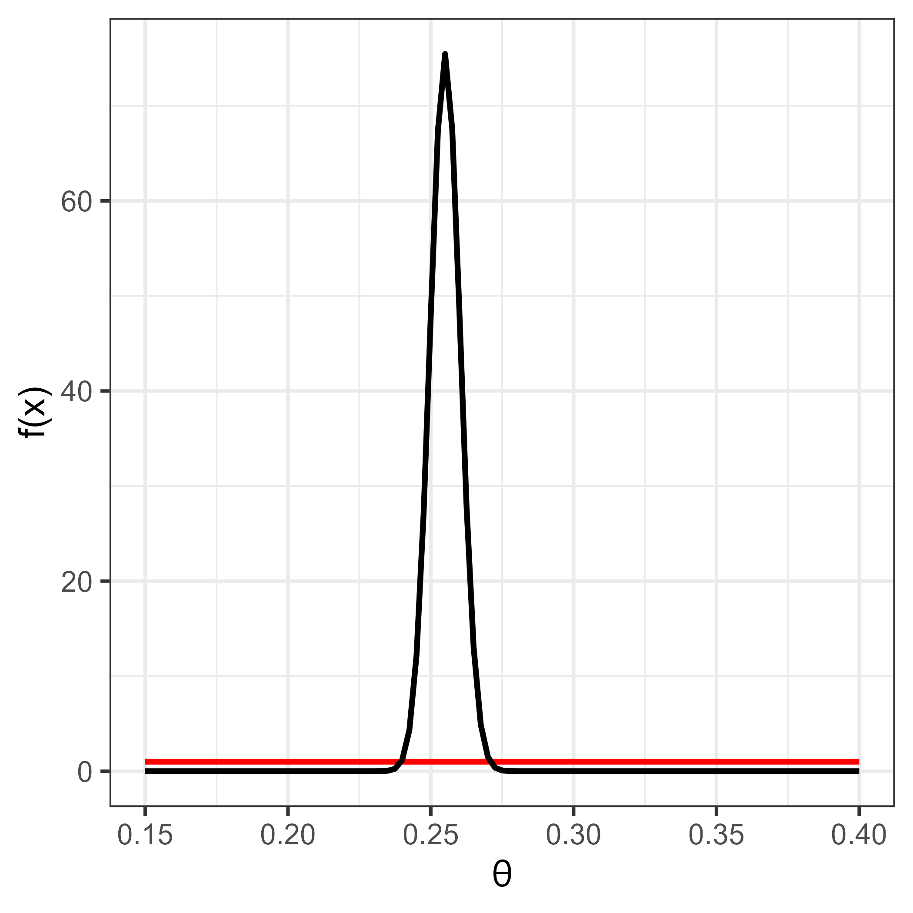
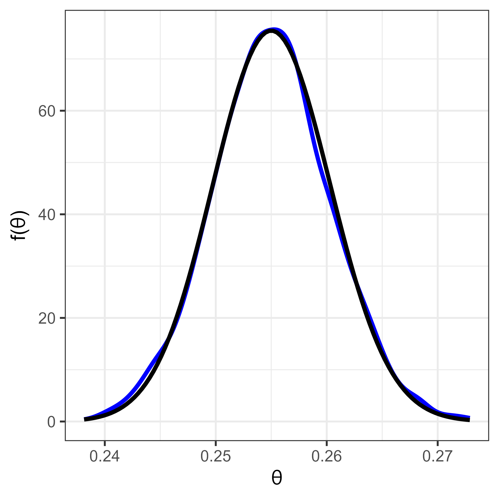
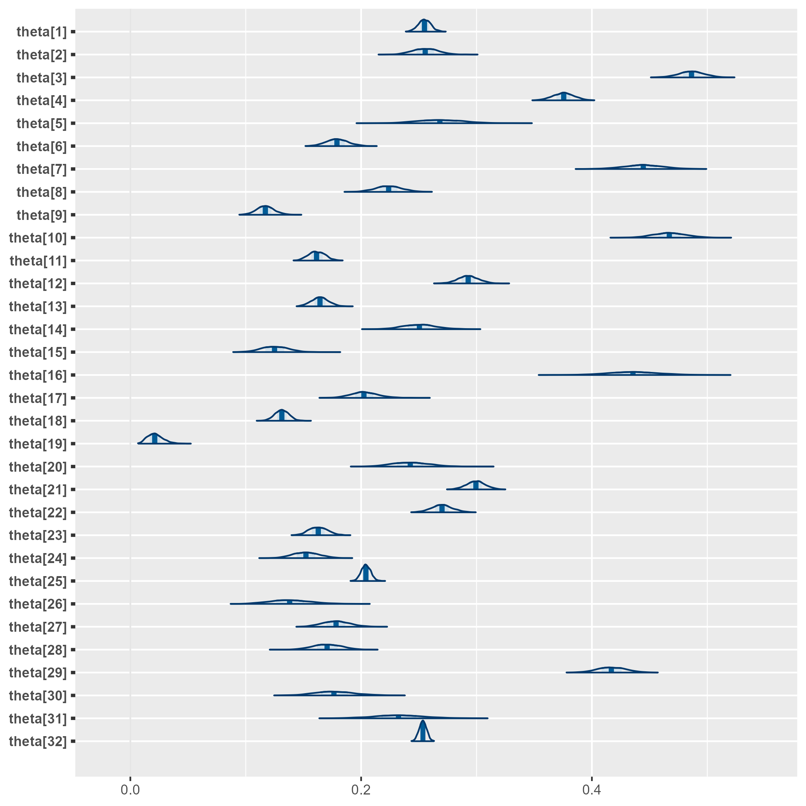
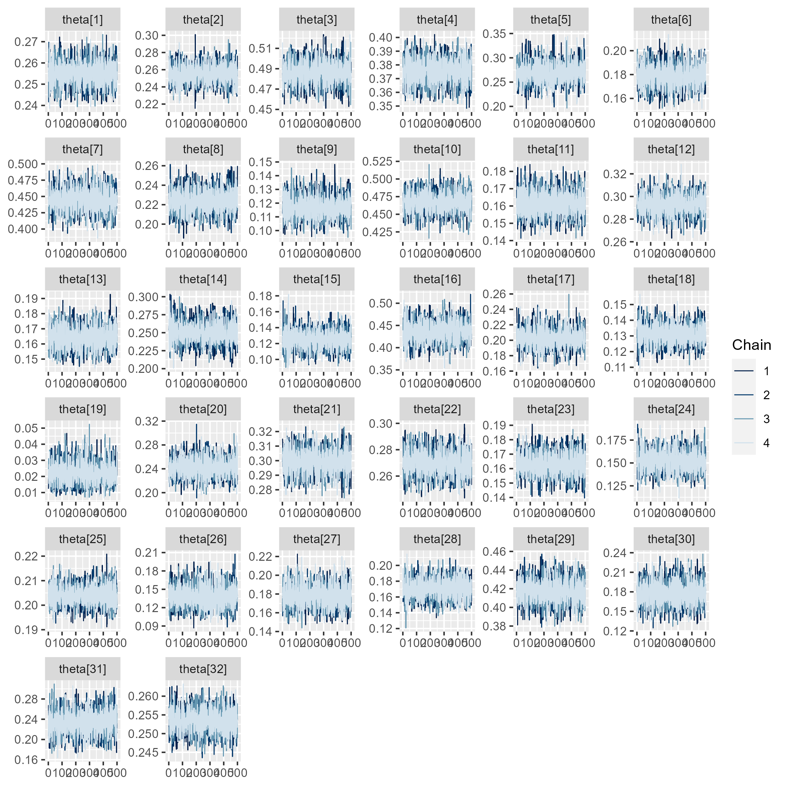
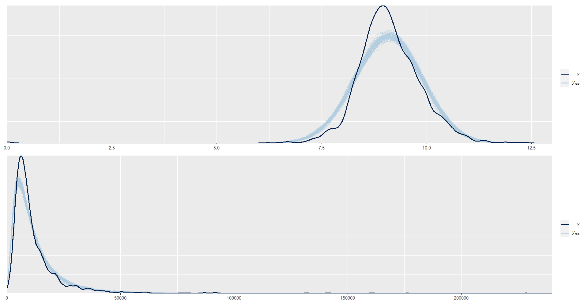
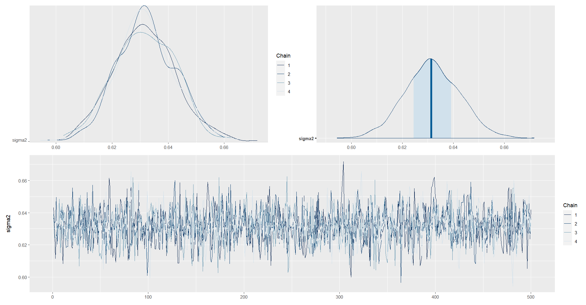
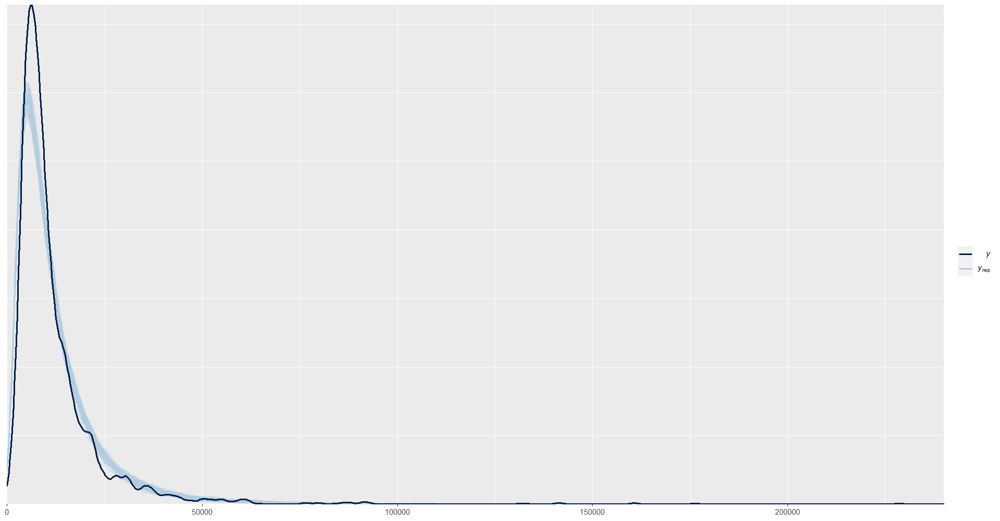
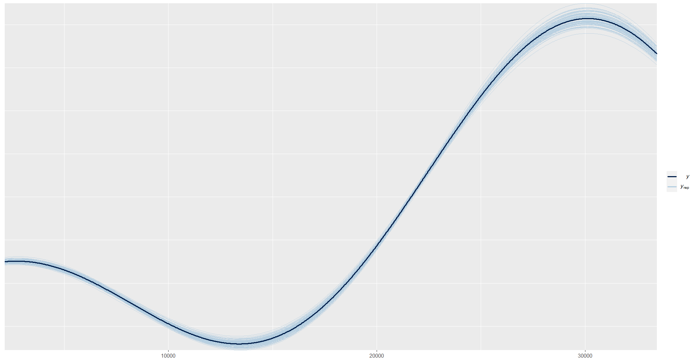

# Día 2 - Sesión 1- Fundamentos de la inferencia Bayesiana en R y STAN


[El proyecto Manhattan y la estimación desagregada con encuestas de hogares ](https://github.com/psirusteam/2023DOMsae/blob/main/Recursos/Docs/Slides/slides_SAEbayesiano.pdf)

# Día 2 - Sesión 1- Modelos sintéticos simples 


## Regla de Bayes

En términos de inferencia para $\boldsymbol{\theta}$, es necesario encontrar la distribución de los parámetros condicionada a la observación de los datos. Para este fin, es necesario definir la distribución conjunta de la variable de interés con el vector de parámetros.

$$
p(\boldsymbol{\theta},\mathbf{Y})=p(\boldsymbol{\theta})p(\mathbf{Y} \mid \boldsymbol{\theta})
$$

-   La distribución $p(\boldsymbol{\theta})$ se le conoce con el nombre de distribución previa.

-   El término $p(\mathbf{Y} \mid \boldsymbol{\theta})$ es la distribución de muestreo, verosimilitud o distribución de los datos.

-   La distribución del vector de parámetros condicionada a los datos observados está dada por

    $$
    p(\boldsymbol{\theta} \mid \mathbf{Y})=\frac{p(\boldsymbol{\theta},\mathbf{Y})}{p(\mathbf{Y})}=\frac{p(\boldsymbol{\theta})p(\mathbf{Y} \mid \boldsymbol{\theta})}{p(\mathbf{Y})}
    $$

-   A la distribución $p(\boldsymbol{\theta} \mid \mathbf{Y})$ se le conoce con el nombre de distribución ***posterior***. Nótese que el denominador no depende del vector de parámetros y considerando a los datos observados como fijos, corresponde a una constante y puede ser obviada. Por lo tanto, otra representación de la regla de Bayes está dada por

    $$
    p(\boldsymbol{\theta} \mid \mathbf{Y})\propto p(\mathbf{Y} \mid \boldsymbol{\theta})p(\boldsymbol{\theta})
    $$

## Inferencia Bayesiana.

En términos de estimación, inferencia y predicción, el enfoque Bayesiano supone dos momentos o etapas:

1.  **Antes de la recolección de las datos**, en donde el investigador propone, basado en su conocimiento, experiencia o fuentes externas, una distribución de probabilidad previa para el parámetro de interés.
2.  **Después de la recolección de los datos.** Siguiendo el teorema de Bayes, el investigador actualiza su conocimiento acerca del comportamiento probabilístico del parámetro de interés mediante la distribución posterior de este.

## Modelos uniparamétricos

Los modelos que están definidos en términos de un solo parámetro que pertenece al conjunto de los números reales se definen como modelos *uniparamétricos*.

### Modelo de unidad: Bernoulli

Suponga que $Y$ es una variable aleatoria con distribución Bernoulli dada por:

$$
p(Y \mid \theta)=\theta^y(1-\theta)^{1-y}I_{\{0,1\}}(y)
$$

Como el parámetro $\theta$ está restringido al espacio $\Theta=[0,1]$, entonces es posible formular varias opciones para la distribución previa del parámetro. En particular, la distribución uniforme restringida al intervalo $[0,1]$ o la distribución Beta parecen ser buenas opciones. Puesto que la distribución uniforme es un caso particular de la distribución Beta. Por lo tanto la distribución previa del parámetro $\theta$ estará dada por

$$
\begin{equation}
p(\theta \mid \alpha,\beta)=
\frac{1}{Beta(\alpha,\beta)}\theta^{\alpha-1}(1-\theta)^{\beta-1}I_{[0,1]}(\theta).
\end{equation}
$$

y la distribución posterior del parámetro $\theta$ sigue una distribución

$$
\begin{equation*}
\theta \mid Y \sim Beta(y+\alpha,\beta-y+1)
\end{equation*}
$$

Cuando se tiene una muestra aleatoria $Y_1,\ldots,Y_n$ de variables con distribución Bernoulli de parámetro $\theta$, entonces la distribución posterior del parámetro de interés es

$$
\begin{equation*}
\theta \mid Y_1,\ldots,Y_n \sim Beta\left(\sum_{i=1}^ny_i+\alpha,\beta-\sum_{i=1}^ny_i+n\right)
\end{equation*}
$$

#### Obejtivo {-}

Estimar la proporción de personas que están por debajo de la linea pobreza. Es decir, 
$$
P = \frac{\sum_{U}y_i}{N}
$$
donde $y_i$ toma el valor de 1 cuando el ingreso de la persona es menor a la linea de pobreza 0 en caso contrario

El estimador de $P$ esta dado por: 

$$
\hat{P} = \frac{\sum_{s}w_{i}y_{i}}{\sum_{s}{w_{i} }}
$$

con $w_i$ el factor de expansión para la $i-ésima$ observación. Además, y obtener $\widehat{Var}\left(\hat{P}\right)$.

#### Práctica en **R**


```r
library(tidyverse)
encuesta <- readRDS("Recursos/Día2/Sesion1/Data/encuestaDOM21N1.rds") 
```

Sea $Y$ la variable aleatoria

$$
Y_{i}=\begin{cases}
1 & ingreso<lp\\
0 & ingreso\geq lp
\end{cases}
$$


El tamaño de la muestra es de 6796 en la dam `1`


```r
datay <- encuesta %>% filter(dam_ee == 1) %>% 
  transmute(y = ifelse(ingcorte < lp, 1,0))
addmargins(table(datay$y))
```


<table>
 <thead>
  <tr>
   <th style="text-align:right;"> 0 </th>
   <th style="text-align:right;"> 1 </th>
   <th style="text-align:right;"> Sum </th>
  </tr>
 </thead>
<tbody>
  <tr>
   <td style="text-align:right;"> 5063 </td>
   <td style="text-align:right;"> 1733 </td>
   <td style="text-align:right;"> 6796 </td>
  </tr>
</tbody>
</table>


Un grupo de estadístico experto decide utilizar una distribución previa Beta, definiendo los parámetros de la distribución previa como $Beta(\alpha=1, \beta=1)$. La distribución posterior del parámetro de interés, que representa la probabilidad de estar por debajo de la linea de pobreza, es $Beta(1733 + 1, 1 - 1733 + 6796)=Beta(1734, 5064)$


<div class="figure" style="text-align: center">

<p class="caption">(\#fig:unnamed-chunk-5)Distribución previa (línea roja) y distribución posterior (línea negra)</p>
</div>

La estimación del parámetro estaría dado por:

$$
E(X) = \frac{\alpha}{\alpha + \beta} = \frac{1734}{1734+ 5064} = 0.255075
$$

luego, el intervalo de credibilidad para la distribución posterior es.


```r
n = length(datay$y)
n1 = sum(datay$y)
qbeta(c(0.025, 0.975),
      shape1 = 1 + n1,
      shape2 = 1 - n1 + n)
```

```
## [1] 0.2447824 0.2655041
```

#### Práctica en **STAN**

En `STAN` es posible obtener el mismo tipo de inferencia creando cuatro cadenas cuya distribución de probabilidad coincide con la distribución posterior del ejemplo.


```r
data {                         // Entrada el modelo 
  int<lower=0> n;              // Numero de observaciones  
  int y[n];                    // Vector de longitud n
  real a;
  real b;
}
parameters {                   // Definir parámetro
  real<lower=0, upper=1> theta;
}
model {                        // Definir modelo
  y ~ bernoulli(theta);
  theta ~ beta(a, b);      // Distribución previa 
}
generated quantities {
    real ypred[n];                    // vector de longitud n
    for (ii in 1:n){
    ypred[ii] = bernoulli_rng(theta);
    }
}
```

Para compilar *STAN* debemos definir los parámetros de entrada


```r
    sample_data <- list(n = nrow(datay),
                        y = datay$y,
                        a = 1,
                        b = 1)
```

Para ejecutar `STAN` en R tenemos la librería *rstan*


```r
library(rstan)
Bernoulli <- "Recursos/Día2/Sesion1/Data/modelosStan/1Bernoulli.stan"
```


```r
options(mc.cores = parallel::detectCores())
rstan::rstan_options(auto_write = TRUE) # speed up running time 
model_Bernoulli <- stan(
  file = Bernoulli,  # Stan program
  data = sample_data,    # named list of data
  verbose = FALSE,
  warmup = 500,          # number of warmup iterations per chain
  iter = 1000,            # total number of iterations per chain
  cores = 4,              # number of cores (could use one per chain)
)

saveRDS(model_Bernoulli,
        file = "Recursos/Día2/Sesion1/0Recursos/Bernoulli/model_Bernoulli.rds")

model_Bernoulli <- readRDS("Recursos/Día2/Sesion1/0Recursos/Bernoulli/model_Bernoulli.rds")
```

La estimación del parámetro $\theta$ es:


```r
tabla_Ber1 <- summary(model_Bernoulli, pars = "theta")$summary
tabla_Ber1 %>% tba()
```

<table class="table table-striped lightable-classic" style="width: auto !important; margin-left: auto; margin-right: auto; font-family: Arial Narrow; width: auto !important; margin-left: auto; margin-right: auto;">
 <thead>
  <tr>
   <th style="text-align:left;">   </th>
   <th style="text-align:right;"> mean </th>
   <th style="text-align:right;"> se_mean </th>
   <th style="text-align:right;"> sd </th>
   <th style="text-align:right;"> 2.5% </th>
   <th style="text-align:right;"> 25% </th>
   <th style="text-align:right;"> 50% </th>
   <th style="text-align:right;"> 75% </th>
   <th style="text-align:right;"> 97.5% </th>
   <th style="text-align:right;"> n_eff </th>
   <th style="text-align:right;"> Rhat </th>
  </tr>
 </thead>
<tbody>
  <tr>
   <td style="text-align:left;"> theta </td>
   <td style="text-align:right;"> 0.255 </td>
   <td style="text-align:right;"> 2e-04 </td>
   <td style="text-align:right;"> 0.0053 </td>
   <td style="text-align:right;"> 0.2445 </td>
   <td style="text-align:right;"> 0.2515 </td>
   <td style="text-align:right;"> 0.255 </td>
   <td style="text-align:right;"> 0.2584 </td>
   <td style="text-align:right;"> 0.2657 </td>
   <td style="text-align:right;"> 703.8891 </td>
   <td style="text-align:right;"> 1.0011 </td>
  </tr>
</tbody>
</table>

Para observar las cadenas compilamos las lineas de código


```r
library(posterior) 
library(ggplot2)
temp <- as_draws_df(as.array(model_Bernoulli,pars = "theta"))

p1 <- ggplot(data = temp, aes(x = theta))+ 
  geom_density(color = "blue", size = 2) +
  stat_function(fun = posterior1,
                args = list(y = datay$y),
                size = 2) + 
  theme_bw(base_size = 20) + 
  labs(x = latex2exp::TeX("\\theta"),
       y = latex2exp::TeX("f(\\theta)"))
#ggsave(filename = "Recursos/Día2/Sesion1/0Recursos/Bernoulli/Bernoulli2.png",plot = p1)
p1 
```

<div class="figure" style="text-align: center">

<p class="caption">(\#fig:unnamed-chunk-14)Resultado con STAN (línea azul) y posterior teórica (línea negra)</p>
</div>

Para validar las cadenas


```r
library(bayesplot)
library(patchwork)
posterior_theta <- as.array(model_Bernoulli, pars = "theta")
(mcmc_dens_chains(posterior_theta) +
    mcmc_areas(posterior_theta) ) / 
  traceplot(model_Bernoulli, pars = "theta", inc_warmup = T)
```


Predicción de $Y$ en cada una de las iteraciones de las cadenas.


```r
y_pred_B <- as.array(model_Bernoulli, pars = "ypred") %>% 
  as_draws_matrix()

rowsrandom <- sample(nrow(y_pred_B), 100)
y_pred2 <- y_pred_B[rowsrandom, 1:n]
ppc_dens_overlay(y = datay$y, y_pred2)
```


### Modelo de área: Binomial

Cuando se dispone de una muestra aleatoria de variables con distribución Bernoulli $Y_1,\ldots,Y_n$, la inferencia Bayesiana se puede llevar a cabo usando la distribución Binomial, puesto que es bien sabido que la suma de variables aleatorias Bernoulli

$$
\begin{equation*}
S=\sum_{i=1}^nY_i
\end{equation*}
$$

sigue una distribución Binomial. Es decir:

$$
\begin{equation}
p(S \mid \theta)=\binom{n}{s}\theta^s(1-\theta)^{n-s}I_{\{0,1,\ldots,n\}}(s),
\end{equation}
$$

Nótese que la distribución Binomial es un caso general para la distribución Bernoulli, cuando $n=1$. Por lo tanto es natural suponer que distribución previa del parámetro $\theta$ estará dada por

$$
\begin{equation}
p(\theta \mid \alpha,\beta)=
\frac{1}{Beta(\alpha,\beta)}\theta^{\alpha-1}(1-\theta)^{\beta-1}I_{[0,1]}(\theta).
\end{equation}
$$

La distribución posterior del parámetro $\theta$ sigue una distribución

$$
\begin{equation*}
\theta \mid S \sim Beta(s+\alpha,\beta-s+n)
\end{equation*}
$$

Ahora, cuando se tiene una sucesión de variables aleatorias $S_1,\ldots,S_d, \ldots,S_D$ independientes y con distribución $Binomial(n_d,\theta_d)$ para $d=1,\ldots,K$, entonces la distribución posterior del parámetro de interés $\theta_d$ es

$$
\begin{equation*}
\theta_d \mid s_d \sim Beta\left(s_d+\alpha,\ \beta+ n_d- s_d\right)
\end{equation*}
$$

#### Obejtivo {-}

Estimar la proporción de personas que están por debajo de la linea pobreza en el $d-ésimo$ dominio. Es decir, 

$$
P_d = \frac{\sum_{U_d}y_{di}}{N_d}
$$
donde $y_i$ toma el valor de 1 cuando el ingreso de la persona es menor a la linea de pobreza 0 en caso contrario. 

El estimador de $P$ esta dado por: 

$$
\hat{P_d} = \frac{\sum_{s_d}w_{di}y_{di}}{\sum_{s_d}{w_{di} }}
$$

con $w_{di}$ el factor de expansión para la $i-ésima$ observación en el $d-ésimo$ dominio. 


#### Práctica en **STAN**

Sea $S_k$ el conteo de personas en condición de pobreza en el $k-ésimo$ departamento en la muestra.


```r
dataS <- encuesta %>% 
  transmute(
    dam = dam_ee,
    y = ifelse(ingcorte < lp, 1,0)
  ) %>% group_by(dam) %>% 
  summarise(nd = n(),   #Número de ensayos 
            Sd = sum(y) #Número de éxito 
            )
tba(dataS)
```


<table class="table table-striped lightable-classic" style="width: auto !important; margin-left: auto; margin-right: auto; font-family: Arial Narrow; width: auto !important; margin-left: auto; margin-right: auto;">
 <thead>
  <tr>
   <th style="text-align:right;"> dam </th>
   <th style="text-align:right;"> nd </th>
   <th style="text-align:right;"> Sd </th>
  </tr>
 </thead>
<tbody>
  <tr>
   <td style="text-align:right;"> 1 </td>
   <td style="text-align:right;"> 6796 </td>
   <td style="text-align:right;"> 1733 </td>
  </tr>
  <tr>
   <td style="text-align:right;"> 2 </td>
   <td style="text-align:right;"> 1556 </td>
   <td style="text-align:right;"> 397 </td>
  </tr>
  <tr>
   <td style="text-align:right;"> 3 </td>
   <td style="text-align:right;"> 2013 </td>
   <td style="text-align:right;"> 979 </td>
  </tr>
  <tr>
   <td style="text-align:right;"> 4 </td>
   <td style="text-align:right;"> 2912 </td>
   <td style="text-align:right;"> 1093 </td>
  </tr>
  <tr>
   <td style="text-align:right;"> 5 </td>
   <td style="text-align:right;"> 466 </td>
   <td style="text-align:right;"> 125 </td>
  </tr>
  <tr>
   <td style="text-align:right;"> 6 </td>
   <td style="text-align:right;"> 1649 </td>
   <td style="text-align:right;"> 295 </td>
  </tr>
  <tr>
   <td style="text-align:right;"> 7 </td>
   <td style="text-align:right;"> 821 </td>
   <td style="text-align:right;"> 365 </td>
  </tr>
  <tr>
   <td style="text-align:right;"> 8 </td>
   <td style="text-align:right;"> 1199 </td>
   <td style="text-align:right;"> 268 </td>
  </tr>
  <tr>
   <td style="text-align:right;"> 9 </td>
   <td style="text-align:right;"> 2012 </td>
   <td style="text-align:right;"> 235 </td>
  </tr>
  <tr>
   <td style="text-align:right;"> 10 </td>
   <td style="text-align:right;"> 1200 </td>
   <td style="text-align:right;"> 561 </td>
  </tr>
  <tr>
   <td style="text-align:right;"> 11 </td>
   <td style="text-align:right;"> 2678 </td>
   <td style="text-align:right;"> 432 </td>
  </tr>
  <tr>
   <td style="text-align:right;"> 12 </td>
   <td style="text-align:right;"> 2543 </td>
   <td style="text-align:right;"> 744 </td>
  </tr>
  <tr>
   <td style="text-align:right;"> 13 </td>
   <td style="text-align:right;"> 2534 </td>
   <td style="text-align:right;"> 416 </td>
  </tr>
  <tr>
   <td style="text-align:right;"> 14 </td>
   <td style="text-align:right;"> 780 </td>
   <td style="text-align:right;"> 195 </td>
  </tr>
  <tr>
   <td style="text-align:right;"> 15 </td>
   <td style="text-align:right;"> 773 </td>
   <td style="text-align:right;"> 96 </td>
  </tr>
  <tr>
   <td style="text-align:right;"> 16 </td>
   <td style="text-align:right;"> 466 </td>
   <td style="text-align:right;"> 203 </td>
  </tr>
  <tr>
   <td style="text-align:right;"> 17 </td>
   <td style="text-align:right;"> 1059 </td>
   <td style="text-align:right;"> 214 </td>
  </tr>
  <tr>
   <td style="text-align:right;"> 18 </td>
   <td style="text-align:right;"> 2907 </td>
   <td style="text-align:right;"> 381 </td>
  </tr>
  <tr>
   <td style="text-align:right;"> 19 </td>
   <td style="text-align:right;"> 460 </td>
   <td style="text-align:right;"> 9 </td>
  </tr>
  <tr>
   <td style="text-align:right;"> 20 </td>
   <td style="text-align:right;"> 669 </td>
   <td style="text-align:right;"> 162 </td>
  </tr>
  <tr>
   <td style="text-align:right;"> 21 </td>
   <td style="text-align:right;"> 3381 </td>
   <td style="text-align:right;"> 1012 </td>
  </tr>
  <tr>
   <td style="text-align:right;"> 22 </td>
   <td style="text-align:right;"> 2318 </td>
   <td style="text-align:right;"> 625 </td>
  </tr>
  <tr>
   <td style="text-align:right;"> 23 </td>
   <td style="text-align:right;"> 2260 </td>
   <td style="text-align:right;"> 368 </td>
  </tr>
  <tr>
   <td style="text-align:right;"> 24 </td>
   <td style="text-align:right;"> 909 </td>
   <td style="text-align:right;"> 138 </td>
  </tr>
  <tr>
   <td style="text-align:right;"> 25 </td>
   <td style="text-align:right;"> 9011 </td>
   <td style="text-align:right;"> 1840 </td>
  </tr>
  <tr>
   <td style="text-align:right;"> 26 </td>
   <td style="text-align:right;"> 401 </td>
   <td style="text-align:right;"> 55 </td>
  </tr>
  <tr>
   <td style="text-align:right;"> 27 </td>
   <td style="text-align:right;"> 963 </td>
   <td style="text-align:right;"> 171 </td>
  </tr>
  <tr>
   <td style="text-align:right;"> 28 </td>
   <td style="text-align:right;"> 923 </td>
   <td style="text-align:right;"> 157 </td>
  </tr>
  <tr>
   <td style="text-align:right;"> 29 </td>
   <td style="text-align:right;"> 1619 </td>
   <td style="text-align:right;"> 675 </td>
  </tr>
  <tr>
   <td style="text-align:right;"> 30 </td>
   <td style="text-align:right;"> 478 </td>
   <td style="text-align:right;"> 84 </td>
  </tr>
  <tr>
   <td style="text-align:right;"> 31 </td>
   <td style="text-align:right;"> 346 </td>
   <td style="text-align:right;"> 80 </td>
  </tr>
  <tr>
   <td style="text-align:right;"> 32 </td>
   <td style="text-align:right;"> 17969 </td>
   <td style="text-align:right;"> 4554 </td>
  </tr>
</tbody>
</table>

Creando código de `STAN`


```r
data {
  int<lower=0> K;                 // Número de provincia  
  int<lower=0> n[K];              // Número de ensayos 
  int<lower=0> s[K];              // Número de éxitos
  real a;
  real b;
}
parameters {
  real<lower=0, upper=1> theta[K]; // theta_d|s_d
}
model {
  for(kk in 1:K) {
  s[kk] ~ binomial(n[kk], theta[kk]);
  }
  to_vector(theta) ~ beta(a, b);
}

generated quantities {
    real spred[K];                    // vector de longitud K
    for(kk in 1:K){
    spred[kk] = binomial_rng(n[kk],theta[kk]);
}
}
```

Preparando el código de `STAN`


```r
Binomial2 <- "Recursos/Día2/Sesion1/Data/modelosStan/3Binomial.stan"
```

Organizando datos para `STAN`


```r
sample_data <- list(K = nrow(dataS),
                    s = dataS$Sd,
                    n = dataS$nd,
                    a = 1,
                    b = 1)
```

Para ejecutar `STAN` en R tenemos la librería *rstan*


```r
options(mc.cores = parallel::detectCores())
model_Binomial2 <- stan(
  file = Binomial2,  # Stan program
  data = sample_data,    # named list of data
  verbose = FALSE,
  warmup = 500,          # number of warmup iterations per chain
  iter = 1000,            # total number of iterations per chain
  cores = 4,              # number of cores (could use one per chain)
)

saveRDS(model_Binomial2, "Recursos/Día2/Sesion1/0Recursos/Binomial/model_Binomial2.rds")
model_Binomial2 <- readRDS("Recursos/Día2/Sesion1/0Recursos/Binomial/model_Binomial2.rds")
```

La estimación del parámetro $\theta$ es:


```r
tabla_Bin1 <-summary(model_Binomial2, pars = "theta")$summary 
tabla_Bin1 %>% tba()
```

<table class="table table-striped lightable-classic" style="width: auto !important; margin-left: auto; margin-right: auto; font-family: Arial Narrow; width: auto !important; margin-left: auto; margin-right: auto;">
 <thead>
  <tr>
   <th style="text-align:left;">   </th>
   <th style="text-align:right;"> mean </th>
   <th style="text-align:right;"> se_mean </th>
   <th style="text-align:right;"> sd </th>
   <th style="text-align:right;"> 2.5% </th>
   <th style="text-align:right;"> 25% </th>
   <th style="text-align:right;"> 50% </th>
   <th style="text-align:right;"> 75% </th>
   <th style="text-align:right;"> 97.5% </th>
   <th style="text-align:right;"> n_eff </th>
   <th style="text-align:right;"> Rhat </th>
  </tr>
 </thead>
<tbody>
  <tr>
   <td style="text-align:left;"> theta[1] </td>
   <td style="text-align:right;"> 0.2550 </td>
   <td style="text-align:right;"> 1e-04 </td>
   <td style="text-align:right;"> 0.0054 </td>
   <td style="text-align:right;"> 0.2443 </td>
   <td style="text-align:right;"> 0.2514 </td>
   <td style="text-align:right;"> 0.2549 </td>
   <td style="text-align:right;"> 0.2586 </td>
   <td style="text-align:right;"> 0.2663 </td>
   <td style="text-align:right;"> 5541.426 </td>
   <td style="text-align:right;"> 0.9984 </td>
  </tr>
  <tr>
   <td style="text-align:left;"> theta[2] </td>
   <td style="text-align:right;"> 0.2557 </td>
   <td style="text-align:right;"> 2e-04 </td>
   <td style="text-align:right;"> 0.0111 </td>
   <td style="text-align:right;"> 0.2346 </td>
   <td style="text-align:right;"> 0.2480 </td>
   <td style="text-align:right;"> 0.2555 </td>
   <td style="text-align:right;"> 0.2633 </td>
   <td style="text-align:right;"> 0.2775 </td>
   <td style="text-align:right;"> 4685.553 </td>
   <td style="text-align:right;"> 0.9988 </td>
  </tr>
  <tr>
   <td style="text-align:left;"> theta[3] </td>
   <td style="text-align:right;"> 0.4863 </td>
   <td style="text-align:right;"> 2e-04 </td>
   <td style="text-align:right;"> 0.0112 </td>
   <td style="text-align:right;"> 0.4639 </td>
   <td style="text-align:right;"> 0.4790 </td>
   <td style="text-align:right;"> 0.4863 </td>
   <td style="text-align:right;"> 0.4937 </td>
   <td style="text-align:right;"> 0.5081 </td>
   <td style="text-align:right;"> 4275.709 </td>
   <td style="text-align:right;"> 0.9995 </td>
  </tr>
  <tr>
   <td style="text-align:left;"> theta[4] </td>
   <td style="text-align:right;"> 0.3754 </td>
   <td style="text-align:right;"> 1e-04 </td>
   <td style="text-align:right;"> 0.0090 </td>
   <td style="text-align:right;"> 0.3578 </td>
   <td style="text-align:right;"> 0.3692 </td>
   <td style="text-align:right;"> 0.3756 </td>
   <td style="text-align:right;"> 0.3815 </td>
   <td style="text-align:right;"> 0.3930 </td>
   <td style="text-align:right;"> 4356.266 </td>
   <td style="text-align:right;"> 0.9993 </td>
  </tr>
  <tr>
   <td style="text-align:left;"> theta[5] </td>
   <td style="text-align:right;"> 0.2688 </td>
   <td style="text-align:right;"> 3e-04 </td>
   <td style="text-align:right;"> 0.0210 </td>
   <td style="text-align:right;"> 0.2310 </td>
   <td style="text-align:right;"> 0.2543 </td>
   <td style="text-align:right;"> 0.2682 </td>
   <td style="text-align:right;"> 0.2831 </td>
   <td style="text-align:right;"> 0.3099 </td>
   <td style="text-align:right;"> 5505.855 </td>
   <td style="text-align:right;"> 0.9987 </td>
  </tr>
  <tr>
   <td style="text-align:left;"> theta[6] </td>
   <td style="text-align:right;"> 0.1792 </td>
   <td style="text-align:right;"> 1e-04 </td>
   <td style="text-align:right;"> 0.0095 </td>
   <td style="text-align:right;"> 0.1612 </td>
   <td style="text-align:right;"> 0.1729 </td>
   <td style="text-align:right;"> 0.1790 </td>
   <td style="text-align:right;"> 0.1858 </td>
   <td style="text-align:right;"> 0.1983 </td>
   <td style="text-align:right;"> 5539.281 </td>
   <td style="text-align:right;"> 0.9985 </td>
  </tr>
  <tr>
   <td style="text-align:left;"> theta[7] </td>
   <td style="text-align:right;"> 0.4447 </td>
   <td style="text-align:right;"> 3e-04 </td>
   <td style="text-align:right;"> 0.0172 </td>
   <td style="text-align:right;"> 0.4108 </td>
   <td style="text-align:right;"> 0.4336 </td>
   <td style="text-align:right;"> 0.4445 </td>
   <td style="text-align:right;"> 0.4562 </td>
   <td style="text-align:right;"> 0.4795 </td>
   <td style="text-align:right;"> 4289.643 </td>
   <td style="text-align:right;"> 0.9989 </td>
  </tr>
  <tr>
   <td style="text-align:left;"> theta[8] </td>
   <td style="text-align:right;"> 0.2240 </td>
   <td style="text-align:right;"> 2e-04 </td>
   <td style="text-align:right;"> 0.0115 </td>
   <td style="text-align:right;"> 0.2019 </td>
   <td style="text-align:right;"> 0.2161 </td>
   <td style="text-align:right;"> 0.2238 </td>
   <td style="text-align:right;"> 0.2315 </td>
   <td style="text-align:right;"> 0.2470 </td>
   <td style="text-align:right;"> 4261.208 </td>
   <td style="text-align:right;"> 0.9993 </td>
  </tr>
  <tr>
   <td style="text-align:left;"> theta[9] </td>
   <td style="text-align:right;"> 0.1172 </td>
   <td style="text-align:right;"> 1e-04 </td>
   <td style="text-align:right;"> 0.0077 </td>
   <td style="text-align:right;"> 0.1023 </td>
   <td style="text-align:right;"> 0.1121 </td>
   <td style="text-align:right;"> 0.1170 </td>
   <td style="text-align:right;"> 0.1222 </td>
   <td style="text-align:right;"> 0.1328 </td>
   <td style="text-align:right;"> 3835.345 </td>
   <td style="text-align:right;"> 0.9994 </td>
  </tr>
  <tr>
   <td style="text-align:left;"> theta[10] </td>
   <td style="text-align:right;"> 0.4673 </td>
   <td style="text-align:right;"> 2e-04 </td>
   <td style="text-align:right;"> 0.0142 </td>
   <td style="text-align:right;"> 0.4402 </td>
   <td style="text-align:right;"> 0.4577 </td>
   <td style="text-align:right;"> 0.4671 </td>
   <td style="text-align:right;"> 0.4769 </td>
   <td style="text-align:right;"> 0.4949 </td>
   <td style="text-align:right;"> 5121.700 </td>
   <td style="text-align:right;"> 0.9992 </td>
  </tr>
  <tr>
   <td style="text-align:left;"> theta[11] </td>
   <td style="text-align:right;"> 0.1617 </td>
   <td style="text-align:right;"> 1e-04 </td>
   <td style="text-align:right;"> 0.0071 </td>
   <td style="text-align:right;"> 0.1483 </td>
   <td style="text-align:right;"> 0.1568 </td>
   <td style="text-align:right;"> 0.1614 </td>
   <td style="text-align:right;"> 0.1667 </td>
   <td style="text-align:right;"> 0.1760 </td>
   <td style="text-align:right;"> 5501.146 </td>
   <td style="text-align:right;"> 0.9983 </td>
  </tr>
  <tr>
   <td style="text-align:left;"> theta[12] </td>
   <td style="text-align:right;"> 0.2930 </td>
   <td style="text-align:right;"> 1e-04 </td>
   <td style="text-align:right;"> 0.0089 </td>
   <td style="text-align:right;"> 0.2759 </td>
   <td style="text-align:right;"> 0.2870 </td>
   <td style="text-align:right;"> 0.2928 </td>
   <td style="text-align:right;"> 0.2988 </td>
   <td style="text-align:right;"> 0.3105 </td>
   <td style="text-align:right;"> 4834.824 </td>
   <td style="text-align:right;"> 0.9987 </td>
  </tr>
  <tr>
   <td style="text-align:left;"> theta[13] </td>
   <td style="text-align:right;"> 0.1644 </td>
   <td style="text-align:right;"> 1e-04 </td>
   <td style="text-align:right;"> 0.0073 </td>
   <td style="text-align:right;"> 0.1503 </td>
   <td style="text-align:right;"> 0.1595 </td>
   <td style="text-align:right;"> 0.1643 </td>
   <td style="text-align:right;"> 0.1691 </td>
   <td style="text-align:right;"> 0.1788 </td>
   <td style="text-align:right;"> 5452.961 </td>
   <td style="text-align:right;"> 0.9981 </td>
  </tr>
  <tr>
   <td style="text-align:left;"> theta[14] </td>
   <td style="text-align:right;"> 0.2505 </td>
   <td style="text-align:right;"> 2e-04 </td>
   <td style="text-align:right;"> 0.0148 </td>
   <td style="text-align:right;"> 0.2216 </td>
   <td style="text-align:right;"> 0.2404 </td>
   <td style="text-align:right;"> 0.2505 </td>
   <td style="text-align:right;"> 0.2598 </td>
   <td style="text-align:right;"> 0.2813 </td>
   <td style="text-align:right;"> 3949.950 </td>
   <td style="text-align:right;"> 0.9985 </td>
  </tr>
  <tr>
   <td style="text-align:left;"> theta[15] </td>
   <td style="text-align:right;"> 0.1253 </td>
   <td style="text-align:right;"> 2e-04 </td>
   <td style="text-align:right;"> 0.0120 </td>
   <td style="text-align:right;"> 0.1024 </td>
   <td style="text-align:right;"> 0.1170 </td>
   <td style="text-align:right;"> 0.1250 </td>
   <td style="text-align:right;"> 0.1334 </td>
   <td style="text-align:right;"> 0.1484 </td>
   <td style="text-align:right;"> 3561.371 </td>
   <td style="text-align:right;"> 0.9985 </td>
  </tr>
  <tr>
   <td style="text-align:left;"> theta[16] </td>
   <td style="text-align:right;"> 0.4359 </td>
   <td style="text-align:right;"> 3e-04 </td>
   <td style="text-align:right;"> 0.0228 </td>
   <td style="text-align:right;"> 0.3920 </td>
   <td style="text-align:right;"> 0.4206 </td>
   <td style="text-align:right;"> 0.4356 </td>
   <td style="text-align:right;"> 0.4507 </td>
   <td style="text-align:right;"> 0.4811 </td>
   <td style="text-align:right;"> 4413.229 </td>
   <td style="text-align:right;"> 0.9989 </td>
  </tr>
  <tr>
   <td style="text-align:left;"> theta[17] </td>
   <td style="text-align:right;"> 0.2030 </td>
   <td style="text-align:right;"> 2e-04 </td>
   <td style="text-align:right;"> 0.0122 </td>
   <td style="text-align:right;"> 0.1803 </td>
   <td style="text-align:right;"> 0.1949 </td>
   <td style="text-align:right;"> 0.2024 </td>
   <td style="text-align:right;"> 0.2106 </td>
   <td style="text-align:right;"> 0.2285 </td>
   <td style="text-align:right;"> 3553.277 </td>
   <td style="text-align:right;"> 0.9984 </td>
  </tr>
  <tr>
   <td style="text-align:left;"> theta[18] </td>
   <td style="text-align:right;"> 0.1313 </td>
   <td style="text-align:right;"> 1e-04 </td>
   <td style="text-align:right;"> 0.0061 </td>
   <td style="text-align:right;"> 0.1193 </td>
   <td style="text-align:right;"> 0.1272 </td>
   <td style="text-align:right;"> 0.1313 </td>
   <td style="text-align:right;"> 0.1355 </td>
   <td style="text-align:right;"> 0.1428 </td>
   <td style="text-align:right;"> 3265.019 </td>
   <td style="text-align:right;"> 0.9987 </td>
  </tr>
  <tr>
   <td style="text-align:left;"> theta[19] </td>
   <td style="text-align:right;"> 0.0217 </td>
   <td style="text-align:right;"> 1e-04 </td>
   <td style="text-align:right;"> 0.0068 </td>
   <td style="text-align:right;"> 0.0105 </td>
   <td style="text-align:right;"> 0.0168 </td>
   <td style="text-align:right;"> 0.0211 </td>
   <td style="text-align:right;"> 0.0258 </td>
   <td style="text-align:right;"> 0.0367 </td>
   <td style="text-align:right;"> 4589.526 </td>
   <td style="text-align:right;"> 0.9989 </td>
  </tr>
  <tr>
   <td style="text-align:left;"> theta[20] </td>
   <td style="text-align:right;"> 0.2427 </td>
   <td style="text-align:right;"> 3e-04 </td>
   <td style="text-align:right;"> 0.0163 </td>
   <td style="text-align:right;"> 0.2119 </td>
   <td style="text-align:right;"> 0.2310 </td>
   <td style="text-align:right;"> 0.2426 </td>
   <td style="text-align:right;"> 0.2539 </td>
   <td style="text-align:right;"> 0.2754 </td>
   <td style="text-align:right;"> 3692.533 </td>
   <td style="text-align:right;"> 0.9985 </td>
  </tr>
  <tr>
   <td style="text-align:left;"> theta[21] </td>
   <td style="text-align:right;"> 0.2995 </td>
   <td style="text-align:right;"> 1e-04 </td>
   <td style="text-align:right;"> 0.0081 </td>
   <td style="text-align:right;"> 0.2833 </td>
   <td style="text-align:right;"> 0.2941 </td>
   <td style="text-align:right;"> 0.2995 </td>
   <td style="text-align:right;"> 0.3047 </td>
   <td style="text-align:right;"> 0.3152 </td>
   <td style="text-align:right;"> 4654.262 </td>
   <td style="text-align:right;"> 0.9994 </td>
  </tr>
  <tr>
   <td style="text-align:left;"> theta[22] </td>
   <td style="text-align:right;"> 0.2701 </td>
   <td style="text-align:right;"> 1e-04 </td>
   <td style="text-align:right;"> 0.0091 </td>
   <td style="text-align:right;"> 0.2520 </td>
   <td style="text-align:right;"> 0.2642 </td>
   <td style="text-align:right;"> 0.2701 </td>
   <td style="text-align:right;"> 0.2759 </td>
   <td style="text-align:right;"> 0.2884 </td>
   <td style="text-align:right;"> 4987.638 </td>
   <td style="text-align:right;"> 0.9986 </td>
  </tr>
  <tr>
   <td style="text-align:left;"> theta[23] </td>
   <td style="text-align:right;"> 0.1630 </td>
   <td style="text-align:right;"> 1e-04 </td>
   <td style="text-align:right;"> 0.0080 </td>
   <td style="text-align:right;"> 0.1477 </td>
   <td style="text-align:right;"> 0.1573 </td>
   <td style="text-align:right;"> 0.1628 </td>
   <td style="text-align:right;"> 0.1684 </td>
   <td style="text-align:right;"> 0.1788 </td>
   <td style="text-align:right;"> 3848.725 </td>
   <td style="text-align:right;"> 0.9985 </td>
  </tr>
  <tr>
   <td style="text-align:left;"> theta[24] </td>
   <td style="text-align:right;"> 0.1524 </td>
   <td style="text-align:right;"> 2e-04 </td>
   <td style="text-align:right;"> 0.0114 </td>
   <td style="text-align:right;"> 0.1310 </td>
   <td style="text-align:right;"> 0.1442 </td>
   <td style="text-align:right;"> 0.1522 </td>
   <td style="text-align:right;"> 0.1603 </td>
   <td style="text-align:right;"> 0.1752 </td>
   <td style="text-align:right;"> 3602.961 </td>
   <td style="text-align:right;"> 0.9989 </td>
  </tr>
  <tr>
   <td style="text-align:left;"> theta[25] </td>
   <td style="text-align:right;"> 0.2042 </td>
   <td style="text-align:right;"> 1e-04 </td>
   <td style="text-align:right;"> 0.0041 </td>
   <td style="text-align:right;"> 0.1964 </td>
   <td style="text-align:right;"> 0.2014 </td>
   <td style="text-align:right;"> 0.2041 </td>
   <td style="text-align:right;"> 0.2070 </td>
   <td style="text-align:right;"> 0.2122 </td>
   <td style="text-align:right;"> 4184.041 </td>
   <td style="text-align:right;"> 0.9995 </td>
  </tr>
  <tr>
   <td style="text-align:left;"> theta[26] </td>
   <td style="text-align:right;"> 0.1388 </td>
   <td style="text-align:right;"> 3e-04 </td>
   <td style="text-align:right;"> 0.0177 </td>
   <td style="text-align:right;"> 0.1069 </td>
   <td style="text-align:right;"> 0.1265 </td>
   <td style="text-align:right;"> 0.1381 </td>
   <td style="text-align:right;"> 0.1505 </td>
   <td style="text-align:right;"> 0.1760 </td>
   <td style="text-align:right;"> 4957.831 </td>
   <td style="text-align:right;"> 0.9985 </td>
  </tr>
  <tr>
   <td style="text-align:left;"> theta[27] </td>
   <td style="text-align:right;"> 0.1783 </td>
   <td style="text-align:right;"> 2e-04 </td>
   <td style="text-align:right;"> 0.0118 </td>
   <td style="text-align:right;"> 0.1560 </td>
   <td style="text-align:right;"> 0.1700 </td>
   <td style="text-align:right;"> 0.1783 </td>
   <td style="text-align:right;"> 0.1863 </td>
   <td style="text-align:right;"> 0.2028 </td>
   <td style="text-align:right;"> 4550.942 </td>
   <td style="text-align:right;"> 0.9987 </td>
  </tr>
  <tr>
   <td style="text-align:left;"> theta[28] </td>
   <td style="text-align:right;"> 0.1706 </td>
   <td style="text-align:right;"> 2e-04 </td>
   <td style="text-align:right;"> 0.0125 </td>
   <td style="text-align:right;"> 0.1467 </td>
   <td style="text-align:right;"> 0.1618 </td>
   <td style="text-align:right;"> 0.1705 </td>
   <td style="text-align:right;"> 0.1796 </td>
   <td style="text-align:right;"> 0.1950 </td>
   <td style="text-align:right;"> 4629.408 </td>
   <td style="text-align:right;"> 0.9993 </td>
  </tr>
  <tr>
   <td style="text-align:left;"> theta[29] </td>
   <td style="text-align:right;"> 0.4171 </td>
   <td style="text-align:right;"> 2e-04 </td>
   <td style="text-align:right;"> 0.0126 </td>
   <td style="text-align:right;"> 0.3926 </td>
   <td style="text-align:right;"> 0.4084 </td>
   <td style="text-align:right;"> 0.4168 </td>
   <td style="text-align:right;"> 0.4257 </td>
   <td style="text-align:right;"> 0.4418 </td>
   <td style="text-align:right;"> 5023.648 </td>
   <td style="text-align:right;"> 0.9989 </td>
  </tr>
  <tr>
   <td style="text-align:left;"> theta[30] </td>
   <td style="text-align:right;"> 0.1772 </td>
   <td style="text-align:right;"> 3e-04 </td>
   <td style="text-align:right;"> 0.0176 </td>
   <td style="text-align:right;"> 0.1442 </td>
   <td style="text-align:right;"> 0.1651 </td>
   <td style="text-align:right;"> 0.1764 </td>
   <td style="text-align:right;"> 0.1884 </td>
   <td style="text-align:right;"> 0.2137 </td>
   <td style="text-align:right;"> 4571.020 </td>
   <td style="text-align:right;"> 0.9988 </td>
  </tr>
  <tr>
   <td style="text-align:left;"> theta[31] </td>
   <td style="text-align:right;"> 0.2328 </td>
   <td style="text-align:right;"> 4e-04 </td>
   <td style="text-align:right;"> 0.0227 </td>
   <td style="text-align:right;"> 0.1895 </td>
   <td style="text-align:right;"> 0.2177 </td>
   <td style="text-align:right;"> 0.2324 </td>
   <td style="text-align:right;"> 0.2477 </td>
   <td style="text-align:right;"> 0.2811 </td>
   <td style="text-align:right;"> 4051.155 </td>
   <td style="text-align:right;"> 0.9993 </td>
  </tr>
  <tr>
   <td style="text-align:left;"> theta[32] </td>
   <td style="text-align:right;"> 0.2535 </td>
   <td style="text-align:right;"> 1e-04 </td>
   <td style="text-align:right;"> 0.0032 </td>
   <td style="text-align:right;"> 0.2473 </td>
   <td style="text-align:right;"> 0.2514 </td>
   <td style="text-align:right;"> 0.2535 </td>
   <td style="text-align:right;"> 0.2557 </td>
   <td style="text-align:right;"> 0.2597 </td>
   <td style="text-align:right;"> 3530.149 </td>
   <td style="text-align:right;"> 0.9992 </td>
  </tr>
</tbody>
</table>


Para validar las cadenas


```r
(s1 <- mcmc_areas(as.array(model_Binomial2, pars = "theta")))
# ggsave(filename = "Recursos/Día2/Sesion1/0Recursos/Binomial/Binomial1.png",plot = s1)
```




```r
(s2 <- mcmc_trace(as.array(model_Binomial2, pars = "theta")))
# ggsave(filename = "Recursos/Día2/Sesion1/0Recursos/Binomial/Binomial2.png",
# plot = s2,width = 20, height = 20, units = "cm")
```





```r
y_pred_B <- as.array(model_Binomial2, pars = "spred") %>% 
  as_draws_matrix()

rowsrandom <- sample(nrow(y_pred_B), 200)
y_pred2 <- y_pred_B[rowsrandom, ]
g1 <- ggplot(data = dataS, aes(x = Sd))+
  geom_histogram(aes(y = ..density..)) +
  geom_density(size = 2, color = "blue") +
  labs(y = "")+
  theme_bw(10) + 
  yaxis_title(FALSE) + xaxis_title(FALSE) + yaxis_text(FALSE) + 
        yaxis_ticks(FALSE)
g2 <- ppc_dens_overlay(y = dataS$Sd, y_pred2) 
g1/g2
```


### Modelo de unidad: Normal con media desconocida

Suponga que $Y_1,\cdots,Y_n$ son variables independientes e idénticamente distribuidos con distribución $Normal(\theta,\sigma^2)$ con $\theta$ desconocido pero $\sigma^2$ conocido. De esta forma, la función de verosimilitud de los datos está dada por

$$
\begin{align*}
p(\mathbf{Y} \mid \theta)
&=\prod_{i=1}^n\frac{1}{\sqrt{2\pi\sigma^2}}\exp\left\{-\frac{1}{2\sigma^2}(y_i-\theta)^2\right\}I_\mathbb{R}(y) \\
&=(2\pi\sigma^2)^{-n/2}\exp\left\{-\frac{1}{2\sigma^2}\sum_{i=1}^n(y_i-\theta)^2\right\}
\end{align*}
$$

Como el parámetro $\theta$ puede tomar cualquier valor en los reales, es posible asignarle una distribución previa $\theta \sim Normal(\mu,\tau^2)$. Bajo este marco de referencia se tienen los siguientes resultados

La distribución posterior del parámetro de interés $\theta$ sigue una distribución

$$
\begin{equation*}
\theta|\mathbf{Y} \sim Normal(\mu_n,\tau^2_n)
\end{equation*}
$$

En donde

$$
\begin{equation}
\mu_n=\frac{\frac{n}{\sigma^2}\bar{Y}+\frac{1}{\tau^2}\mu}{\frac{n}{\sigma^2}+\frac{1}{\tau^2}}
\ \ \ \ \ \ \ \text{y} \ \ \ \ \ \ \
\tau_n^2=\left(\frac{n}{\sigma^2}+\frac{1}{\tau^2}\right)^{-1}
\end{equation}
$$

#### Obejtivo {-}

Estimar el ingreso medio de la población, es decir, 

$$
\bar{Y} = \frac{\sum_Uy_i}{N}
$$
donde, $y_i$ es el ingreso de las personas. El estimador de $\bar{Y}$ esta dado por 
$$
\hat{\bar{Y}} = \frac{\sum_{s}w_{i}y_{i}}{\sum_s{w_i}}
$$
y obtener $\widehat{Var}\left(\hat{\bar{Y}}\right)$.

#### Práctica en **STAN**

Sea $Y$ el logaritmo del ingreso


```r
dataNormal <- encuesta %>%
    transmute(
     dam_ee ,
  logIngreso = log(ingcorte +1)) %>% 
  filter(dam_ee == 1)
#3
media <- mean(dataNormal$logIngreso)
Sd <- sd(dataNormal$logIngreso)

g1 <- ggplot(dataNormal,aes(x = logIngreso))+ 
  geom_density(size = 2, color = "blue") +
  stat_function(fun =dnorm, 
                args = list(mean = media, sd = Sd),
                size =2) +
  theme_bw(base_size = 20) + 
  labs(y = "", x = ("Log(Ingreso)"))

g2 <- ggplot(dataNormal, aes(sample = logIngreso)) +
     stat_qq() + stat_qq_line() +
  theme_bw(base_size = 20) 
g1|g2
```


Creando código de `STAN`


```r
data {
  int<lower=0> n;     // Número de observaciones
  real y[n];          // LogIngreso 
  real <lower=0> Sigma;  // Desviación estándar   
}
parameters {
  real theta;
}
model {
  y ~ normal(theta, Sigma);
  theta ~ normal(0, 1000); // Distribución previa
}
generated quantities {
    real ypred[n];                    // Vector de longitud n
    for(kk in 1:n){
    ypred[kk] = normal_rng(theta,Sigma);
}
}
```

Preparando el código de `STAN`


```r
NormalMedia <- "Recursos/Día2/Sesion1/Data/modelosStan/4NormalMedia.stan" 
```

Organizando datos para `STAN`


```r
sample_data <- list(n = nrow(dataNormal),
                    Sigma = sd(dataNormal$logIngreso),
                    y = dataNormal$logIngreso)
```

Para ejecutar `STAN` en R tenemos la librería *rstan*


```r
options(mc.cores = parallel::detectCores())
model_NormalMedia <- stan(
  file = NormalMedia,  
  data = sample_data,   
  verbose = FALSE,
  warmup = 500,         
  iter = 1000,            
  cores = 4              
)
saveRDS(model_NormalMedia, "Recursos/Día2/Sesion1/0Recursos/Normal/model_NormalMedia.rds")
model_NormalMedia <- 
  readRDS("Recursos/Día2/Sesion1/0Recursos/Normal/model_NormalMedia.rds")
```

La estimación del parámetro $\theta$ es:


```r
tabla_Nor1 <- summary(model_NormalMedia, pars = "theta")$summary
tabla_Nor1 %>% tba()  
```

<table class="table table-striped lightable-classic" style="width: auto !important; margin-left: auto; margin-right: auto; font-family: Arial Narrow; width: auto !important; margin-left: auto; margin-right: auto;">
 <thead>
  <tr>
   <th style="text-align:left;">   </th>
   <th style="text-align:right;"> mean </th>
   <th style="text-align:right;"> se_mean </th>
   <th style="text-align:right;"> sd </th>
   <th style="text-align:right;"> 2.5% </th>
   <th style="text-align:right;"> 25% </th>
   <th style="text-align:right;"> 50% </th>
   <th style="text-align:right;"> 75% </th>
   <th style="text-align:right;"> 97.5% </th>
   <th style="text-align:right;"> n_eff </th>
   <th style="text-align:right;"> Rhat </th>
  </tr>
 </thead>
<tbody>
  <tr>
   <td style="text-align:left;"> theta </td>
   <td style="text-align:right;"> 9.0982 </td>
   <td style="text-align:right;"> 4e-04 </td>
   <td style="text-align:right;"> 0.0095 </td>
   <td style="text-align:right;"> 9.0786 </td>
   <td style="text-align:right;"> 9.0917 </td>
   <td style="text-align:right;"> 9.0985 </td>
   <td style="text-align:right;"> 9.1046 </td>
   <td style="text-align:right;"> 9.1167 </td>
   <td style="text-align:right;"> 654.8346 </td>
   <td style="text-align:right;"> 1.0008 </td>
  </tr>
</tbody>
</table>


```r
posterior_theta <- as.array(model_NormalMedia, pars = "theta")
(mcmc_dens_chains(posterior_theta) +
    mcmc_areas(posterior_theta) ) / 
  mcmc_trace(posterior_theta)
```


```r
y_pred_B <- as.array(model_NormalMedia, pars = "ypred") %>% 
  as_draws_matrix()

rowsrandom <- sample(nrow(y_pred_B), 100)
y_pred2 <- y_pred_B[rowsrandom, ]
ppc_dens_overlay(y = as.numeric(dataNormal$logIngreso), y_pred2)/
ppc_dens_overlay(y = exp(as.numeric(dataNormal$logIngreso))-1, exp(y_pred2)-1) + xlim(0,240000)
```




## Modelos multiparamétricos

-   La distribución normal univariada que tiene dos parámetros: la media $\theta$ y la varianza $\sigma^2$.
-   La distribución multinomial cuyo parámetro es un vector de probabilidades $\boldsymbol{\theta}$.

### Modelo de unidad: Normal con media y varianza desconocida

Supongamos que se dispone de realizaciones de un conjunto de variables independientes e idénticamente distribuidas $Y_1,\cdots,Y_n\sim N(\theta,\sigma^2)$. Cuando se desconoce tanto la media como la varianza de la distribución es necesario plantear diversos enfoques y situarse en el más conveniente, según el contexto del problema. En términos de la asignación de las distribuciones previas para $\theta$ y $\sigma^2$ es posible:

-   Suponer que la distribución previa $p(\theta)$ es independiente de la distribución previa $p(\sigma^2)$ y que ambas distribuciones son informativas.
-   Suponer que la distribución previa $p(\theta)$ es independiente de la distribución previa $p(\sigma^2)$ y que ambas distribuciones son no informativas.
-   Suponer que la distribución previa para $\theta$ depende de $\sigma^2$ y escribirla como $p(\theta \mid \sigma^2)$, mientras que la distribución previa de $\sigma^2$ no depende de $\theta$ y se puede escribir como $p(\sigma^2)$.


La distribución previa para el parámetro $\theta$ será

$$
\begin{equation*}
\theta \sim Normal(0,10000)
\end{equation*}
$$

Y la distribución previa para el parámetro $\sigma^2$ será

$$
\begin{equation*}
\sigma^2 \sim IG(0.0001,0.0001)
\end{equation*}
$$

La distribución posterior condicional de $\theta$ es

$$
\begin{equation}
\theta  \mid  \sigma^2,\mathbf{Y} \sim Normal(\mu_n,\tau_n^2)
\end{equation}
$$

En donde las expresiones para $\mu_n$ y $\tau_n^2$ están dados previamente. 

En el siguiente enlace enconará el libro:  [Modelos Bayesianos con R y STAN](https://psirusteam.github.io/bookdownBayesiano/) donde puede profundizar en el desarrollo matemático de los resultados anteriores. 

#### Obejtivo {-}

Estimar el ingreso medio de las personas, es decir, 

$$
\bar{Y} = \frac{\sum_Uy_i}{N}
$$
donde, $y_i$ es el ingreso de las personas. El estimador de $\bar{Y}$ esta dado por 
$$
\hat{\bar{Y}} = \frac{\sum_{s}w_{i}y_{i}}{\sum_s{w_i}}
$$
y obtener $\widehat{Var}\left(\hat{\bar{Y}}\right)$.

#### Práctica en **STAN**

Sea $Y$ el logaritmo del ingreso


```r
dataNormal <- encuesta %>%
    transmute(dam_ee,
      logIngreso = log(ingcorte +1)) %>% 
  filter(dam_ee == 1)
```


Creando código de `STAN`


```r
data {
  int<lower=0> n;
  real y[n];
}
parameters {
  real sigma;
  real theta;
}
transformed parameters {
  real sigma2;
  sigma2 = pow(sigma, 2);
}
model {
  y ~ normal(theta, sigma);
  theta ~ normal(0, 1000);
  sigma2 ~ inv_gamma(0.001, 0.001);
}
generated quantities {
    real ypred[n];                    // vector de longitud n
    for(kk in 1:n){
    ypred[kk] = normal_rng(theta,sigma);
}
}
```

Preparando el código de `STAN`


```r
NormalMeanVar  <- "Recursos/Día2/Sesion1/Data/modelosStan/5NormalMeanVar.stan" 
```

Organizando datos para `STAN`


```r
sample_data <- list(n = nrow(dataNormal),
                    y = dataNormal$logIngreso)
```

Para ejecutar `STAN` en R tenemos la librería *rstan*


```r
options(mc.cores = parallel::detectCores())
model_NormalMedia <- stan(
  file = NormalMeanVar,  
  data = sample_data,   
  verbose = FALSE,
  warmup = 500,         
  iter = 1000,            
  cores = 4              
)

saveRDS(model_NormalMedia,"Recursos/Día2/Sesion1/0Recursos/Normal/model_NormalMedia2.rds")
model_NormalMedia <- 
  readRDS("Recursos/Día2/Sesion1/0Recursos/Normal/model_NormalMedia2.rds")
```

La estimación del parámetro $\theta$ y $\sigma^2$ es:


```r
tabla_Nor2 <- summary(model_NormalMedia, 
        pars = c("theta", "sigma2", "sigma"))$summary

tabla_Nor2 %>% tba()
```

<table class="table table-striped lightable-classic" style="width: auto !important; margin-left: auto; margin-right: auto; font-family: Arial Narrow; width: auto !important; margin-left: auto; margin-right: auto;">
 <thead>
  <tr>
   <th style="text-align:left;">   </th>
   <th style="text-align:right;"> mean </th>
   <th style="text-align:right;"> se_mean </th>
   <th style="text-align:right;"> sd </th>
   <th style="text-align:right;"> 2.5% </th>
   <th style="text-align:right;"> 25% </th>
   <th style="text-align:right;"> 50% </th>
   <th style="text-align:right;"> 75% </th>
   <th style="text-align:right;"> 97.5% </th>
   <th style="text-align:right;"> n_eff </th>
   <th style="text-align:right;"> Rhat </th>
  </tr>
 </thead>
<tbody>
  <tr>
   <td style="text-align:left;"> theta </td>
   <td style="text-align:right;"> 9.0991 </td>
   <td style="text-align:right;"> 3e-04 </td>
   <td style="text-align:right;"> 0.0099 </td>
   <td style="text-align:right;"> 9.0801 </td>
   <td style="text-align:right;"> 9.0924 </td>
   <td style="text-align:right;"> 9.0989 </td>
   <td style="text-align:right;"> 9.1057 </td>
   <td style="text-align:right;"> 9.1189 </td>
   <td style="text-align:right;"> 1569.114 </td>
   <td style="text-align:right;"> 1.0002 </td>
  </tr>
  <tr>
   <td style="text-align:left;"> sigma2 </td>
   <td style="text-align:right;"> 0.6318 </td>
   <td style="text-align:right;"> 2e-04 </td>
   <td style="text-align:right;"> 0.0108 </td>
   <td style="text-align:right;"> 0.6101 </td>
   <td style="text-align:right;"> 0.6244 </td>
   <td style="text-align:right;"> 0.6314 </td>
   <td style="text-align:right;"> 0.6392 </td>
   <td style="text-align:right;"> 0.6531 </td>
   <td style="text-align:right;"> 1935.498 </td>
   <td style="text-align:right;"> 0.9991 </td>
  </tr>
  <tr>
   <td style="text-align:left;"> sigma </td>
   <td style="text-align:right;"> 0.7948 </td>
   <td style="text-align:right;"> 2e-04 </td>
   <td style="text-align:right;"> 0.0068 </td>
   <td style="text-align:right;"> 0.7811 </td>
   <td style="text-align:right;"> 0.7902 </td>
   <td style="text-align:right;"> 0.7946 </td>
   <td style="text-align:right;"> 0.7995 </td>
   <td style="text-align:right;"> 0.8081 </td>
   <td style="text-align:right;"> 1935.196 </td>
   <td style="text-align:right;"> 0.9991 </td>
  </tr>
</tbody>
</table>


```r
posterior_theta <- as.array(model_NormalMedia, pars = "theta")
(mcmc_dens_chains(posterior_theta) +
    mcmc_areas(posterior_theta) ) / 
  mcmc_trace(posterior_theta)
```


```r
posterior_sigma2 <- as.array(model_NormalMedia, pars = "sigma2")
(mcmc_dens_chains(posterior_sigma2) +
    mcmc_areas(posterior_sigma2) ) / 
  mcmc_trace(posterior_sigma2)
```




```r
posterior_sigma <- as.array(model_NormalMedia, pars = "sigma")
(mcmc_dens_chains(posterior_sigma) +
    mcmc_areas(posterior_sigma) ) / 
  mcmc_trace(posterior_sigma)
```


```r
y_pred_B <- as.array(model_NormalMedia, pars = "ypred") %>% 
  as_draws_matrix()
rowsrandom <- sample(nrow(y_pred_B), 100)
y_pred2 <- y_pred_B[rowsrandom, ]
ppc_dens_overlay(y = as.numeric(exp(dataNormal$logIngreso)-1), y_pred2) +   xlim(0,240000)
```




### Modelo Multinomial

En esta sección discutimos el modelamiento bayesiano de datos provenientes de una distribución multinomial que corresponde a una extensión multivariada de la distribución binomial. Suponga que $\textbf{Y}=(Y_1,\ldots,Y_p)'$ es un vector aleatorio con distribución multinomial, así, su distribución está parametrizada por el vector $\boldsymbol{\theta}=(\theta_1,\ldots,\theta_p)'$ y está dada por la siguiente expresión

$$
\begin{equation}
p(\mathbf{Y} \mid \boldsymbol{\theta})=\binom{n}{y_1,\ldots,y_p}\prod_{i=1}^p\theta_i^{y_i} \ \ \ \ \ \theta_i>0 \texttt{ , }  \sum_{i=1}^py_i=n \texttt{ y } \sum_{i=1}^p\theta_i=1
\end{equation}
$$ Donde

$$
\begin{equation*}
\binom{n}{y_1,\ldots,y_p}=\frac{n!}{y_1!\cdots y_p!}.
\end{equation*}
$$

Como cada parámetro $\theta_i$ está restringido al espacio $\Theta=[0,1]$, entonces es posible asignar a la distribución de Dirichlet como la distribución previa del vector de parámetros. Por lo tanto la distribución previa del vector de parámetros $\boldsymbol{\theta}$, parametrizada por el vector de hiperparámetros $\boldsymbol{\alpha}=(\alpha_1,\ldots,\alpha_p)'$, está dada por

$$
\begin{equation}
p(\boldsymbol{\theta} \mid \boldsymbol{\alpha})=\frac{\Gamma(\alpha_1+\cdots+\alpha_p)}{\Gamma(\alpha_1)\cdots\Gamma(\alpha_p)}
  \prod_{i=1}^p\theta_i^{\alpha_i-1} \ \ \ \ \ \alpha_i>0 \texttt{ y } \sum_{i=1}^p\theta_i=1
\end{equation}
$$

La distribución posterior del parámetro $\boldsymbol{\theta}$ sigue una distribución $Dirichlet(y_1+\alpha_1,\ldots,y_p+\alpha_p)$

#### Obejtivo {-}

Sea $N_1$ el número de personas ocupadas, $N_2$ Número de personas desocupadas,  $N_3$ es el número de personas inactivas en la población y $N = N_1 +N_2 + N_3$. Entonces el objetivo es estimar el vector de parámetros $\boldsymbol{P}=\left(P_{1},P_{2},P_{3}\right)$, con $P_{k}=\frac{N_{k}}{N}$, para $k=1,2,3$,  

El estimador de $\boldsymbol{P}$ esta dado por 
$$
\hat{\boldsymbol{P}} =\left(\hat{P}_{1},\hat{P}_{2},\hat{P}_{3}\right)
$$
donde,
$$
\hat{P}_{k} = \frac{\sum_{s}w_{i}y_{ik}}{\sum_s{w_i}} = \frac{\hat{N}_k}{\hat{N}}
$$
y $y_{ik}$ toma el valor 1 cuando la $i-ésima$ persona responde la $k-ésima$ categoría (**Ocupado** o **Desocupado** o **Inactivo**). Además, obtener $\widehat{Var}\left(\hat{P}_{k}\right)$.


#### Práctica en **STAN**

Sea $Y$ condición de actividad laboral


```r
dataMult <- encuesta %>% filter(condact3 %in% 1:3) %>% 
  transmute(
   empleo = as_factor(condact3)) %>% 
  group_by(empleo) %>%  tally() %>% 
  mutate(theta = n/sum(n))
tba(dataMult)
```

<table class="table table-striped lightable-classic" style="width: auto !important; margin-left: auto; margin-right: auto; font-family: Arial Narrow; width: auto !important; margin-left: auto; margin-right: auto;">
 <thead>
  <tr>
   <th style="text-align:left;"> empleo </th>
   <th style="text-align:right;"> n </th>
   <th style="text-align:right;"> theta </th>
  </tr>
 </thead>
<tbody>
  <tr>
   <td style="text-align:left;"> Ocupado </td>
   <td style="text-align:right;"> 33047 </td>
   <td style="text-align:right;"> 0.5267 </td>
  </tr>
  <tr>
   <td style="text-align:left;"> Desocupado </td>
   <td style="text-align:right;"> 2371 </td>
   <td style="text-align:right;"> 0.0378 </td>
  </tr>
  <tr>
   <td style="text-align:left;"> Inactivo </td>
   <td style="text-align:right;"> 27324 </td>
   <td style="text-align:right;"> 0.4355 </td>
  </tr>
</tbody>
</table>

donde  *1*  corresponde a **Ocupado**, *2* son los **Desocupado** y *3* son **Inactivo**

Creando código de `STAN`


```r
data {
  int<lower=0> k;  // Número de cátegoria 
  int y[k];        // Número de exitos 
  vector[k] alpha; // Parámetro de las distribción previa 
}
parameters {
  simplex[k] theta;
}
transformed parameters {
  real delta;                              // Tasa de desocupación
  delta = theta[2]/ (theta[2] + theta[1]); // (Desocupado)/(Desocupado + Ocupado)
}
model {
  y ~ multinomial(theta);
  theta ~ dirichlet(alpha);
}
generated quantities {
  int ypred[k];
  ypred = multinomial_rng(theta, sum(y));
}
```

Preparando el código de `STAN`


```r
Multinom  <- "Recursos/Día2/Sesion1/Data/modelosStan/6Multinom.stan" 
```

Organizando datos para `STAN`


```r
sample_data <- list(k = nrow(dataMult),
                    y = dataMult$n,
                    alpha = c(0.5, 0.5, 0.5))
```

Para ejecutar `STAN` en R tenemos la librería *rstan*


```r
options(mc.cores = parallel::detectCores())
model_Multinom <- stan(
  file = Multinom,  
  data = sample_data,   
  verbose = FALSE,
  warmup = 500,         
  iter = 1000,            
  cores = 4              
)
saveRDS(model_Multinom, "Recursos/Día2/Sesion1/0Recursos/Multinomial/model_Multinom.rds")
model_Multinom <- readRDS("Recursos/Día2/Sesion1/0Recursos/Multinomial/model_Multinom.rds")
```


La estimación del parámetro $\theta$ y $\delta$ es:


```r
tabla_Mul1 <- summary(model_Multinom, pars = c("delta", "theta"))$summary 
tabla_Mul1 %>% tba()
```

<table class="table table-striped lightable-classic" style="width: auto !important; margin-left: auto; margin-right: auto; font-family: Arial Narrow; width: auto !important; margin-left: auto; margin-right: auto;">
 <thead>
  <tr>
   <th style="text-align:left;">   </th>
   <th style="text-align:right;"> mean </th>
   <th style="text-align:right;"> se_mean </th>
   <th style="text-align:right;"> sd </th>
   <th style="text-align:right;"> 2.5% </th>
   <th style="text-align:right;"> 25% </th>
   <th style="text-align:right;"> 50% </th>
   <th style="text-align:right;"> 75% </th>
   <th style="text-align:right;"> 97.5% </th>
   <th style="text-align:right;"> n_eff </th>
   <th style="text-align:right;"> Rhat </th>
  </tr>
 </thead>
<tbody>
  <tr>
   <td style="text-align:left;"> delta </td>
   <td style="text-align:right;"> 0.0670 </td>
   <td style="text-align:right;"> 0 </td>
   <td style="text-align:right;"> 0.0013 </td>
   <td style="text-align:right;"> 0.0644 </td>
   <td style="text-align:right;"> 0.0661 </td>
   <td style="text-align:right;"> 0.0670 </td>
   <td style="text-align:right;"> 0.0679 </td>
   <td style="text-align:right;"> 0.0695 </td>
   <td style="text-align:right;"> 1414.051 </td>
   <td style="text-align:right;"> 1.0014 </td>
  </tr>
  <tr>
   <td style="text-align:left;"> theta[1] </td>
   <td style="text-align:right;"> 0.5268 </td>
   <td style="text-align:right;"> 0 </td>
   <td style="text-align:right;"> 0.0019 </td>
   <td style="text-align:right;"> 0.5231 </td>
   <td style="text-align:right;"> 0.5255 </td>
   <td style="text-align:right;"> 0.5268 </td>
   <td style="text-align:right;"> 0.5280 </td>
   <td style="text-align:right;"> 0.5305 </td>
   <td style="text-align:right;"> 1692.834 </td>
   <td style="text-align:right;"> 0.9989 </td>
  </tr>
  <tr>
   <td style="text-align:left;"> theta[2] </td>
   <td style="text-align:right;"> 0.0378 </td>
   <td style="text-align:right;"> 0 </td>
   <td style="text-align:right;"> 0.0008 </td>
   <td style="text-align:right;"> 0.0363 </td>
   <td style="text-align:right;"> 0.0373 </td>
   <td style="text-align:right;"> 0.0378 </td>
   <td style="text-align:right;"> 0.0383 </td>
   <td style="text-align:right;"> 0.0393 </td>
   <td style="text-align:right;"> 1379.738 </td>
   <td style="text-align:right;"> 1.0018 </td>
  </tr>
  <tr>
   <td style="text-align:left;"> theta[3] </td>
   <td style="text-align:right;"> 0.4354 </td>
   <td style="text-align:right;"> 0 </td>
   <td style="text-align:right;"> 0.0019 </td>
   <td style="text-align:right;"> 0.4317 </td>
   <td style="text-align:right;"> 0.4341 </td>
   <td style="text-align:right;"> 0.4354 </td>
   <td style="text-align:right;"> 0.4367 </td>
   <td style="text-align:right;"> 0.4392 </td>
   <td style="text-align:right;"> 1633.676 </td>
   <td style="text-align:right;"> 0.9997 </td>
  </tr>
</tbody>
</table>
        


```r
posterior_theta1 <- as.array(model_Multinom, pars = "theta[1]")
(mcmc_dens_chains(posterior_theta1) +
    mcmc_areas(posterior_theta1) ) / 
  mcmc_trace(posterior_theta1)
```


```r
posterior_theta2 <- as.array(model_Multinom, pars = "theta[2]")
(mcmc_dens_chains(posterior_theta2) +
    mcmc_areas(posterior_theta2) ) / 
  mcmc_trace(posterior_theta2)
```


```r
posterior_theta3 <- as.array(model_Multinom, pars = "theta[3]")
(mcmc_dens_chains(posterior_theta3) +
    mcmc_areas(posterior_theta3) ) / 
  mcmc_trace(posterior_theta3)
```


```r
posterior_delta <- as.array(model_Multinom, pars = "delta")
(mcmc_dens_chains(posterior_delta) +
    mcmc_areas(posterior_delta) ) / 
  mcmc_trace(posterior_delta)
```


La imagen es muy pesada no se carga al repositorio. 


```r
n <- nrow(dataMult)
y_pred_B <- as.array(model_Multinom, pars = "ypred") %>% 
  as_draws_matrix()

rowsrandom <- sample(nrow(y_pred_B), 100)
y_pred2 <- y_pred_B[rowsrandom, 1:n]
ppc_dens_overlay(y = as.numeric(dataMult$n), y_pred2)
```


