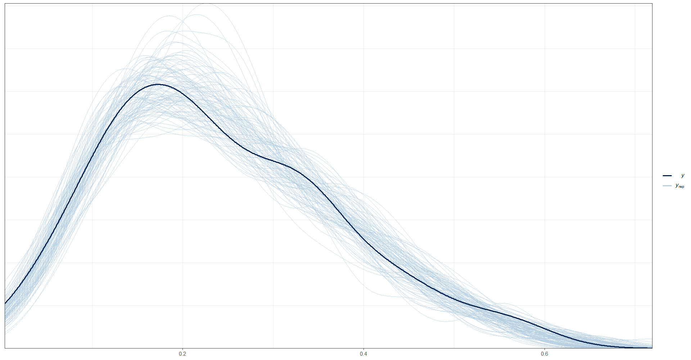
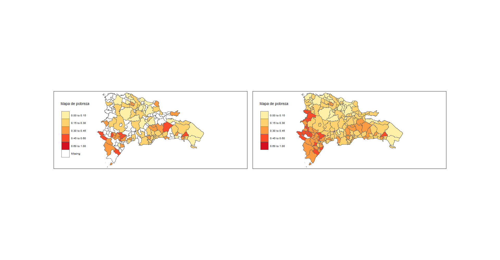
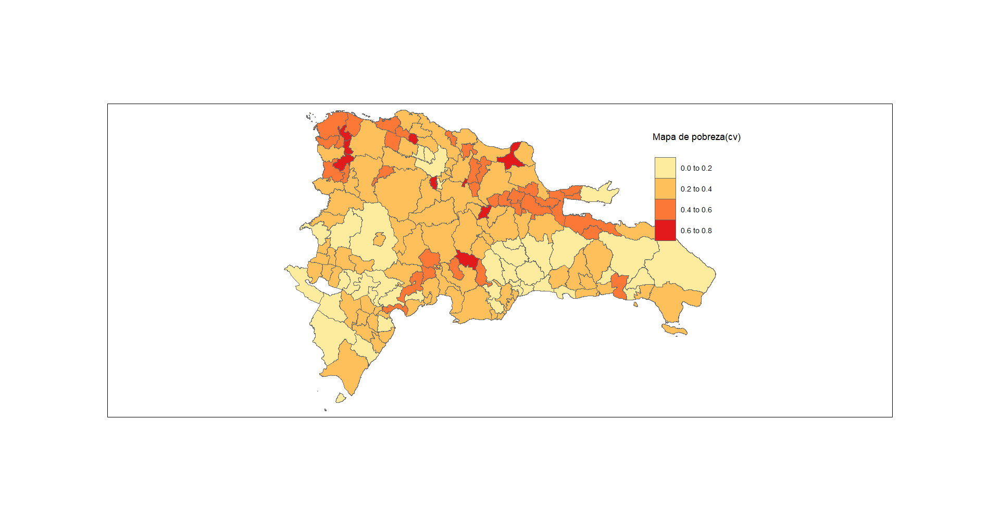

# Día 3 - Sesión 1- Modelos de área - Estimación de la pobreza y la transformación ArcoSeno.


En su concepción más básica, el modelo de **Fay-Herriot** es una combinación lineal de covariables. Sin embargo, el resultado de esta combinación pueden tomar valores que se salen del rango aceptable en el que puede estar una proporción; es decir, en general el estimador de Fay-Herriot $\theta \in R$, mientras que el estimador directo $\theta \in (0,1)$. La transformación arcoseno esta dada por: 

$$
\hat{z}_d = arcsin\left( \sqrt{ \hat{\theta}_d} \right)
$$ donde

$$
Var\left( \hat{z}_d \right) = \frac{\widehat{DEFF}_d}{4\times n_d} = \frac{1}{4\times n_{d,efectivo} }
$$

El modelo de Fay-Herriot  estaría definido de la siguiente forma:

$$
\begin{eqnarray*}
Z_d \mid \mu_d,\sigma^2_d &  \sim  & N(\mu_d, \sigma^2_d)\\
\mu_d & = & \boldsymbol{x}^{T}_{d}\boldsymbol{\beta} + u_d \\
\theta_d & = &  \left(sin(\mu_d)\right)^2
\end{eqnarray*}
$$ donde $u_d \sim N(0 , \sigma^2)$.


Suponga de las distribuciones previas para 
$\boldsymbol{\beta}$ y $\sigma_{u}^{2}$ son dadas por 
$$
\begin{eqnarray*}
\boldsymbol{\beta}	\sim	N\left(0,1000 \right)\\
\sigma_{u}^{2}	\sim	IG\left(0.0001,0.0001\right)
\end{eqnarray*}
$$

## Procedimiento de estimación

Lectura de la base de datos que resultó en el paso anterior y selección de las columnas de interés

```r
library(tidyverse)
library(magrittr)

base_FH <- readRDS("Recursos/Día3/Sesion1/Data/base_FH_2018.rds") %>% 
  transmute(dam2,                            ## id dominios
            pobreza,
            T_pobreza = asin(sqrt(pobreza)),  ## creando zd
            n_effec = n_eff_FGV,              ## n efectivo
            varhat = 1/(4*n_effec)            ## varianza para zd
            )
```

Lectura de las covariables, las cuales son obtenidas previamente. Dado la diferencia entre las escalas de las variables  es necesario hacer un ajuste a estas. 


```r
statelevel_predictors_df <- readRDS("Recursos/Día3/Sesion1/Data/statelevel_predictors_df_dam2.rds") %>% 
    mutate_at(.vars = c("luces_nocturnas",
                      "cubrimiento_cultivo",
                      "cubrimiento_urbano",
                      "modificacion_humana",
                      "accesibilidad_hospitales",
                      "accesibilidad_hosp_caminado"),
            function(x) as.numeric(scale(x)))
```

Uniendo las dos bases de datos. 


```r
base_FH <- full_join(base_FH, statelevel_predictors_df, by = "dam2" )
tba(base_FH[,1:8] %>% head(10))
```

<table class="table table-striped lightable-classic" style="width: auto !important; margin-left: auto; margin-right: auto; font-family: Arial Narrow; width: auto !important; margin-left: auto; margin-right: auto;">
 <thead>
  <tr>
   <th style="text-align:left;"> dam2 </th>
   <th style="text-align:right;"> pobreza </th>
   <th style="text-align:right;"> T_pobreza </th>
   <th style="text-align:right;"> n_effec </th>
   <th style="text-align:right;"> varhat </th>
   <th style="text-align:right;"> modificacion_humana </th>
   <th style="text-align:right;"> accesibilidad_hospitales </th>
   <th style="text-align:right;"> accesibilidad_hosp_caminado </th>
  </tr>
 </thead>
<tbody>
  <tr>
   <td style="text-align:left;"> 00101 </td>
   <td style="text-align:right;"> 0.2225 </td>
   <td style="text-align:right;"> 0.4912 </td>
   <td style="text-align:right;"> 332.3384 </td>
   <td style="text-align:right;"> 0.0008 </td>
   <td style="text-align:right;"> 3.6127 </td>
   <td style="text-align:right;"> -1.1835 </td>
   <td style="text-align:right;"> -1.5653 </td>
  </tr>
  <tr>
   <td style="text-align:left;"> 00201 </td>
   <td style="text-align:right;"> 0.1822 </td>
   <td style="text-align:right;"> 0.4409 </td>
   <td style="text-align:right;"> 28.0165 </td>
   <td style="text-align:right;"> 0.0089 </td>
   <td style="text-align:right;"> -0.0553 </td>
   <td style="text-align:right;"> 0.4449 </td>
   <td style="text-align:right;"> 0.2100 </td>
  </tr>
  <tr>
   <td style="text-align:left;"> 00206 </td>
   <td style="text-align:right;"> 0.3366 </td>
   <td style="text-align:right;"> 0.6190 </td>
   <td style="text-align:right;"> 44.7971 </td>
   <td style="text-align:right;"> 0.0056 </td>
   <td style="text-align:right;"> 0.5157 </td>
   <td style="text-align:right;"> -0.1468 </td>
   <td style="text-align:right;"> -0.1811 </td>
  </tr>
  <tr>
   <td style="text-align:left;"> 00301 </td>
   <td style="text-align:right;"> 0.4266 </td>
   <td style="text-align:right;"> 0.7117 </td>
   <td style="text-align:right;"> 125.6580 </td>
   <td style="text-align:right;"> 0.0020 </td>
   <td style="text-align:right;"> 0.1364 </td>
   <td style="text-align:right;"> 0.5744 </td>
   <td style="text-align:right;"> 1.1660 </td>
  </tr>
  <tr>
   <td style="text-align:left;"> 00302 </td>
   <td style="text-align:right;"> 0.4461 </td>
   <td style="text-align:right;"> 0.7314 </td>
   <td style="text-align:right;"> 261.0000 </td>
   <td style="text-align:right;"> 0.0010 </td>
   <td style="text-align:right;"> -0.5103 </td>
   <td style="text-align:right;"> 0.2531 </td>
   <td style="text-align:right;"> 1.0880 </td>
  </tr>
  <tr>
   <td style="text-align:left;"> 00303 </td>
   <td style="text-align:right;"> 0.5587 </td>
   <td style="text-align:right;"> 0.8442 </td>
   <td style="text-align:right;"> 75.7938 </td>
   <td style="text-align:right;"> 0.0033 </td>
   <td style="text-align:right;"> -0.6591 </td>
   <td style="text-align:right;"> 0.6249 </td>
   <td style="text-align:right;"> 1.2229 </td>
  </tr>
  <tr>
   <td style="text-align:left;"> 00304 </td>
   <td style="text-align:right;"> 0.5406 </td>
   <td style="text-align:right;"> 0.8261 </td>
   <td style="text-align:right;"> 154.4069 </td>
   <td style="text-align:right;"> 0.0016 </td>
   <td style="text-align:right;"> -0.5573 </td>
   <td style="text-align:right;"> 1.4586 </td>
   <td style="text-align:right;"> 2.7337 </td>
  </tr>
  <tr>
   <td style="text-align:left;"> 00401 </td>
   <td style="text-align:right;"> 0.3359 </td>
   <td style="text-align:right;"> 0.6182 </td>
   <td style="text-align:right;"> 105.4750 </td>
   <td style="text-align:right;"> 0.0024 </td>
   <td style="text-align:right;"> 0.3979 </td>
   <td style="text-align:right;"> -0.0833 </td>
   <td style="text-align:right;"> -0.4490 </td>
  </tr>
  <tr>
   <td style="text-align:left;"> 00402 </td>
   <td style="text-align:right;"> 0.1496 </td>
   <td style="text-align:right;"> 0.3972 </td>
   <td style="text-align:right;"> 59.6357 </td>
   <td style="text-align:right;"> 0.0042 </td>
   <td style="text-align:right;"> -0.3661 </td>
   <td style="text-align:right;"> -0.0114 </td>
   <td style="text-align:right;"> -0.2863 </td>
  </tr>
  <tr>
   <td style="text-align:left;"> 00403 </td>
   <td style="text-align:right;"> 0.4644 </td>
   <td style="text-align:right;"> 0.7498 </td>
   <td style="text-align:right;"> 197.2378 </td>
   <td style="text-align:right;"> 0.0013 </td>
   <td style="text-align:right;"> -1.0446 </td>
   <td style="text-align:right;"> 0.4542 </td>
   <td style="text-align:right;"> 0.5702 </td>
  </tr>
</tbody>
</table>

Seleccionando las covariables para el modelo. 


```r
names_cov <- c(
  "sexo2" ,
  "anoest2" ,
  "anoest3",
  "anoest4",
  "edad2" ,
  "edad3" ,
  "edad4" ,
  "edad5" ,
  "tasa_desocupacion" ,
  "luces_nocturnas" ,
  "cubrimiento_cultivo" ,
  "alfabeta"
)
```

## Preparando los insumos para `STAN`

  1.    Dividir la base de datos en dominios observados y no observados

Dominios observados.

```r
data_dir <- base_FH %>% filter(!is.na(T_pobreza))
```

Dominios NO observados.

```r
data_syn <-
  base_FH %>% anti_join(data_dir %>% select(dam2))
tba(data_syn[,1:8] %>% slice(1:10))
```

<table class="table table-striped lightable-classic" style="width: auto !important; margin-left: auto; margin-right: auto; font-family: Arial Narrow; width: auto !important; margin-left: auto; margin-right: auto;">
 <thead>
  <tr>
   <th style="text-align:left;"> dam2 </th>
   <th style="text-align:right;"> pobreza </th>
   <th style="text-align:right;"> T_pobreza </th>
   <th style="text-align:right;"> n_effec </th>
   <th style="text-align:right;"> varhat </th>
   <th style="text-align:right;"> modificacion_humana </th>
   <th style="text-align:right;"> accesibilidad_hospitales </th>
   <th style="text-align:right;"> accesibilidad_hosp_caminado </th>
  </tr>
 </thead>
<tbody>
  <tr>
   <td style="text-align:left;"> 00202 </td>
   <td style="text-align:right;"> NA </td>
   <td style="text-align:right;"> NA </td>
   <td style="text-align:right;"> NA </td>
   <td style="text-align:right;"> NA </td>
   <td style="text-align:right;"> -0.3758 </td>
   <td style="text-align:right;"> 0.0000 </td>
   <td style="text-align:right;"> 0.1482 </td>
  </tr>
  <tr>
   <td style="text-align:left;"> 00203 </td>
   <td style="text-align:right;"> NA </td>
   <td style="text-align:right;"> NA </td>
   <td style="text-align:right;"> NA </td>
   <td style="text-align:right;"> NA </td>
   <td style="text-align:right;"> -0.9259 </td>
   <td style="text-align:right;"> 0.5732 </td>
   <td style="text-align:right;"> -0.1402 </td>
  </tr>
  <tr>
   <td style="text-align:left;"> 00204 </td>
   <td style="text-align:right;"> NA </td>
   <td style="text-align:right;"> NA </td>
   <td style="text-align:right;"> NA </td>
   <td style="text-align:right;"> NA </td>
   <td style="text-align:right;"> -1.3166 </td>
   <td style="text-align:right;"> 1.1111 </td>
   <td style="text-align:right;"> 0.4438 </td>
  </tr>
  <tr>
   <td style="text-align:left;"> 00205 </td>
   <td style="text-align:right;"> NA </td>
   <td style="text-align:right;"> NA </td>
   <td style="text-align:right;"> NA </td>
   <td style="text-align:right;"> NA </td>
   <td style="text-align:right;"> -0.7474 </td>
   <td style="text-align:right;"> 2.1155 </td>
   <td style="text-align:right;"> 1.2271 </td>
  </tr>
  <tr>
   <td style="text-align:left;"> 00207 </td>
   <td style="text-align:right;"> NA </td>
   <td style="text-align:right;"> NA </td>
   <td style="text-align:right;"> NA </td>
   <td style="text-align:right;"> NA </td>
   <td style="text-align:right;"> 1.7368 </td>
   <td style="text-align:right;"> -0.7648 </td>
   <td style="text-align:right;"> -0.4861 </td>
  </tr>
  <tr>
   <td style="text-align:left;"> 00208 </td>
   <td style="text-align:right;"> NA </td>
   <td style="text-align:right;"> NA </td>
   <td style="text-align:right;"> NA </td>
   <td style="text-align:right;"> NA </td>
   <td style="text-align:right;"> -0.5942 </td>
   <td style="text-align:right;"> 0.3212 </td>
   <td style="text-align:right;"> -0.1697 </td>
  </tr>
  <tr>
   <td style="text-align:left;"> 00209 </td>
   <td style="text-align:right;"> NA </td>
   <td style="text-align:right;"> NA </td>
   <td style="text-align:right;"> NA </td>
   <td style="text-align:right;"> NA </td>
   <td style="text-align:right;"> -1.5280 </td>
   <td style="text-align:right;"> 3.0192 </td>
   <td style="text-align:right;"> 1.9428 </td>
  </tr>
  <tr>
   <td style="text-align:left;"> 00210 </td>
   <td style="text-align:right;"> NA </td>
   <td style="text-align:right;"> NA </td>
   <td style="text-align:right;"> NA </td>
   <td style="text-align:right;"> NA </td>
   <td style="text-align:right;"> -1.0038 </td>
   <td style="text-align:right;"> 0.5778 </td>
   <td style="text-align:right;"> 0.2678 </td>
  </tr>
  <tr>
   <td style="text-align:left;"> 00305 </td>
   <td style="text-align:right;"> NA </td>
   <td style="text-align:right;"> NA </td>
   <td style="text-align:right;"> NA </td>
   <td style="text-align:right;"> NA </td>
   <td style="text-align:right;"> -0.8480 </td>
   <td style="text-align:right;"> 1.5047 </td>
   <td style="text-align:right;"> 3.2004 </td>
  </tr>
  <tr>
   <td style="text-align:left;"> 00404 </td>
   <td style="text-align:right;"> NA </td>
   <td style="text-align:right;"> NA </td>
   <td style="text-align:right;"> NA </td>
   <td style="text-align:right;"> NA </td>
   <td style="text-align:right;"> -0.5678 </td>
   <td style="text-align:right;"> 1.0735 </td>
   <td style="text-align:right;"> 0.9856 </td>
  </tr>
</tbody>
</table>


  2.    Definir matriz de efectos fijos.
  


```r
## Dominios observados
Xdat <- cbind(inter = 1,data_dir[,names_cov])

## Dominios no observados
Xs <-  cbind(inter = 1,data_syn[,names_cov])
```

  3.    Creando lista de parámetros para `STAN`


```r
sample_data <- list(
  N1 = nrow(Xdat),       # Observados.
  N2 = nrow(Xs),         # NO Observados.
  p  = ncol(Xdat),       # Número de regresores.
  X  = as.matrix(Xdat),  # Covariables Observados.
  Xs = as.matrix(Xs),    # Covariables NO Observados
  y  = as.numeric(data_dir$T_pobreza),
  sigma_e = sqrt(data_dir$varhat)
)
```

  4.    Compilando el modelo en `STAN`
  

```r
library(rstan)
fit_FH_arcoseno <- "Recursos/Día3/Sesion1/Data/modelosStan/15FH_arcsin_normal.stan"
options(mc.cores = parallel::detectCores())
model_FH_arcoseno <- stan(
  file = fit_FH_arcoseno,  
  data = sample_data,   
  verbose = FALSE,
  warmup = 500,         
  iter = 1000,            
  cores = 4              
)
saveRDS(model_FH_arcoseno,
        "Recursos/Día3/Sesion1/Data/model_FH_arcoseno.rds")
```


```r
model_FH_arcoseno <- readRDS("Recursos/Día3/Sesion1/Data/model_FH_arcoseno.rds")
```


### Resultados del modelo para los dominios observados. 

En este código, se cargan las librerías `bayesplot`, `posterior` y `patchwork`, que se utilizan para realizar gráficos y visualizaciones de los resultados del modelo.

A continuación, se utiliza la función `as.array()` y `as_draws_matrix()` para extraer las muestras de la distribución posterior del parámetro `theta` del modelo, y se seleccionan aleatoriamente 100 filas de estas muestras utilizando la función `sample()`, lo que resulta en la matriz `y_pred2.`

Finalmente, se utiliza la función `ppc_dens_overlay()` de `bayesplot` para graficar una comparación entre la distribución empírica de la variable observada pobreza en los datos (`data_dir$pobreza`) y las distribuciones predictivas posteriores simuladas para la misma variable (`y_pred2`). La función `ppc_dens_overlay()` produce un gráfico de densidad para ambas distribuciones, lo que permite visualizar cómo se comparan.


```r
library(bayesplot)
library(patchwork)
library(posterior)

y_pred_B <- as.array(model_FH_arcoseno, pars = "theta") %>% 
  as_draws_matrix()
rowsrandom <- sample(nrow(y_pred_B), 100)

y_pred2 <- y_pred_B[rowsrandom, ]
ppc_dens_overlay(y = as.numeric(data_dir$pobreza), y_pred2)
```




Análisis gráfico de la convergencia de las cadenas de $\sigma^2_u$. 


```r
posterior_sigma2_u <- as.array(model_FH_arcoseno, pars = "sigma2_u")
(mcmc_dens_chains(posterior_sigma2_u) +
    mcmc_areas(posterior_sigma2_u) ) / 
  mcmc_trace(posterior_sigma2_u)

# traceplot(model_FH_arcoseno,pars = "sigma2_u",inc_warmup = TRUE)
```


Estimación del FH de la pobreza en los dominios observados. 


```r
theta_FH <-   summary(model_FH_arcoseno,pars =  "theta")$summary %>%
  data.frame()
data_dir %<>% mutate(pred_arcoseno = theta_FH$mean, 
                     pred_arcoseno_EE = theta_FH$sd,
                     Cv_pred = pred_arcoseno_EE/pred_arcoseno)
```

Estimación del FH de la pobreza en los dominios NO observados. 


```r
theta_FH_pred <- summary(model_FH_arcoseno,pars =  "theta_pred")$summary %>%
  data.frame()
data_syn <- data_syn %>% 
  mutate(pred_arcoseno = theta_FH_pred$mean,
         pred_arcoseno_EE = theta_FH_pred$sd,
         Cv_pred = pred_arcoseno_EE/pred_arcoseno)
```

## Mapa de pobreza

El siguiente bloque de código  carga los paquetes `sp`, `sf` y `tmap`, y realiza algunas operaciones. Primero, une (rbind) las estimaciones de los dominios observados y los no observados (`data_dir`, `data_syn`) y selecciona las variables `dam2`, `pobreza`, `pred_arcoseno`, `pred_arcoseno_EE` y `Cv_pred` utilizando la función `select()`. Luego, lee un archivo `Shapefile` que contiene información geoespacial del país. A continuación, crea un mapa temático (`tmap`) utilizando la función `tm_shape()` y agregando capas con la función `tm_polygons()`. El mapa representa dos variables llamadas pobreza y `pred_arcoseno`, utilizando una paleta de colores llamada "YlOrRd" y establece los cortes de los intervalos de las variables con la variable `brks_lp`. Finalmente, la función `tm_layout()` establece algunos parámetros de diseño del mapa, como la relación de aspecto (asp).


```r
library(sp)
library(sf)
library(tmap)

data_map <- rbind(data_dir, data_syn) %>% 
  select(dam2, pobreza, pred_arcoseno, pred_arcoseno_EE,Cv_pred ) 


## Leer Shapefile del país
ShapeSAE <- read_sf("Recursos/Día3/Sesion1/Shape/DOM_dam2.shp") %>% 
   rename(dam2 = id_dominio) %>% 
  mutate(dam2 = str_pad(
                 string = dam2,
                 width = 5,
                 pad = "0"
               ))

mapa <- tm_shape(ShapeSAE %>%
                   left_join(data_map,  by = "dam2"))

brks_lp <- c(0,0.15, 0.3, 0.45, 0.6, 1)
tmap_options(check.and.fix = TRUE)
Mapa_lp <-
  mapa + tm_polygons(
    c("pobreza", "pred_arcoseno"),
    breaks = brks_lp,
    title = "Mapa de pobreza",
    palette = "YlOrRd",
    colorNA = "white"
  ) + tm_layout(asp = 2.5)

Mapa_lp
```





## Mapa del coeficiente de variación.  

Ahora, se crea un segundo mapa temático (`tmap`) llamado `Mapa_cv`. Utiliza la misma estructura del primer mapa (mapa) creado anteriormente y agrega una capa utilizando la función `tm_polygons()`. El mapa representa la variable `Cv_pred`, utilizando una paleta de colores llamada "YlOrRd" y establece el título del mapa con el parámetro `title`. La función `tm_layout()` establece algunos parámetros de diseño del mapa, como la relación de aspecto (asp). Finalmente, el mapa Mapa_cv se muestra en la consola de R.


```r
Mapa_cv <-
  mapa + tm_polygons(
    c("Cv_pred"),
     title = "Mapa de pobreza(cv)",
    palette = "YlOrRd",
    colorNA = "white"
  ) + tm_layout(asp = 2.5)

Mapa_cv
```




