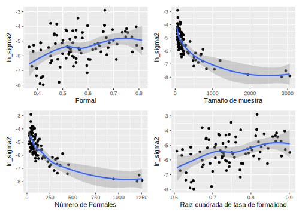
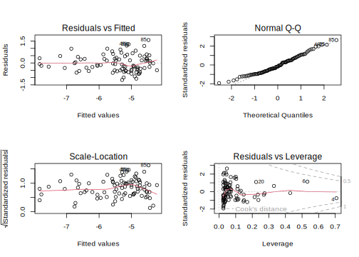
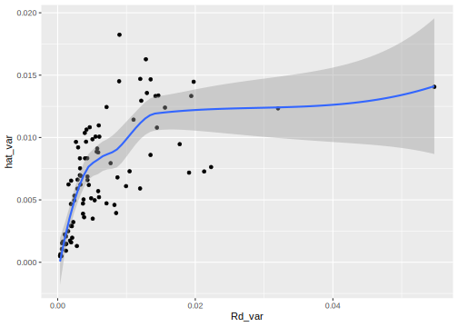
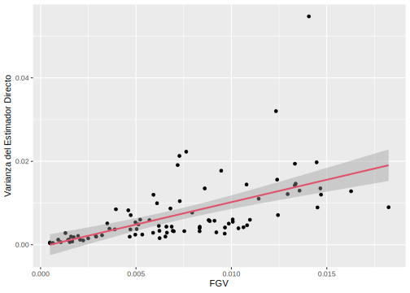
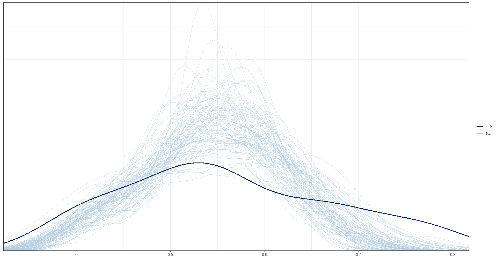
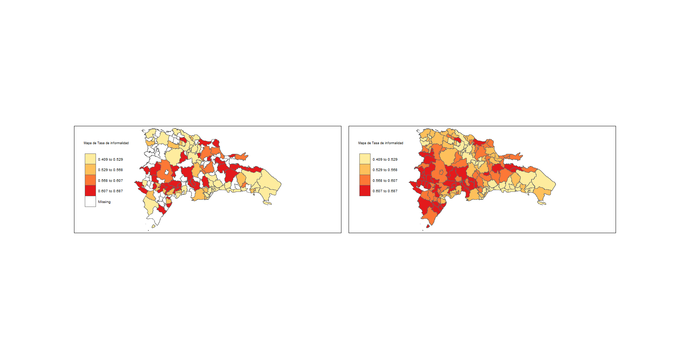
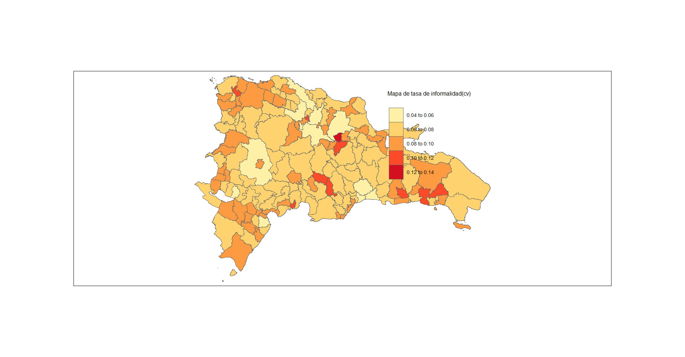

# Día 3 - Sesión 3- Modelos de área - Estimación de la informalidad laboral.


La informalidad laboral es un fenómeno que ha sido objeto de estudio en la República Dominicana y en Latinoamérica debido a su impacto en el mercado laboral y en el desarrollo social. Según "La informalidad en el mercado laboral urbano de la República Dominicana", la informalidad laboral se refiere a la falta de registro y protección social de los trabajadores, así como a la ausencia de derechos laborales y condiciones de trabajo dignas. A pesar de que existe una definición común, la medición de la informalidad varía según el enfoque y la metodología utilizada, lo cual puede generar diferencias en los resultados obtenidos.

En la República Dominicana, la informalidad laboral es un fenómeno que afecta principalmente a los trabajadores del sector informal, que representan más de la mitad de la fuerza laboral del país. Este sector se caracteriza por la falta de protección social, la inestabilidad laboral y la baja remuneración, lo que limita las oportunidades de desarrollo de los trabajadores y sus familias. Además, la informalidad laboral tiene un impacto negativo en la economía del país, ya que reduce la recaudación fiscal y limita la inversión en programas sociales y de desarrollo.

Es importante conocer estas estimaciones de la informalidad laboral para comprender las desigualdades económicas y laborales en el país y desarrollar medidas para proteger los derechos laborales de los trabajadores informales y mejorar la economía del país en general.

## Estimaciones directas.

En este apartado realizaremos las estimaciones directas para los dominios que fueron seleccionados en la muestra, dado que estos fueron no planeados. Las estimaciones directas son una herramienta comúnmente utilizada en la estadística inferencial para obtener información sobre una población a partir de una muestra. Sin embargo, estas estimaciones pueden presentar problemas cuando la muestra es pequeña, lo que puede conducir a una falta de precisión en las estimaciones y a una mayor incertidumbre en las conclusiones que se puedan extraer.


```r
encuestaDOM <-  readRDS("Recursos/Día3/Sesion3/Data/encuestaDOM.Rds")

encuestaDOM <-
  encuestaDOM %>%
  transmute(
    dam2 = id_dominio,
    upm = str_pad(string = upm,width = 9,pad = "0"),
    estrato = str_pad(string = estrato,width = 5,pad = "0"),
    factor_anual = factor_expansion / 4, 
    pet, ocupado,orden_sector
) %>% 
    filter(ocupado == 1 & pet == 1)
```

Para la definición del diseño se hace uso de la librería `survey` como se muestra en el siguiente código


```r
options(survey.lonely.psu= 'adjust' )
disenoDOM <- encuestaDOM %>%
  as_survey_design(
    strata = estrato,
    ids = upm,
    weights = factor_anual,
    nest=T
  )
```

###  Calculo del indicador

La informalidad laboral en República Dominicana se define como el trabajo que se realiza al margen de las leyes tributarias y laborales, así como aquel que busca evadir sus obligaciones fiscales ante las agencias del gobierno. Para definir el indicador de la informalidad laboral en República Dominicana, se utiliza la siguiente fórmula:

$$
Tas\ de\ informalidad\ laboral = \frac{Número\ de\ trabajadores\ informales}{ Población\ económicamente\ activa} \times 100.
$$

Este bloque de código realiza lo siguiente:

  -   Se agrupa la encuesta por dam2
  -   Se calcula el tamaño muestral no ponderado (`n()`).
  -   Se calcula la razón de la variable `orden_sector` igual a 2 sobre la variable constante igual a 1 mediante el uso de `survey_ratio()`, que utiliza los pesos de muestreo para producir estimaciones de varianza y errores estándar apropiados para el muestreo complejo.
  -   La función `survey_ratio()` también permite calcular intervalos de confianza y coeficientes de variación.


```r
indicador_dom <-
  disenoDOM %>% group_by(dam2) %>% 
  summarise(
    n = unweighted(n()),
    Rd = survey_ratio(
      numerator = orden_sector == 2 ,
      denominator = 1,
      vartype = c("se", "ci", "var", "cv"),
      deff = T
    )
  )
```

Ahora, como parte del proceso es necesario incorporar la información del número de
upm por dam2, para lo cual se hace 


```r
n_upm <- encuestaDOM %>% distinct(dam2, upm) %>% 
  group_by(dam2) %>% tally(name = "n_upm",sort = TRUE)
indicador_dom <- inner_join(n_upm,indicador_dom)
saveRDS(object = indicador_dom, file = "Recursos/Día3/Sesion3/Data/indicador_dom.rds")
```


<table class="table table-striped lightable-classic" style="width: auto !important; margin-left: auto; margin-right: auto; font-family: Arial Narrow; width: auto !important; margin-left: auto; margin-right: auto;">
 <thead>
  <tr>
   <th style="text-align:left;"> dam2 </th>
   <th style="text-align:right;"> n_upm </th>
   <th style="text-align:right;"> n </th>
   <th style="text-align:right;"> Rd </th>
   <th style="text-align:right;"> Rd_se </th>
   <th style="text-align:right;"> Rd_low </th>
   <th style="text-align:right;"> Rd_upp </th>
   <th style="text-align:right;"> Rd_var </th>
   <th style="text-align:right;"> Rd_cv </th>
   <th style="text-align:right;"> Rd_deff </th>
  </tr>
 </thead>
<tbody>
  <tr>
   <td style="text-align:left;"> 0101 </td>
   <td style="text-align:right;"> 126 </td>
   <td style="text-align:right;"> 2951 </td>
   <td style="text-align:right;"> 0.4147 </td>
   <td style="text-align:right;"> 0.0234 </td>
   <td style="text-align:right;"> 0.3688 </td>
   <td style="text-align:right;"> 0.4605 </td>
   <td style="text-align:right;"> 0.0005 </td>
   <td style="text-align:right;"> 0.0564 </td>
   <td style="text-align:right;"> 6.6763 </td>
  </tr>
  <tr>
   <td style="text-align:left;"> 3201 </td>
   <td style="text-align:right;"> 108 </td>
   <td style="text-align:right;"> 2840 </td>
   <td style="text-align:right;"> 0.4233 </td>
   <td style="text-align:right;"> 0.0186 </td>
   <td style="text-align:right;"> 0.3868 </td>
   <td style="text-align:right;"> 0.4597 </td>
   <td style="text-align:right;"> 0.0003 </td>
   <td style="text-align:right;"> 0.0439 </td>
   <td style="text-align:right;"> 4.0432 </td>
  </tr>
  <tr>
   <td style="text-align:left;"> 2501 </td>
   <td style="text-align:right;"> 87 </td>
   <td style="text-align:right;"> 3057 </td>
   <td style="text-align:right;"> 0.4108 </td>
   <td style="text-align:right;"> 0.0192 </td>
   <td style="text-align:right;"> 0.3731 </td>
   <td style="text-align:right;"> 0.4485 </td>
   <td style="text-align:right;"> 0.0004 </td>
   <td style="text-align:right;"> 0.0467 </td>
   <td style="text-align:right;"> 4.6897 </td>
  </tr>
  <tr>
   <td style="text-align:left;"> 3203 </td>
   <td style="text-align:right;"> 59 </td>
   <td style="text-align:right;"> 1944 </td>
   <td style="text-align:right;"> 0.4858 </td>
   <td style="text-align:right;"> 0.0202 </td>
   <td style="text-align:right;"> 0.4462 </td>
   <td style="text-align:right;"> 0.5255 </td>
   <td style="text-align:right;"> 0.0004 </td>
   <td style="text-align:right;"> 0.0416 </td>
   <td style="text-align:right;"> 3.1956 </td>
  </tr>
  <tr>
   <td style="text-align:left;"> 3202 </td>
   <td style="text-align:right;"> 42 </td>
   <td style="text-align:right;"> 1046 </td>
   <td style="text-align:right;"> 0.4221 </td>
   <td style="text-align:right;"> 0.0247 </td>
   <td style="text-align:right;"> 0.3736 </td>
   <td style="text-align:right;"> 0.4706 </td>
   <td style="text-align:right;"> 0.0006 </td>
   <td style="text-align:right;"> 0.0585 </td>
   <td style="text-align:right;"> 2.6301 </td>
  </tr>
  <tr>
   <td style="text-align:left;"> 1101 </td>
   <td style="text-align:right;"> 38 </td>
   <td style="text-align:right;"> 1198 </td>
   <td style="text-align:right;"> 0.3788 </td>
   <td style="text-align:right;"> 0.0347 </td>
   <td style="text-align:right;"> 0.3107 </td>
   <td style="text-align:right;"> 0.4469 </td>
   <td style="text-align:right;"> 0.0012 </td>
   <td style="text-align:right;"> 0.0916 </td>
   <td style="text-align:right;"> 6.1659 </td>
  </tr>
  <tr>
   <td style="text-align:left;"> 3206 </td>
   <td style="text-align:right;"> 32 </td>
   <td style="text-align:right;"> 836 </td>
   <td style="text-align:right;"> 0.3968 </td>
   <td style="text-align:right;"> 0.0252 </td>
   <td style="text-align:right;"> 0.3474 </td>
   <td style="text-align:right;"> 0.4462 </td>
   <td style="text-align:right;"> 0.0006 </td>
   <td style="text-align:right;"> 0.0635 </td>
   <td style="text-align:right;"> 2.2273 </td>
  </tr>
  <tr>
   <td style="text-align:left;"> 0901 </td>
   <td style="text-align:right;"> 20 </td>
   <td style="text-align:right;"> 743 </td>
   <td style="text-align:right;"> 0.5236 </td>
   <td style="text-align:right;"> 0.0529 </td>
   <td style="text-align:right;"> 0.4198 </td>
   <td style="text-align:right;"> 0.6273 </td>
   <td style="text-align:right;"> 0.0028 </td>
   <td style="text-align:right;"> 0.1010 </td>
   <td style="text-align:right;"> 8.3883 </td>
  </tr>
  <tr>
   <td style="text-align:left;"> 1301 </td>
   <td style="text-align:right;"> 20 </td>
   <td style="text-align:right;"> 738 </td>
   <td style="text-align:right;"> 0.4899 </td>
   <td style="text-align:right;"> 0.0338 </td>
   <td style="text-align:right;"> 0.4236 </td>
   <td style="text-align:right;"> 0.5562 </td>
   <td style="text-align:right;"> 0.0011 </td>
   <td style="text-align:right;"> 0.0690 </td>
   <td style="text-align:right;"> 3.3902 </td>
  </tr>
  <tr>
   <td style="text-align:left;"> 2101 </td>
   <td style="text-align:right;"> 20 </td>
   <td style="text-align:right;"> 505 </td>
   <td style="text-align:right;"> 0.4522 </td>
   <td style="text-align:right;"> 0.0391 </td>
   <td style="text-align:right;"> 0.3756 </td>
   <td style="text-align:right;"> 0.5289 </td>
   <td style="text-align:right;"> 0.0015 </td>
   <td style="text-align:right;"> 0.0864 </td>
   <td style="text-align:right;"> 3.1216 </td>
  </tr>
</tbody>
</table>


## Función Generalizada de Varianza

La Función Generalizada de Varianza (GVF) es una técnica estadística utilizada para suavizar las estimaciones de las varianzas directas de los estimadores. Esta técnica busca estimar la varianza suavizada del estimador directo a través de un modelo log-lineal que involucra un vector de covariables auxiliares. La GVF es particularmente útil para modelar las varianzas de los estimadores directos, ya que permite lidiar con la naturaleza positiva de este parámetro. Además, esta técnica ha sido ampliamente utilizada en la literatura para estimar la varianza de los estimadores directos en diferentes contextos, incluyendo la estimación de ingreso per cápita en los Estados Unidos, cifras oficiales del mercado de trabajo en Canadá y las tasas de pobreza comunal en la región. En este sentido, la GVF se plantea en términos de una relación log-lineal con un vector de covariables auxiliares que puede variar dependiendo del contexto en que se aplique.

El proceso continua con la selección de las dam que posean una varianza estimada mayor que cero, un deff mayor que 1 y 2 o más UPMs. Para los dominios que superan estas condiciones se realiza la transformación $\log(\hat{\sigma}^2_d)$, además se realiza la selección de las columnas identificador del municipio (`id_dominio`), la estimación directa del indicador (`Rd`), El número de personas en el dominio (`n`) y la varianza estimada del para la estimación directa `Rd_var`,siendo esta la que transforma mediante la función `log()`. 


```r
indicador_dom1 <- indicador_dom %>% 
  filter(Rd_var>0 & Rd_deff>=1 & n_upm >= 2) 

baseFGV <-  indicador_dom1 %>%  
  dplyr::select(dam2 , Rd, n, Rd_var) %>%
  mutate(ln_sigma2 = log(Rd_var))
```


### Gráficas exploratorias

El código muestra la creación de cuatro gráficos usando la librería `ggplot2` y el uso de los datos `baseFGV`.  Estos gráficos tienen como objetivo explorar la relación entre el logaritmo de la varianza y diferentes transformaciones de la `n` y `Rd`.

El primer gráfico (`p1`) representa la relación entre la estimación directa y el logaritmo de la varianza. El segundo gráfico (`p2`) representa la relación entre el tamaño de muestra y el logaritmo de la varianza. El tercer gráfico (`p3`) representa la relación entre $n_d \times Rd$  y el logaritmo de la varianza. Finalmente, el cuarto gráfico (`p4`) representa la relación entre la raíz cuadrada de la estimación directa y el logaritmo de la varianza.


```r
library(patchwork)
p1 <- ggplot(baseFGV, aes(x = Rd, y = ln_sigma2)) +
  geom_point() +
  geom_smooth(method = "loess") +
  xlab("Formal")

p2 <- ggplot(baseFGV, aes(x = n, y = ln_sigma2)) + 
  geom_point() +
  geom_smooth(method = "loess") + 
  xlab("Tamaño de muestra")

p3 <- ggplot(baseFGV, 
             aes(x = Rd * n, y = ln_sigma2)) + 
  geom_point() +
  geom_smooth(method = "loess") + 
  xlab("Número de Formales")

p4 <- ggplot(baseFGV, 
             aes(x = sqrt(Rd), y = ln_sigma2)) + 
  geom_point() +
  geom_smooth(method = "loess") + 
  xlab("Raiz cuadrada de tasa de formalidad")


(p1 | p2) / (p3 | p4)
```



```r
rm('p1','p2','p3','p4')
```

### Ajustando el modelo log-lineal de la varianza 

El código ajusta un modelo de regresión lineal múltiple (utilizando la función `lm()`), donde `ln_sigma2` es la variable respuesta y las variables predictoras son `Rd`, `n`, y varias transformaciones de éstas. El objetivo de este modelo es estimar la función generalizada de varianza (FGV) para los dominios observados.


```r
library(gtsummary)
FGV1 <- lm(ln_sigma2 ~ 1 + Rd + 
             n + I(n ^ 2) + I(Rd * n) +
             I(sqrt(Rd)) + I(sqrt(n)) + 
             I(sqrt(Rd * n)) ,
           data = baseFGV)

tbl_regression(FGV1) %>% 
  add_glance_table(include = c(r.squared, adj.r.squared))
```

```{=html}
<div id="iguswyzxws" style="padding-left:0px;padding-right:0px;padding-top:10px;padding-bottom:10px;overflow-x:auto;overflow-y:auto;width:auto;height:auto;">
<style>html {
  font-family: -apple-system, BlinkMacSystemFont, 'Segoe UI', Roboto, Oxygen, Ubuntu, Cantarell, 'Helvetica Neue', 'Fira Sans', 'Droid Sans', Arial, sans-serif;
}

#iguswyzxws .gt_table {
  display: table;
  border-collapse: collapse;
  margin-left: auto;
  margin-right: auto;
  color: #333333;
  font-size: 16px;
  font-weight: normal;
  font-style: normal;
  background-color: #FFFFFF;
  width: auto;
  border-top-style: solid;
  border-top-width: 2px;
  border-top-color: #A8A8A8;
  border-right-style: none;
  border-right-width: 2px;
  border-right-color: #D3D3D3;
  border-bottom-style: solid;
  border-bottom-width: 2px;
  border-bottom-color: #A8A8A8;
  border-left-style: none;
  border-left-width: 2px;
  border-left-color: #D3D3D3;
}

#iguswyzxws .gt_heading {
  background-color: #FFFFFF;
  text-align: center;
  border-bottom-color: #FFFFFF;
  border-left-style: none;
  border-left-width: 1px;
  border-left-color: #D3D3D3;
  border-right-style: none;
  border-right-width: 1px;
  border-right-color: #D3D3D3;
}

#iguswyzxws .gt_caption {
  padding-top: 4px;
  padding-bottom: 4px;
}

#iguswyzxws .gt_title {
  color: #333333;
  font-size: 125%;
  font-weight: initial;
  padding-top: 4px;
  padding-bottom: 4px;
  padding-left: 5px;
  padding-right: 5px;
  border-bottom-color: #FFFFFF;
  border-bottom-width: 0;
}

#iguswyzxws .gt_subtitle {
  color: #333333;
  font-size: 85%;
  font-weight: initial;
  padding-top: 0;
  padding-bottom: 6px;
  padding-left: 5px;
  padding-right: 5px;
  border-top-color: #FFFFFF;
  border-top-width: 0;
}

#iguswyzxws .gt_bottom_border {
  border-bottom-style: solid;
  border-bottom-width: 2px;
  border-bottom-color: #D3D3D3;
}

#iguswyzxws .gt_col_headings {
  border-top-style: solid;
  border-top-width: 2px;
  border-top-color: #D3D3D3;
  border-bottom-style: solid;
  border-bottom-width: 2px;
  border-bottom-color: #D3D3D3;
  border-left-style: none;
  border-left-width: 1px;
  border-left-color: #D3D3D3;
  border-right-style: none;
  border-right-width: 1px;
  border-right-color: #D3D3D3;
}

#iguswyzxws .gt_col_heading {
  color: #333333;
  background-color: #FFFFFF;
  font-size: 100%;
  font-weight: normal;
  text-transform: inherit;
  border-left-style: none;
  border-left-width: 1px;
  border-left-color: #D3D3D3;
  border-right-style: none;
  border-right-width: 1px;
  border-right-color: #D3D3D3;
  vertical-align: bottom;
  padding-top: 5px;
  padding-bottom: 6px;
  padding-left: 5px;
  padding-right: 5px;
  overflow-x: hidden;
}

#iguswyzxws .gt_column_spanner_outer {
  color: #333333;
  background-color: #FFFFFF;
  font-size: 100%;
  font-weight: normal;
  text-transform: inherit;
  padding-top: 0;
  padding-bottom: 0;
  padding-left: 4px;
  padding-right: 4px;
}

#iguswyzxws .gt_column_spanner_outer:first-child {
  padding-left: 0;
}

#iguswyzxws .gt_column_spanner_outer:last-child {
  padding-right: 0;
}

#iguswyzxws .gt_column_spanner {
  border-bottom-style: solid;
  border-bottom-width: 2px;
  border-bottom-color: #D3D3D3;
  vertical-align: bottom;
  padding-top: 5px;
  padding-bottom: 5px;
  overflow-x: hidden;
  display: inline-block;
  width: 100%;
}

#iguswyzxws .gt_group_heading {
  padding-top: 8px;
  padding-bottom: 8px;
  padding-left: 5px;
  padding-right: 5px;
  color: #333333;
  background-color: #FFFFFF;
  font-size: 100%;
  font-weight: initial;
  text-transform: inherit;
  border-top-style: solid;
  border-top-width: 2px;
  border-top-color: #D3D3D3;
  border-bottom-style: solid;
  border-bottom-width: 2px;
  border-bottom-color: #D3D3D3;
  border-left-style: none;
  border-left-width: 1px;
  border-left-color: #D3D3D3;
  border-right-style: none;
  border-right-width: 1px;
  border-right-color: #D3D3D3;
  vertical-align: middle;
  text-align: left;
}

#iguswyzxws .gt_empty_group_heading {
  padding: 0.5px;
  color: #333333;
  background-color: #FFFFFF;
  font-size: 100%;
  font-weight: initial;
  border-top-style: solid;
  border-top-width: 2px;
  border-top-color: #D3D3D3;
  border-bottom-style: solid;
  border-bottom-width: 2px;
  border-bottom-color: #D3D3D3;
  vertical-align: middle;
}

#iguswyzxws .gt_from_md > :first-child {
  margin-top: 0;
}

#iguswyzxws .gt_from_md > :last-child {
  margin-bottom: 0;
}

#iguswyzxws .gt_row {
  padding-top: 8px;
  padding-bottom: 8px;
  padding-left: 5px;
  padding-right: 5px;
  margin: 10px;
  border-top-style: solid;
  border-top-width: 1px;
  border-top-color: #D3D3D3;
  border-left-style: none;
  border-left-width: 1px;
  border-left-color: #D3D3D3;
  border-right-style: none;
  border-right-width: 1px;
  border-right-color: #D3D3D3;
  vertical-align: middle;
  overflow-x: hidden;
}

#iguswyzxws .gt_stub {
  color: #333333;
  background-color: #FFFFFF;
  font-size: 100%;
  font-weight: initial;
  text-transform: inherit;
  border-right-style: solid;
  border-right-width: 2px;
  border-right-color: #D3D3D3;
  padding-left: 5px;
  padding-right: 5px;
}

#iguswyzxws .gt_stub_row_group {
  color: #333333;
  background-color: #FFFFFF;
  font-size: 100%;
  font-weight: initial;
  text-transform: inherit;
  border-right-style: solid;
  border-right-width: 2px;
  border-right-color: #D3D3D3;
  padding-left: 5px;
  padding-right: 5px;
  vertical-align: top;
}

#iguswyzxws .gt_row_group_first td {
  border-top-width: 2px;
}

#iguswyzxws .gt_summary_row {
  color: #333333;
  background-color: #FFFFFF;
  text-transform: inherit;
  padding-top: 8px;
  padding-bottom: 8px;
  padding-left: 5px;
  padding-right: 5px;
}

#iguswyzxws .gt_first_summary_row {
  border-top-style: solid;
  border-top-color: #D3D3D3;
}

#iguswyzxws .gt_first_summary_row.thick {
  border-top-width: 2px;
}

#iguswyzxws .gt_last_summary_row {
  padding-top: 8px;
  padding-bottom: 8px;
  padding-left: 5px;
  padding-right: 5px;
  border-bottom-style: solid;
  border-bottom-width: 2px;
  border-bottom-color: #D3D3D3;
}

#iguswyzxws .gt_grand_summary_row {
  color: #333333;
  background-color: #FFFFFF;
  text-transform: inherit;
  padding-top: 8px;
  padding-bottom: 8px;
  padding-left: 5px;
  padding-right: 5px;
}

#iguswyzxws .gt_first_grand_summary_row {
  padding-top: 8px;
  padding-bottom: 8px;
  padding-left: 5px;
  padding-right: 5px;
  border-top-style: double;
  border-top-width: 6px;
  border-top-color: #D3D3D3;
}

#iguswyzxws .gt_striped {
  background-color: rgba(128, 128, 128, 0.05);
}

#iguswyzxws .gt_table_body {
  border-top-style: solid;
  border-top-width: 2px;
  border-top-color: #D3D3D3;
  border-bottom-style: solid;
  border-bottom-width: 2px;
  border-bottom-color: #D3D3D3;
}

#iguswyzxws .gt_footnotes {
  color: #333333;
  background-color: #FFFFFF;
  border-bottom-style: none;
  border-bottom-width: 2px;
  border-bottom-color: #D3D3D3;
  border-left-style: none;
  border-left-width: 2px;
  border-left-color: #D3D3D3;
  border-right-style: none;
  border-right-width: 2px;
  border-right-color: #D3D3D3;
}

#iguswyzxws .gt_footnote {
  margin: 0px;
  font-size: 90%;
  padding-left: 4px;
  padding-right: 4px;
  padding-left: 5px;
  padding-right: 5px;
}

#iguswyzxws .gt_sourcenotes {
  color: #333333;
  background-color: #FFFFFF;
  border-bottom-style: none;
  border-bottom-width: 2px;
  border-bottom-color: #D3D3D3;
  border-left-style: none;
  border-left-width: 2px;
  border-left-color: #D3D3D3;
  border-right-style: none;
  border-right-width: 2px;
  border-right-color: #D3D3D3;
}

#iguswyzxws .gt_sourcenote {
  font-size: 90%;
  padding-top: 4px;
  padding-bottom: 4px;
  padding-left: 5px;
  padding-right: 5px;
}

#iguswyzxws .gt_left {
  text-align: left;
}

#iguswyzxws .gt_center {
  text-align: center;
}

#iguswyzxws .gt_right {
  text-align: right;
  font-variant-numeric: tabular-nums;
}

#iguswyzxws .gt_font_normal {
  font-weight: normal;
}

#iguswyzxws .gt_font_bold {
  font-weight: bold;
}

#iguswyzxws .gt_font_italic {
  font-style: italic;
}

#iguswyzxws .gt_super {
  font-size: 65%;
}

#iguswyzxws .gt_footnote_marks {
  font-style: italic;
  font-weight: normal;
  font-size: 75%;
  vertical-align: 0.4em;
}

#iguswyzxws .gt_asterisk {
  font-size: 100%;
  vertical-align: 0;
}

#iguswyzxws .gt_indent_1 {
  text-indent: 5px;
}

#iguswyzxws .gt_indent_2 {
  text-indent: 10px;
}

#iguswyzxws .gt_indent_3 {
  text-indent: 15px;
}

#iguswyzxws .gt_indent_4 {
  text-indent: 20px;
}

#iguswyzxws .gt_indent_5 {
  text-indent: 25px;
}
</style>
<table class="gt_table">
  
  <thead class="gt_col_headings">
    <tr>
      <th class="gt_col_heading gt_columns_bottom_border gt_left" rowspan="1" colspan="1" scope="col" id="&lt;strong&gt;Characteristic&lt;/strong&gt;"><strong>Characteristic</strong></th>
      <th class="gt_col_heading gt_columns_bottom_border gt_center" rowspan="1" colspan="1" scope="col" id="&lt;strong&gt;Beta&lt;/strong&gt;"><strong>Beta</strong></th>
      <th class="gt_col_heading gt_columns_bottom_border gt_center" rowspan="1" colspan="1" scope="col" id="&lt;strong&gt;95% CI&lt;/strong&gt;&lt;sup class=&quot;gt_footnote_marks&quot;&gt;1&lt;/sup&gt;"><strong>95% CI</strong><sup class="gt_footnote_marks">1</sup></th>
      <th class="gt_col_heading gt_columns_bottom_border gt_center" rowspan="1" colspan="1" scope="col" id="&lt;strong&gt;p-value&lt;/strong&gt;"><strong>p-value</strong></th>
    </tr>
  </thead>
  <tbody class="gt_table_body">
    <tr><td headers="label" class="gt_row gt_left">Rd</td>
<td headers="estimate" class="gt_row gt_center">-22</td>
<td headers="ci" class="gt_row gt_center">-50, 5.8</td>
<td headers="p.value" class="gt_row gt_center">0.12</td></tr>
    <tr><td headers="label" class="gt_row gt_left">n</td>
<td headers="estimate" class="gt_row gt_center">-0.01</td>
<td headers="ci" class="gt_row gt_center">-0.03, 0.01</td>
<td headers="p.value" class="gt_row gt_center">0.3</td></tr>
    <tr><td headers="label" class="gt_row gt_left">I(n^2)</td>
<td headers="estimate" class="gt_row gt_center">0.00</td>
<td headers="ci" class="gt_row gt_center">0.00, 0.00</td>
<td headers="p.value" class="gt_row gt_center">0.5</td></tr>
    <tr><td headers="label" class="gt_row gt_left">I(Rd * n)</td>
<td headers="estimate" class="gt_row gt_center">0.02</td>
<td headers="ci" class="gt_row gt_center">-0.01, 0.05</td>
<td headers="p.value" class="gt_row gt_center">0.2</td></tr>
    <tr><td headers="label" class="gt_row gt_left">I(sqrt(Rd))</td>
<td headers="estimate" class="gt_row gt_center">45</td>
<td headers="ci" class="gt_row gt_center">-4.7, 94</td>
<td headers="p.value" class="gt_row gt_center">0.076</td></tr>
    <tr><td headers="label" class="gt_row gt_left">I(sqrt(n))</td>
<td headers="estimate" class="gt_row gt_center">0.87</td>
<td headers="ci" class="gt_row gt_center">-0.48, 2.2</td>
<td headers="p.value" class="gt_row gt_center">0.2</td></tr>
    <tr><td headers="label" class="gt_row gt_left">I(sqrt(Rd * n))</td>
<td headers="estimate" class="gt_row gt_center">-1.4</td>
<td headers="ci" class="gt_row gt_center">-3.1, 0.34</td>
<td headers="p.value" class="gt_row gt_center">0.11</td></tr>
    <tr><td headers="label" class="gt_row gt_left" style="border-top-width: 2px; border-top-style: solid; border-top-color: #D3D3D3;">R²</td>
<td headers="estimate" class="gt_row gt_center" style="border-top-width: 2px; border-top-style: solid; border-top-color: #D3D3D3;">0.683</td>
<td headers="ci" class="gt_row gt_center" style="border-top-width: 2px; border-top-style: solid; border-top-color: #D3D3D3;"></td>
<td headers="p.value" class="gt_row gt_center" style="border-top-width: 2px; border-top-style: solid; border-top-color: #D3D3D3;"></td></tr>
    <tr><td headers="label" class="gt_row gt_left">Adjusted R²</td>
<td headers="estimate" class="gt_row gt_center">0.656</td>
<td headers="ci" class="gt_row gt_center"></td>
<td headers="p.value" class="gt_row gt_center"></td></tr>
  </tbody>
  
  <tfoot class="gt_footnotes">
    <tr>
      <td class="gt_footnote" colspan="4"><sup class="gt_footnote_marks">1</sup> CI = Confidence Interval</td>
    </tr>
  </tfoot>
</table>
</div>
```

Después de tener la estimación del modelo se debe obtener el  valor de la constante $\Delta$ para lo cual se usa el siguiente código.  


```r
delta.hat = sum(baseFGV$Rd_var) / sum(exp(fitted.values(FGV1)))
```
De donde se obtiene que $\Delta = 1.2364739$. Final es posible obtener la varianza suavizada  ejecutando el siguiente comando. 


```r
baseFGV <-
  baseFGV %>% mutate(hat_var = delta.hat * exp(fitted.values(FGV1)))
```

### Validaciones sobre el modelo 


```r
par(mfrow = c(2, 2))
plot(FGV1)
```


varianza suavizada Vs varianza estimada 


```r
ggplot(baseFGV, 
       aes(x = Rd_var, y = hat_var)) + 
  geom_point() +
  geom_smooth(method = "loess")
```



Este código está realizando una Consolidación de los dominios observados y no observados para lo cual hace una unión izquierda (`left_join()`) entre: `indicador_dom` y `baseFGV` de la cual selecciona las columnas de `id_dominio` y `hat_var`. El argumento `by = id_dominio` especifica que la unión debe realizarse mediante la columna `id_dominio`.

Luego, se utiliza la función `mutate()` para crear dos nuevas variables. La primera variable `Rd_var` se asigna el valor de `Rd_var` de `baseFGV` si `hat_var` no es un valor nulo (`NA`), de lo contrario se le asigna un valor `NA_real_` (NA pero de tipo numérico). De manera similar, se crea la variable `Rd_deff` con el valor de `Rd_deff` de `baseFGV` si `hat_var` no es nulo, de lo contrario se le asigna un valor `NA_real_`. 


```r
base_sae <- left_join(indicador_dom,
                      baseFGV %>% select(dam2, hat_var), 
                      by = "dam2") %>%
  mutate(
    Rd_var = ifelse(is.na(hat_var), NA_real_, Rd_var),
    Rd_deff = ifelse(is.na(hat_var), NA_real_, Rd_deff)
  )
```

Ahora, se debe estimar **deff_FGV** y **n_eff_FGV** a parir de la varianza suvizada (`hat_var`). 


```r
base_FH <- base_sae %>%
  mutate(
    Rd_deff = ifelse(is.nan(Rd_deff), 1, Rd_deff),
    deff_FGV = ifelse(Rd_var == 0 ,
      1,
      hat_var / (Rd_var / Rd_deff) #Fórmula del nuevo DEFF
    ),
   # Criterio MDS para regularizar el DeffFGV
    deff_FGV = ifelse(deff_FGV <= 1, NA_real_, deff_FGV), #Deff estimado
    n_eff_FGV = n / deff_FGV, #Número efectivo de personas encuestadas
   # Si no se estimó varianza para ese municipio, también excluir
   # la estimación directa de este municipio, esto es relevante para el modelo FH  
    hat_var = ifelse(deff_FGV <= 1, NA_real_, hat_var), 
    Rd = ifelse(is.na(hat_var), NA_real_, Rd) 
  )
tba(head(base_FH %>% select(dam2,n,n_upm,Rd, Rd_var,hat_var:n_eff_FGV), 10))
```

<table class="table table-striped lightable-classic" style="width: auto !important; margin-left: auto; margin-right: auto; font-family: Arial Narrow; width: auto !important; margin-left: auto; margin-right: auto;">
 <thead>
  <tr>
   <th style="text-align:left;"> dam2 </th>
   <th style="text-align:right;"> n </th>
   <th style="text-align:right;"> n_upm </th>
   <th style="text-align:right;"> Rd </th>
   <th style="text-align:right;"> Rd_var </th>
   <th style="text-align:right;"> hat_var </th>
   <th style="text-align:right;"> deff_FGV </th>
   <th style="text-align:right;"> n_eff_FGV </th>
  </tr>
 </thead>
<tbody>
  <tr>
   <td style="text-align:left;"> 0101 </td>
   <td style="text-align:right;"> 2951 </td>
   <td style="text-align:right;"> 126 </td>
   <td style="text-align:right;"> 0.4147 </td>
   <td style="text-align:right;"> 0.0005 </td>
   <td style="text-align:right;"> 0.0005 </td>
   <td style="text-align:right;"> 5.9862 </td>
   <td style="text-align:right;"> 492.9681 </td>
  </tr>
  <tr>
   <td style="text-align:left;"> 3201 </td>
   <td style="text-align:right;"> 2840 </td>
   <td style="text-align:right;"> 108 </td>
   <td style="text-align:right;"> 0.4233 </td>
   <td style="text-align:right;"> 0.0003 </td>
   <td style="text-align:right;"> 0.0005 </td>
   <td style="text-align:right;"> 6.0488 </td>
   <td style="text-align:right;"> 469.5114 </td>
  </tr>
  <tr>
   <td style="text-align:left;"> 2501 </td>
   <td style="text-align:right;"> 3057 </td>
   <td style="text-align:right;"> 87 </td>
   <td style="text-align:right;"> 0.4108 </td>
   <td style="text-align:right;"> 0.0004 </td>
   <td style="text-align:right;"> 0.0005 </td>
   <td style="text-align:right;"> 6.2443 </td>
   <td style="text-align:right;"> 489.5639 </td>
  </tr>
  <tr>
   <td style="text-align:left;"> 3203 </td>
   <td style="text-align:right;"> 1944 </td>
   <td style="text-align:right;"> 59 </td>
   <td style="text-align:right;"> 0.4858 </td>
   <td style="text-align:right;"> 0.0004 </td>
   <td style="text-align:right;"> 0.0006 </td>
   <td style="text-align:right;"> 5.0816 </td>
   <td style="text-align:right;"> 382.5577 </td>
  </tr>
  <tr>
   <td style="text-align:left;"> 3202 </td>
   <td style="text-align:right;"> 1046 </td>
   <td style="text-align:right;"> 42 </td>
   <td style="text-align:right;"> 0.4221 </td>
   <td style="text-align:right;"> 0.0006 </td>
   <td style="text-align:right;"> 0.0011 </td>
   <td style="text-align:right;"> 4.5844 </td>
   <td style="text-align:right;"> 228.1662 </td>
  </tr>
  <tr>
   <td style="text-align:left;"> 1101 </td>
   <td style="text-align:right;"> 1198 </td>
   <td style="text-align:right;"> 38 </td>
   <td style="text-align:right;"> 0.3788 </td>
   <td style="text-align:right;"> 0.0012 </td>
   <td style="text-align:right;"> 0.0009 </td>
   <td style="text-align:right;"> 4.7384 </td>
   <td style="text-align:right;"> 252.8274 </td>
  </tr>
  <tr>
   <td style="text-align:left;"> 3206 </td>
   <td style="text-align:right;"> 836 </td>
   <td style="text-align:right;"> 32 </td>
   <td style="text-align:right;"> 0.3968 </td>
   <td style="text-align:right;"> 0.0006 </td>
   <td style="text-align:right;"> 0.0015 </td>
   <td style="text-align:right;"> 5.3642 </td>
   <td style="text-align:right;"> 155.8470 </td>
  </tr>
  <tr>
   <td style="text-align:left;"> 0901 </td>
   <td style="text-align:right;"> 743 </td>
   <td style="text-align:right;"> 20 </td>
   <td style="text-align:right;"> 0.5236 </td>
   <td style="text-align:right;"> 0.0028 </td>
   <td style="text-align:right;"> 0.0013 </td>
   <td style="text-align:right;"> 3.9091 </td>
   <td style="text-align:right;"> 190.0700 </td>
  </tr>
  <tr>
   <td style="text-align:left;"> 1301 </td>
   <td style="text-align:right;"> 738 </td>
   <td style="text-align:right;"> 20 </td>
   <td style="text-align:right;"> 0.4899 </td>
   <td style="text-align:right;"> 0.0011 </td>
   <td style="text-align:right;"> 0.0014 </td>
   <td style="text-align:right;"> 4.2704 </td>
   <td style="text-align:right;"> 172.8174 </td>
  </tr>
  <tr>
   <td style="text-align:left;"> 2101 </td>
   <td style="text-align:right;"> 505 </td>
   <td style="text-align:right;"> 20 </td>
   <td style="text-align:right;"> 0.4522 </td>
   <td style="text-align:right;"> 0.0015 </td>
   <td style="text-align:right;"> 0.0025 </td>
   <td style="text-align:right;"> 5.0969 </td>
   <td style="text-align:right;"> 99.0789 </td>
  </tr>
</tbody>
</table>

### Otras validaciones sobre el resultado del modelo. 

Continuando con el proceso de validación se construye el siguiente gráfico de dispersión con la variable de la varianza del estimador directo en el eje _y_ y la varianza FGV  en el eje _x_, para los municipios que tienen valores válidos para ambas variables. La línea de regresión lineal se ajusta a los puntos usando el método de mínimos cuadrados.

La visualización del gráfico permite evaluar si la FGV está capturando adecuadamente la variabilidad de la variable de interés (en este caso, la variable de varianza del estimador directo). Si la FGV captura la variabilidad, se espera que los puntos estén relativamente cerca de la línea de regresión, lo que indicaría que la FGV explica una gran parte de la variabilidad de la varianza del estimador directo. Por otro lado, si la FGV no captura la variabilidad, los puntos estarán más dispersos y alejados de la línea de regresión. 


```r
nDom <- sum(!is.na(base_FH$hat_var))
temp_FH <- base_FH %>% filter(!is.na(hat_var))

ggplot(temp_FH %>% arrange(n), aes(x = hat_var, y = Rd_var)) + 
  geom_point() + 
  geom_smooth(method = "lm", col = 2) + 
  labs(x = "FGV", y = "VaRdirEst") +
  ylab("Varianza del Estimador Directo")
```




Ahora, se realiza la comparación de la variabilidad de la varianza del estimador directo frente a la varianza suavizada a medida que el tamaño de muestra aumenta. El eje _x_ representa el tamaño de la muestra y el eje _y_ representa las varianzas. La línea azul representa la varianza FGV, mientras que la línea roja representa la varianza del estimador directo. En el gráfica es posible notar que la varianza FGV tiene una menos volatilidad que la varianza directa. 


```r
ggplot(temp_FH %>% 
         arrange(n), aes(x = 1:nDom)) +
  geom_line(aes(y = Rd_var, color = "VarDirEst")) +
  geom_line(aes(y = hat_var, color = "FGV")) +
  labs(y = "Varianzas", x = "Tamaño muestral", color = " ") +
  scale_x_continuous(breaks = seq(1, nDom, by = 10),
                     labels = temp_FH$n[order(temp_FH$n)][seq(1, nDom, by = 10)]) +
  scale_color_manual(values = c("FGV" = "Blue", "VarDirEst" = "Red"))
```


Siguiendo en la misma línea, se realiza la comparación del efectivo directo (n_eff_DIR) y el efectivo FGV (n_eff_DIR). El código que se muestra a continuación produce un gráfico que compara el tamaño de muestra efectivo obtenido a través de la estimación del DEFF con el tamaño de muestra directo. En el eje x se muestra el tamaño de muestra directo (n) y en el eje y se muestra el tamaño de muestra efectivo, calculado a través de la fórmula n/DEFF para la estimación directa (en rojo) y para la FGV (en azul).

Se puede observar que, en general, el tamaño de muestra efectivo estimado a través de la FGV es menos variable que el estimado a través de la estimación directa, lo que indica que la FGV reduce la varianza de la estimación. Además, se puede observar que para algunos dominios, el tamaño de muestra efectivo estimado a través de la FGV es menor que el tamaño de muestra directo, lo que podría deberse a la estimación de la varianza a través de la FGV. En general, este gráfico es útil para comparar la eficiencia de la estimación a través de la FGV y la estimación directa para cada dominio.


```r
ggplot(temp_FH %>%
         arrange(n), aes(x = 1:nDom)) +
  geom_line(aes(y =  n / Rd_deff, color = "n_eff_DIR")) +
  geom_line(aes(y = n_eff_FGV, color = "n_eff_FGV")) +
  labs(y = "Tamaño de muestra efectivo",
       x = "Tamaño muestral", color = " ") +
  scale_x_continuous(breaks = seq(1, nDom, by = 10),
                     labels = temp_FH$n[order(temp_FH$n)][seq(1, nDom, by = 10)]) +
  scale_color_manual(values = c("n_eff_FGV" = "Blue", "n_eff_DIR" = "red"))
```


Por último, guardamos la base resultante. 

```r
saveRDS(object = base_FH, "Recursos/Día3/Sesion3/Data/base_FH.Rds")
```


## Estimación de la informalidad laboral con un modelo de área con tranformación arcoseno.


El Modelo de Fay-Herriot con transformación arcoseno es una técnica estadística ampliamente utilizada en la estimación de la media y la varianza de una población a partir de una muestra. Esta herramienta es particularmente útil cuando se trabaja con datos que no cumplen con los supuestos de normalidad, como es el caso de las proporciones o porcentajes limitados entre 0 y 1.

La transformación arcoseno es una técnica matemática que se aplica a los datos para mejorar su distribución. Esta transformación se utiliza comúnmente en estadística para trabajar con datos que tienen una distribución asimétrica o no cumplen con la normalidad. La transformación arcoseno es especialmente útil para trabajar con variables como la informalidad laboral, que se define como la proporción de trabajadores informales en una población.

En este contexto, el modelo de Fay-Herriot con transformación arcoseno se convierte en una herramienta valiosa para la estimación de la informalidad laboral en pequeñas áreas geográficas. Esta técnica permite la inclusión de información auxiliar, como las características socioeconómicas de las áreas geográficas, para mejorar la precisión y la confiabilidad de las estimaciones.

Además, el modelo de Fay-Herriot con transformación arcoseno también permite la inclusión de covariables para tener en cuenta los factores socioeconómicos que pueden influir en la informalidad laboral. Al incorporar esta información adicional, se pueden obtener estimaciones más precisas y detalladas de la informalidad laboral en áreas geográficas específicas.

Ahora, la transformación arcoseno para la estimación directa $\theta_d$ esta dada por: 

$$
\hat{z}_d = arcsin\left( \sqrt{ \hat{\theta}_d} \right)
$$ donde

$$
Var\left( \hat{z}_d \right) = \frac{\widehat{DEFF}_d}{4\times n_d} = \frac{1}{4\times n_{d,efectivo} }
$$

Y el modelo de Fay-Herriot  estaría definido de la siguiente forma:

$$
\begin{eqnarray*}
Z_d \mid \mu_d,\sigma^2_d &  \sim  & N(\mu_d, \sigma^2_d)\\
\mu_d & = & \boldsymbol{x}^{T}_{d}\boldsymbol{\beta} + u_d \\
\theta_d & = &  \left(sin(\mu_d)\right)^2
\end{eqnarray*}
$$ donde $u_d \sim N(0 , \sigma^2)$.


Suponga de las distribuciones previas para 
$\boldsymbol{\beta}$ y $\sigma_{u}^{2}$ son dadas por 

$$
\begin{eqnarray*}
\boldsymbol{\beta}	\sim	N\left(0,1000 \right)\\
\sigma_{u}^{2}	\sim	IG\left(0.0001,0.0001\right)
\end{eqnarray*}
$$

## Procedimiento de estimación

Lectura de la base de datos que resultó en el paso anterior y selección de las columnas de interés

```r
library(tidyverse)
library(magrittr)

base_FH <- readRDS("Recursos/Día3/Sesion3/Data/base_FH.rds") %>% 
  transmute(dam2,                            ## id dominios
            Rd,
            T_pobreza = asin(sqrt(Rd)),      ## creando zd
            n_effec = n_eff_FGV,             ## n efectivo
            varhat = 1/(4*n_effec)           ## varianza para zd
            )
```

Lectura de las covariables, las cuales son obtenidas previamente. Dado la diferencia entre las escalas de las variables  es necesario hacer un ajuste a estas. 


```r
statelevel_predictors_df <- readRDS("Recursos/Día3/Sesion3/Data/statelevel_predictors_df_dam2.rds") %>% 
    mutate_at(.vars = c("luces_nocturnas",
                      "cubrimiento_cultivo",
                      "cubrimiento_urbano",
                      "modificacion_humana",
                      "accesibilidad_hospitales",
                      "accesibilidad_hosp_caminado"),
            function(x) as.numeric(scale(x))) %>% 
  mutate(dam2 = str_sub(dam2,2,5))
```

Uniendo las dos bases de datos. 


```r
base_FH <- full_join(base_FH, statelevel_predictors_df, by = "dam2" )
tba(base_FH[,1:8] %>% head(10))
```

<table class="table table-striped lightable-classic" style="width: auto !important; margin-left: auto; margin-right: auto; font-family: Arial Narrow; width: auto !important; margin-left: auto; margin-right: auto;">
 <thead>
  <tr>
   <th style="text-align:left;"> dam2 </th>
   <th style="text-align:right;"> Rd </th>
   <th style="text-align:right;"> T_pobreza </th>
   <th style="text-align:right;"> n_effec </th>
   <th style="text-align:right;"> varhat </th>
   <th style="text-align:right;"> modificacion_humana </th>
   <th style="text-align:right;"> accesibilidad_hospitales </th>
   <th style="text-align:right;"> accesibilidad_hosp_caminado </th>
  </tr>
 </thead>
<tbody>
  <tr>
   <td style="text-align:left;"> 0101 </td>
   <td style="text-align:right;"> 0.4147 </td>
   <td style="text-align:right;"> 0.6996 </td>
   <td style="text-align:right;"> 492.9681 </td>
   <td style="text-align:right;"> 0.0005 </td>
   <td style="text-align:right;"> 3.6127 </td>
   <td style="text-align:right;"> -1.1835 </td>
   <td style="text-align:right;"> -1.5653 </td>
  </tr>
  <tr>
   <td style="text-align:left;"> 3201 </td>
   <td style="text-align:right;"> 0.4233 </td>
   <td style="text-align:right;"> 0.7083 </td>
   <td style="text-align:right;"> 469.5114 </td>
   <td style="text-align:right;"> 0.0005 </td>
   <td style="text-align:right;"> 2.7794 </td>
   <td style="text-align:right;"> -1.1311 </td>
   <td style="text-align:right;"> -1.4114 </td>
  </tr>
  <tr>
   <td style="text-align:left;"> 2501 </td>
   <td style="text-align:right;"> 0.4108 </td>
   <td style="text-align:right;"> 0.6957 </td>
   <td style="text-align:right;"> 489.5639 </td>
   <td style="text-align:right;"> 0.0005 </td>
   <td style="text-align:right;"> 1.4723 </td>
   <td style="text-align:right;"> -0.9237 </td>
   <td style="text-align:right;"> -1.0018 </td>
  </tr>
  <tr>
   <td style="text-align:left;"> 3203 </td>
   <td style="text-align:right;"> 0.4858 </td>
   <td style="text-align:right;"> 0.7712 </td>
   <td style="text-align:right;"> 382.5577 </td>
   <td style="text-align:right;"> 0.0007 </td>
   <td style="text-align:right;"> 1.3957 </td>
   <td style="text-align:right;"> -0.8956 </td>
   <td style="text-align:right;"> -0.6852 </td>
  </tr>
  <tr>
   <td style="text-align:left;"> 3202 </td>
   <td style="text-align:right;"> 0.4221 </td>
   <td style="text-align:right;"> 0.7072 </td>
   <td style="text-align:right;"> 228.1662 </td>
   <td style="text-align:right;"> 0.0011 </td>
   <td style="text-align:right;"> 3.2182 </td>
   <td style="text-align:right;"> -1.1432 </td>
   <td style="text-align:right;"> -1.3703 </td>
  </tr>
  <tr>
   <td style="text-align:left;"> 1101 </td>
   <td style="text-align:right;"> 0.3788 </td>
   <td style="text-align:right;"> 0.6630 </td>
   <td style="text-align:right;"> 252.8274 </td>
   <td style="text-align:right;"> 0.0010 </td>
   <td style="text-align:right;"> 0.1812 </td>
   <td style="text-align:right;"> -0.3456 </td>
   <td style="text-align:right;"> 0.2598 </td>
  </tr>
  <tr>
   <td style="text-align:left;"> 3206 </td>
   <td style="text-align:right;"> 0.3968 </td>
   <td style="text-align:right;"> 0.6814 </td>
   <td style="text-align:right;"> 155.8470 </td>
   <td style="text-align:right;"> 0.0016 </td>
   <td style="text-align:right;"> 2.8725 </td>
   <td style="text-align:right;"> -1.1422 </td>
   <td style="text-align:right;"> -1.3920 </td>
  </tr>
  <tr>
   <td style="text-align:left;"> 0901 </td>
   <td style="text-align:right;"> 0.5236 </td>
   <td style="text-align:right;"> 0.8090 </td>
   <td style="text-align:right;"> 190.0700 </td>
   <td style="text-align:right;"> 0.0013 </td>
   <td style="text-align:right;"> 0.7267 </td>
   <td style="text-align:right;"> -0.9136 </td>
   <td style="text-align:right;"> -0.9395 </td>
  </tr>
  <tr>
   <td style="text-align:left;"> 1301 </td>
   <td style="text-align:right;"> 0.4899 </td>
   <td style="text-align:right;"> 0.7753 </td>
   <td style="text-align:right;"> 172.8174 </td>
   <td style="text-align:right;"> 0.0014 </td>
   <td style="text-align:right;"> 0.9296 </td>
   <td style="text-align:right;"> -0.8801 </td>
   <td style="text-align:right;"> -0.9322 </td>
  </tr>
  <tr>
   <td style="text-align:left;"> 2101 </td>
   <td style="text-align:right;"> 0.4522 </td>
   <td style="text-align:right;"> 0.7376 </td>
   <td style="text-align:right;"> 99.0789 </td>
   <td style="text-align:right;"> 0.0025 </td>
   <td style="text-align:right;"> 1.4404 </td>
   <td style="text-align:right;"> -0.9892 </td>
   <td style="text-align:right;"> -1.0458 </td>
  </tr>
</tbody>
</table>

Seleccionando las covariables para el modelo. 


```r
names_cov <- c(
  "sexo2" ,
  "tasa_desocupacion" ,
  "luces_nocturnas" ,
  "cubrimiento_cultivo" ,
  "modificacion_humana",
  "alfabeta"
)
```

## Preparando los insumos para `STAN`

  1.    Dividir la base de datos en dominios observados y no observados

Dominios observados.

```r
data_dir <- base_FH %>% filter(!is.na(T_pobreza))
```

Dominios NO observados.

```r
data_syn <-
  base_FH %>% anti_join(data_dir %>% select(dam2))
tba(data_syn[,1:8] %>% slice(1:10))
```

<table class="table table-striped lightable-classic" style="width: auto !important; margin-left: auto; margin-right: auto; font-family: Arial Narrow; width: auto !important; margin-left: auto; margin-right: auto;">
 <thead>
  <tr>
   <th style="text-align:left;"> dam2 </th>
   <th style="text-align:right;"> Rd </th>
   <th style="text-align:right;"> T_pobreza </th>
   <th style="text-align:right;"> n_effec </th>
   <th style="text-align:right;"> varhat </th>
   <th style="text-align:right;"> modificacion_humana </th>
   <th style="text-align:right;"> accesibilidad_hospitales </th>
   <th style="text-align:right;"> accesibilidad_hosp_caminado </th>
  </tr>
 </thead>
<tbody>
  <tr>
   <td style="text-align:left;"> 2702 </td>
   <td style="text-align:right;"> NA </td>
   <td style="text-align:right;"> NA </td>
   <td style="text-align:right;"> NA </td>
   <td style="text-align:right;"> NA </td>
   <td style="text-align:right;"> 0.8018 </td>
   <td style="text-align:right;"> -0.7175 </td>
   <td style="text-align:right;"> -0.7444 </td>
  </tr>
  <tr>
   <td style="text-align:left;"> 2901 </td>
   <td style="text-align:right;"> NA </td>
   <td style="text-align:right;"> NA </td>
   <td style="text-align:right;"> NA </td>
   <td style="text-align:right;"> NA </td>
   <td style="text-align:right;"> 0.0542 </td>
   <td style="text-align:right;"> -0.7779 </td>
   <td style="text-align:right;"> -0.7341 </td>
  </tr>
  <tr>
   <td style="text-align:left;"> 1303 </td>
   <td style="text-align:right;"> NA </td>
   <td style="text-align:right;"> NA </td>
   <td style="text-align:right;"> NA </td>
   <td style="text-align:right;"> NA </td>
   <td style="text-align:right;"> -0.5140 </td>
   <td style="text-align:right;"> 0.5302 </td>
   <td style="text-align:right;"> 0.4079 </td>
  </tr>
  <tr>
   <td style="text-align:left;"> 1804 </td>
   <td style="text-align:right;"> NA </td>
   <td style="text-align:right;"> NA </td>
   <td style="text-align:right;"> NA </td>
   <td style="text-align:right;"> NA </td>
   <td style="text-align:right;"> -0.0336 </td>
   <td style="text-align:right;"> -0.6339 </td>
   <td style="text-align:right;"> -0.2478 </td>
  </tr>
  <tr>
   <td style="text-align:left;"> 2404 </td>
   <td style="text-align:right;"> NA </td>
   <td style="text-align:right;"> NA </td>
   <td style="text-align:right;"> NA </td>
   <td style="text-align:right;"> NA </td>
   <td style="text-align:right;"> 0.3128 </td>
   <td style="text-align:right;"> -0.7926 </td>
   <td style="text-align:right;"> -0.7880 </td>
  </tr>
  <tr>
   <td style="text-align:left;"> 2601 </td>
   <td style="text-align:right;"> NA </td>
   <td style="text-align:right;"> NA </td>
   <td style="text-align:right;"> NA </td>
   <td style="text-align:right;"> NA </td>
   <td style="text-align:right;"> -0.2175 </td>
   <td style="text-align:right;"> 1.4552 </td>
   <td style="text-align:right;"> 0.9138 </td>
  </tr>
  <tr>
   <td style="text-align:left;"> 2905 </td>
   <td style="text-align:right;"> NA </td>
   <td style="text-align:right;"> NA </td>
   <td style="text-align:right;"> NA </td>
   <td style="text-align:right;"> NA </td>
   <td style="text-align:right;"> 0.1913 </td>
   <td style="text-align:right;"> -0.3997 </td>
   <td style="text-align:right;"> -0.5567 </td>
  </tr>
  <tr>
   <td style="text-align:left;"> 0202 </td>
   <td style="text-align:right;"> NA </td>
   <td style="text-align:right;"> NA </td>
   <td style="text-align:right;"> NA </td>
   <td style="text-align:right;"> NA </td>
   <td style="text-align:right;"> -0.3758 </td>
   <td style="text-align:right;"> 0.0000 </td>
   <td style="text-align:right;"> 0.1482 </td>
  </tr>
  <tr>
   <td style="text-align:left;"> 0402 </td>
   <td style="text-align:right;"> NA </td>
   <td style="text-align:right;"> NA </td>
   <td style="text-align:right;"> NA </td>
   <td style="text-align:right;"> NA </td>
   <td style="text-align:right;"> -0.3661 </td>
   <td style="text-align:right;"> -0.0114 </td>
   <td style="text-align:right;"> -0.2863 </td>
  </tr>
  <tr>
   <td style="text-align:left;"> 0404 </td>
   <td style="text-align:right;"> NA </td>
   <td style="text-align:right;"> NA </td>
   <td style="text-align:right;"> NA </td>
   <td style="text-align:right;"> NA </td>
   <td style="text-align:right;"> -0.5678 </td>
   <td style="text-align:right;"> 1.0735 </td>
   <td style="text-align:right;"> 0.9856 </td>
  </tr>
</tbody>
</table>


  2.    Definir matriz de efectos fijos.
  


```r
## Dominios observados
Xdat <- cbind(inter = 1,data_dir[,names_cov])

## Dominios no observados
Xs <-  cbind(inter = 1,data_syn[,names_cov])
```

  3.    Creando lista de parámetros para `STAN`


```r
sample_data <- list(
  N1 = nrow(Xdat),       # Observados.
  N2 = nrow(Xs),         # NO Observados.
  p  = ncol(Xdat),       # Número de regresores.
  X  = as.matrix(Xdat),  # Covariables Observados.
  Xs = as.matrix(Xs),    # Covariables NO Observados
  y  = as.numeric(data_dir$T_pobreza),
  sigma_e = sqrt(data_dir$varhat)
)
```

  4.    Compilando el modelo en `STAN`
  

```r
library(rstan)
fit_FH_arcoseno <- "Recursos/Día3/Sesion3/Data/modelosStan/15FH_arcsin_normal.stan"
options(mc.cores = parallel::detectCores())
model_FH_arcoseno <- stan(
  file = fit_FH_arcoseno,  
  data = sample_data,   
  verbose = FALSE,
  warmup = 500,         
  iter = 1000,            
  cores = 4              
)
saveRDS(model_FH_arcoseno,
        "Recursos/Día3/Sesion3/Data/model_FH_arcoseno.rds")
```


```r
model_FH_arcoseno <- readRDS("Recursos/Día3/Sesion3/Data/model_FH_arcoseno.rds")
```


### Resultados del modelo para los dominios observados. 

En este código, se cargan las librerías `bayesplot`, `posterior` y `patchwork`, que se utilizan para realizar gráficos y visualizaciones de los resultados del modelo.

A continuación, se utiliza la función `as.array()` y `as_draws_matrix()` para extraer las muestras de la distribución posterior del parámetro `theta` del modelo, y se seleccionan aleatoriamente 100 filas de estas muestras utilizando la función `sample()`, lo que resulta en la matriz `y_pred2.`

Finalmente, se utiliza la función `ppc_dens_overlay()` de `bayesplot` para graficar una comparación entre la distribución empírica de la variable observada pobreza en los datos (`data_dir$pobreza`) y las distribuciones predictivas posteriores simuladas para la misma variable (`y_pred2`). La función `ppc_dens_overlay()` produce un gráfico de densidad para ambas distribuciones, lo que permite visualizar cómo se comparan.


```r
library(bayesplot)
library(patchwork)
library(posterior)

y_pred_B <- as.array(model_FH_arcoseno, pars = "theta") %>% 
  as_draws_matrix()
rowsrandom <- sample(nrow(y_pred_B), 100)

y_pred2 <- y_pred_B[rowsrandom, ]
ppc_dens_overlay(y = as.numeric(data_dir$Rd), y_pred2)
```




Análisis gráfico de la convergencia de las cadenas de $\sigma^2_u$. 


```r
posterior_sigma2_u <- as.array(model_FH_arcoseno, pars = "sigma2_u")
(mcmc_dens_chains(posterior_sigma2_u) +
    mcmc_areas(posterior_sigma2_u) ) / 
  mcmc_trace(posterior_sigma2_u)

# traceplot(model_FH_arcoseno,pars = "sigma2_u",inc_warmup = TRUE)
# stan_plot(model_FH_arcoseno)
#traceplot(model_FH_arcoseno,pars = "beta",inc_warmup = TRUE)
```


Estimación del FH de la pobreza en los dominios observados. 


```r
theta_FH <-   summary(model_FH_arcoseno,pars =  "theta")$summary %>%
  data.frame()
data_dir %<>% mutate(pred_arcoseno = theta_FH$mean, 
                     pred_arcoseno_EE = theta_FH$sd,
                     Cv_pred = pred_arcoseno_EE/pred_arcoseno)
```

Estimación del FH de la pobreza en los dominios NO observados. 


```r
theta_FH_pred <- summary(model_FH_arcoseno,pars =  "theta_pred")$summary %>%
  data.frame()
data_syn <- data_syn %>% 
  mutate(pred_arcoseno = theta_FH_pred$mean,
         pred_arcoseno_EE = theta_FH_pred$sd,
         Cv_pred = pred_arcoseno_EE/pred_arcoseno)
```

## Mapa de informalidad laboral

El siguiente bloque de código carga los paquetes `sp`, `sf` y `tmap` y realiza una serie de operaciones. En primer lugar, une (rbind) las estimaciones de los dominios observados y no observados (`data_dir`, `data_syn`) y selecciona las variables `dam2`, `pobreza` (informalidad laboral), `pred_arcoseno`, `pred_arcoseno_EE` y `Cv_pred` utilizando la función `select()`. A continuación, lee un archivo `Shapefile` que contiene información geoespacial del país. Luego, crea un mapa temático (`tmap`) utilizando la función `tm_shape()` y agregando capas con la función `tm_polygons()`. El mapa representa dos variables llamadas `pobreza` y `pred_arcoseno`, utilizando una paleta de colores llamada "YlOrRd" y establece los cortes de los intervalos de las variables con la variable `brks_lp`. Finalmente, la función `tm_layout()` establece algunos parámetros de diseño del mapa, como la relación de aspecto (`asp`).


```r
library(sp)
library(sf)
library(tmap)

data_map <- rbind(data_dir, data_syn) %>% 
  select(dam2, Rd, pred_arcoseno, pred_arcoseno_EE,Cv_pred ) 


## Leer Shapefile del país
ShapeSAE <- read_sf("Recursos/Día3/Sesion3/Shape/DOM_dam2.shp") %>% 
   rename(dam2 = id_dominio) 

mapa <- tm_shape(ShapeSAE %>%
                   left_join(data_map,  by = "dam2"))

brks_lp <- quantile(data_map$pred_arcoseno)
tmap_options(check.and.fix = TRUE)
Mapa_lp <-
  mapa + tm_polygons(
    c("Rd", "pred_arcoseno"),
    breaks = brks_lp,
    title = "Mapa de Tasa de informalidad",
    palette = "YlOrRd",
    colorNA = "white"
  ) + tm_layout(asp = 2.5)

Mapa_lp
```





## Mapa del coeficiente de variación.  

Ahora, se crea un segundo mapa temático (`tmap`) llamado `Mapa_cv`. Utiliza la misma estructura del primer mapa (mapa) creado anteriormente y agrega una capa utilizando la función `tm_polygons()`. El mapa representa la variable `Cv_pred`, utilizando una paleta de colores llamada "YlOrRd" y establece el título del mapa con el parámetro `title`. La función `tm_layout()` establece algunos parámetros de diseño del mapa, como la relación de aspecto (asp). Finalmente, el mapa Mapa_cv se muestra en la consola de R.


```r
Mapa_cv <-
  mapa + tm_polygons(
    c("Cv_pred"),
     title = "Mapa de tasa de informalidad(cv)",
    palette = "YlOrRd",
    colorNA = "white"
  ) + tm_layout(asp = 2.5)

Mapa_cv
```




